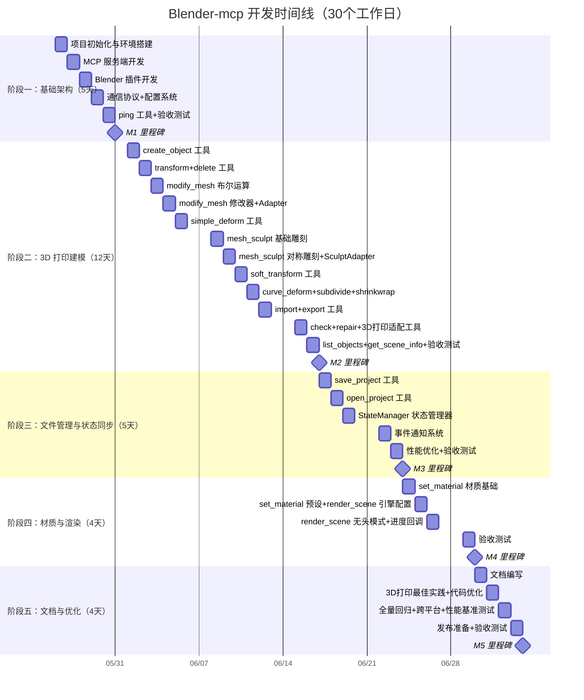
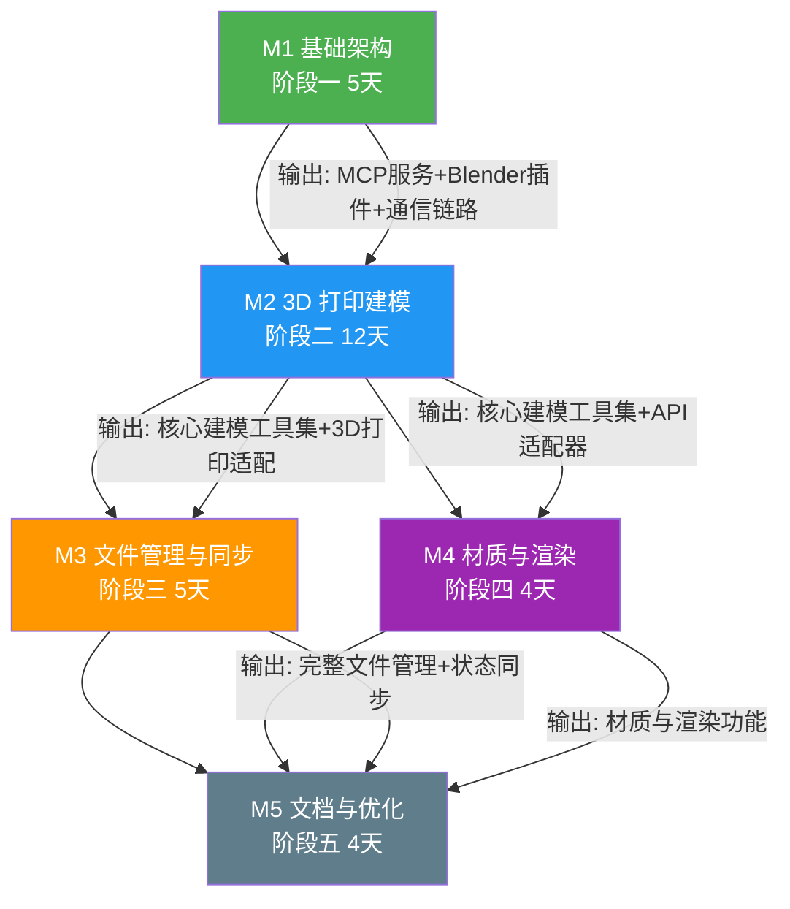

# Blender-mcp 客户端开发计划

> **文档编号**：DP-001
> **文档版本**：v1.6
> **最后更新**：2026-05-25
> **作者**：Blender-mcp 项目组
> **审核状态**：已审核
> **关联文档**：[需求文档](./需求文档.md) | [系统架构文档](./系统架构文档.md) | [阶段一详细设计](./阶段一详细设计.md) | [阶段二详细设计](./阶段二详细设计.md) | [阶段三详细设计](./阶段三详细设计.md) | [阶段四详细设计](./阶段四详细设计.md) | [阶段五详细设计](./阶段五详细设计.md)

---

## 目录

- [项目总览与里程碑](#项目总览与里程碑)
- [阶段一：项目初始化与基础架构搭建（5天）](#阶段一项目初始化与基础架构搭建5天)
- [阶段二：3D 打印建模核心功能开发（12天）](#阶段二3d-打印建模核心功能开发12天)
- [阶段三：文件管理与状态同步（5天）](#阶段三文件管理与状态同步5天)
- [阶段四：材质与渲染（4天）](#阶段四材质与渲染4天)
- [阶段五：文档与优化（4天）](#阶段五文档与优化4天)
- [总体时间线](#总体时间线)
- [风险与应对](#风险与应对)
- [测试策略](#测试策略)
- [异常测试场景与压力测试](#异常测试场景与压力测试)
- [操作恢复与数据保护机制](#操作恢复与数据保护机制)
- [开发环境要求](#开发环境要求)
- [代码规范](#代码规范)
- [CI/CD 流水线](#cicd-流水线)
- [已知兼容性问题](#已知兼容性问题)
- [完成度追踪表](#完成度追踪表)
- [详细排期表](#详细排期表)
- [术语表](#术语表)

---

## 项目总览与里程碑

### 里程碑甘特图



### 阶段依赖关系图



> **关联文档**：各阶段的验收标准详见 [需求文档 §7 - 验收标准](./需求文档.md#7-验收标准)；阶段间依赖的技术分析详见 [系统架构文档 §1 - 架构设计](./系统架构文档.md#1-架构设计)。

---

## 阶段一：项目初始化与基础架构搭建（5天）

### 目标
建立项目基础结构，配置开发环境，实现最小可用的 MCP 服务与 Blender 插件连接，完成通信协议和配置系统。

### 任务清单

#### Day 1：项目初始化
- [ ] 研究 Blender 4.2+ Python API 新特性与变更
- [ ] 创建项目目录结构
- [ ] 配置 Python 虚拟环境
- [ ] 编写 requirements.txt
- [ ] Blender API 研究与版本兼容性分析

#### Day 2：MCP 服务端开发
- [ ] 实现 MCPServer 类（初始化、启动、停止、请求处理）
- [ ] 实现 ToolRegistry 工具注册机制（注册、查找、调用、装饰器模式）
- [ ] 实现 StdioTransport stdio 通信层（消息读取、写入、主循环、通知发送）
- [ ] 实现 MCP 协议握手流程（initialize → tools/list）

#### Day 3：Blender 插件开发
- [ ] 实现 bl_info 定义与 register/unregister 函数
- [ ] 实现 BlenderMCPProperties 属性组（host/port/auto_connect/connection_status/latency_ms）
- [ ] 实现 BLENDER_MCP_PT_ConnectionPanel 连接面板 UI
- [ ] 实现 BLENDER_MCP_OT_StartServer / StopServer / PingTest 操作按钮
- [ ] 实现 BlenderWSClient WebSocket 客户端（单例模式、连接、断开、消息处理、线程模型）

#### Day 4：通信协议 + 配置系统
- [ ] 实现 WebSocket 消息格式（请求/响应/事件/错误响应消息定义）
- [ ] 实现心跳机制（Ping/Pong 帧、应用层心跳、超时检测、参数配置）
- [ ] 实现消息序列化/反序列化方案（类型映射、大小限制、校验规则）
- [ ] 实现 YAML 配置文件（defaults.yaml / config.yaml）
- [ ] 实现 ConfigManager 配置管理器（加载、深度合并、环境变量覆盖、校验）

#### Day 5：ping 工具 + 验收测试
- [ ] 实现 ping 工具（MCP 服务端 handler + Blender 插件端处理）
- [ ] 实现 ping 超时处理（连接错误、发送超时、响应超时、内部异常）
- [ ] 执行阶段一验收测试（15 个用例）

### 交付物
- 可运行的项目骨架
- MCP 服务端框架（MCPServer + ToolRegistry + StdioTransport）
- Blender 插件（属性面板 + WebSocket 客户端）
- 通信协议实现（消息格式 + 心跳机制 + 序列化）
- 配置系统（YAML + 环境变量覆盖）
- ping 工具与基础通信链路验证

### 预计时间
5 天

### 对应详细设计章节
[阶段一详细设计](./阶段一详细设计.md)：§1 MCP 服务端详细设计、§2 Blender 插件详细设计、§3 通信协议详细设计、§4 配置系统详细设计、§5 ping 工具详细设计、§7 验收测试用例

---

## 阶段二：3D 打印建模核心功能开发（12天）

### 目标
实现 3D 打印建模所需的核心功能，包括对象创建、变换、修改器、变形雕刻、模型修复、文件导入导出、3D 打印适配等。

### 任务清单

#### Day 1：create_object 工具
- [ ] 实现 6 种网格类型的 bpy 调用映射（cube/sphere/cylinder/plane/cone/torus）
- [ ] 实现 ObjectNamer 命名策略（自动命名、重名冲突处理、名称清理）
- [ ] 实现 create_object 参数验证与错误处理
- [ ] 实现 create_object 返回值构建（bounds 计算）

#### Day 2：transform_object + delete_object 工具
- [ ] 实现 transform_object absolute/relative 模式
- [ ] 实现 bpy 属性映射（location/rotation_euler/scale）
- [ ] 实现旋转单位转换（度 ↔ 弧度）
- [ ] 实现 delete_object 工具（按 object_id 删除、批量删除）

#### Day 3：modify_mesh 工具（布尔运算）
- [ ] 实现布尔运算（union/difference/intersect）的 bpy 调用
- [ ] 实现布尔运算前置检查（类型校验、包围盒重叠检测）
- [ ] 实现布尔运算后处理（目标对象清理、结果验证）

#### Day 4：modify_mesh 工具（修改器）+ API 适配器基础
- [ ] 实现倒角（bevel）修改器
- [ ] 实现挤出（extrude）修改器
- [ ] 实现实体化（solidify）修改器
- [ ] 实现 BlenderAdapter 类（统一错误处理、上下文管理）
- [ ] 实现 BlenderContextAdapter 上下文管理器（temp_override）
- [ ] 实现 OperationRollback 操作回滚机制

#### Day 5：simple_deform 工具
- [ ] 实现 Bend 变形
- [ ] 实现 Taper 变形
- [ ] 实现 Twist 变形
- [ ] 实现 Stretch 变形
- [ ] 实现变形轴和原点设置
- [ ] 实现变形限制范围（limits）

#### Day 6：mesh_sculpt 工具（基础雕刻）
- [ ] 实现 Push 操作（沿法线/方向外推顶点）
- [ ] 实现 Pull 操作（沿法线/方向内拉顶点）
- [ ] 实现 Smooth 操作（拉普拉斯平滑算法）
- [ ] 实现 Inflate 操作（沿法线均匀外扩）
- [ ] 实现基于 bmesh 的顶点级操作框架
- [ ] 实现 KD-Tree 顶点查找与权重计算

#### Day 7：mesh_sculpt 工具（对称雕刻）+ SculptAdapter 类
- [ ] 实现对称雕刻（X/Y/Z 轴镜像检测和同步操作）
- [ ] 实现 SculptAdapter 类（封装 bmesh/kdtree/bvhtree 调用）
- [ ] 实现雕刻操作通用框架（bmesh 获取 → KD-Tree 构建 → 顶点查找 → 位移计算 → 更新）

#### Day 8：soft_transform 工具
- [ ] 实现衰减函数（smooth/sphere/root/sharp/linear/constant）
- [ ] 实现 KD-Tree 顶点选择和权重计算
- [ ] 实现软选择移动（translate）
- [ ] 实现软选择旋转（rotate）
- [ ] 实现软选择缩放（scale）

#### Day 9：curve_deform + subdivide_mesh + shrinkwrap 工具
- [ ] 实现 curve_deform 工具（Curve 修改器、变形轴设置）
- [ ] 实现 subdivide_mesh 工具（Subdivision Surface 修改器、平滑度控制）
- [ ] 实现 shrinkwrap 工具（Shrinkwrap 修改器、nearest_surface/projection 模式）

#### Day 10：import_model + export_model 工具
- [ ] 实现 STL 导入导出（Blender 4.2+ / 4.0/4.1 版本兼容适配）
- [ ] 实现 OBJ 导入导出（新版/旧版 API 适配）
- [ ] 实现版本兼容性适配（_call_version_safe 函数）
- [ ] 实现导出路径白名单校验

#### Day 11：check_model + repair_model + 3D 打印适配工具
- [ ] 实现 check_model 工具（非流形检测、法线检测、壁厚检测）
- [ ] 实现 repair_model 工具（法线翻转修复、顶点合并修复、孔洞填充修复）
- [ ] 实现 detect_overhangs 工具（基于面法线与Z轴夹角的悬垂检测）
- [ ] 实现 optimize_orientation 工具（多维度评估的打印方向优化）
- [ ] 实现 set_shrinkage_compensation 工具（材料收缩率补偿）
- [ ] 实现 validate_printability 工具（综合可打印性验证）

#### Day 12：list_objects + get_scene_info + 验收测试
- [ ] 实现 list_objects 工具（全部/按类型过滤）
- [ ] 实现 get_scene_info 工具（场景名、对象统计、渲染设置）
- [ ] 执行阶段二验收测试（45 个用例）

### 交付物
- 对象创建与变换工具（create_object / transform_object / delete_object）
- 网格修改工具（modify_mesh：布尔运算 + 倒角/挤出/实体化）
- 变形与雕刻工具集（simple_deform / mesh_sculpt / soft_transform / curve_deform / subdivide_mesh / shrinkwrap）
- 模型检查与修复工具（check_model / repair_model）
- 3D 打印适配工具（detect_overhangs / optimize_orientation / set_shrinkage_compensation / validate_printability）
- 文件导入导出工具（import_model / export_model）
- 场景查询工具（list_objects / get_scene_info）
- API 适配器（BlenderAdapter / SculptAdapter / BlenderContextAdapter / OperationRollback）

### 预计时间
12 天

### 对应详细设计章节
[阶段二详细设计](./阶段二详细设计.md)：§1 create_object、§2 transform_object、§3 modify_mesh、§4 变形与雕刻工具、§5 模型检查与修复工具、§6 3D 打印适配工具、§7 文件导入导出、§8 API 适配器、§9 验收测试用例

---

## 阶段三：文件管理与状态同步（5天）

### 目标
实现项目文件操作、完善的状态同步机制、事件通知系统和性能优化。

### 任务清单

#### Day 1：save_project 工具
- [ ] 实现 bpy.ops.wm.save_as_mainfile 调用
- [ ] 实现备份策略（.blend.bak 原子性备份）
- [ ] 实现压缩选项
- [ ] 实现路径安全校验（白名单检查、磁盘空间检查）
- [ ] 实现文件大小估算

#### Day 2：open_project 工具
- [ ] 实现 bpy.ops.wm.open_mainfile 调用
- [ ] 实现未保存变更提示处理（自动保存到临时文件）
- [ ] 实现文件锁定检测（Windows 独占模式 / Linux psutil 检测）
- [ ] 实现场景加载后状态重置（StateManager.reset + full_sync）

#### Day 3：StateManager 状态管理器
- [ ] 实现 StateManager 类（单例模式、版本号管理、变更日志）
- [ ] 实现场景状态快照机制（ObjectState / SceneState / 网格哈希计算）
- [ ] 实现增量同步算法（基于对象哈希的变更检测：added/removed/modified/unchanged）
- [ ] 实现状态版本号管理（bump / compute_scene_hash / get_changes_since / is_stale）
- [ ] 实现全量同步（full_sync）

#### Day 4：事件通知系统
- [ ] 实现 BlenderEventHandler（app.handlers 集成：depsgraph_update_post / undo_post / redo_post / load_post / save_post）
- [ ] 实现场景变更事件类型定义（EventType 枚举 / SceneChangeEvent 数据类）
- [ ] 实现事件到 MCP 通知的转换
- [ ] 实现事件节流防抖策略（EventThrottle：节流/防抖/合并）

#### Day 5：性能优化 + 验收测试
- [ ] 实现大场景状态同步优化（增量同步、分层哈希、延迟计算、采样哈希）
- [ ] 实现智能同步策略（smart_sync：自动选择增量/全量同步）
- [ ] 实现缓存策略（QueryResultCache：对象哈希缓存、场景状态缓存、快照缓存、查询结果缓存）
- [ ] 执行阶段三验收测试（17 个用例）

### 交付物
- 文件管理工具（save_project / open_project）
- 状态管理器（StateManager：快照机制、增量同步、版本管理）
- 事件通知系统（BlenderEventHandler + EventThrottle）
- 性能优化（缓存策略、采样哈希、智能同步）

### 预计时间
5 天

### 对应详细设计章节
[阶段三详细设计](./阶段三详细设计.md)：§1 save_project、§2 open_project、§3 状态管理器、§4 事件通知系统、§5 性能优化设计、§6 验收测试用例

---

## 阶段四：材质与渲染（4天）

### 目标
实现材质设置、渲染控制等高级功能。

### 任务清单

#### Day 1：set_material 工具（材质基础）
- [ ] 实现 Principled BSDF 材质创建（base_color / metallic / roughness / specular / transmission / emission / alpha）
- [ ] 实现材质属性映射（MCP 参数 → Blender Principled BSDF 输入）
- [ ] 实现材质分配到对象（assign_material_to_object：追加/替换模式）
- [ ] 实现材质库管理（MaterialLibrary：get_or_create / list_materials / delete_material）

#### Day 2：set_material 工具（预设+校验）+ render_scene 工具（引擎配置）
- [ ] 实现材质预设（plastic / glossy_plastic / metal / chrome / glass / rubber / ceramic / wood）
- [ ] 实现材质参数校验（_validate_material_params）
- [ ] 实现渲染引擎选择与配置（EEVEE / Cycles）
- [ ] 实现渲染参数配置（分辨率、输出格式、采样数、降噪）

#### Day 3：render_scene 工具（无头模式+进度回调）
- [ ] 实现无头模式渲染（CPU 降级、自动检测 GPU 可用性）
- [ ] 实现输出路径和格式配置（PNG / JPEG / TIFF / OpenEXR）
- [ ] 实现 RenderProgressCallback 渲染进度回调（render_init / render_complete / render_cancel / render_write）
- [ ] 实现渲染超时处理与错误恢复

#### Day 4：验收测试
- [ ] 执行阶段四验收测试（16 个用例）

### 交付物
- 材质设置功能（Principled BSDF 创建、材质预设、材质库管理、参数校验）
- 渲染控制功能（EEVEE/Cycles 引擎配置、无头模式渲染、进度回调）

### 预计时间
4 天

### 对应详细设计章节
[阶段四详细设计](./阶段四详细设计.md)：§1 set_material 工具详细设计、§2 render_scene 工具详细设计、§3 验收测试用例

---

## 阶段五：文档与优化（4天）

### 目标
完善文档，优化用户体验，进行最终测试与发布准备。

### 任务清单

#### Day 1：文档编写
- [ ] 完善 README.md（项目简介、功能特性、快速开始、使用示例、配置说明、FAQ）
- [ ] 编写用户使用手册（9 章 + 2 附录）
- [ ] 编写 Blender 插件安装指南（7 步骤 + 跨平台注意事项）
- [ ] 编写 MCP 服务配置指南（6 步骤 + Trae SOLO / hermes-agent 配置示例）

#### Day 2：3D 打印最佳实践文档 + 代码优化与重构
- [ ] 编写 3D 打印建模最佳实践文档（10 章节大纲）
- [ ] 性能瓶颈识别（cProfile / line_profiler / memory_profiler）
- [ ] 代码重构（函数长度、类职责单一性、循环依赖、重复代码、魔法数字、异常处理完整性）
- [ ] 实现批处理模式（BatchOperationManager）

#### Day 3：全量回归测试 + 跨平台测试 + 性能基准测试
- [ ] 执行全量回归测试（单元 + 集成 + 端到端）
- [ ] 执行跨平台测试（Windows / macOS / Linux × Blender 4.2 / 4.3）
- [ ] 执行性能基准测试（12 项基准指标）
- [ ] 执行用户验收测试（5 个 UAT 场景）

#### Day 4：发布准备 + 验收测试
- [ ] 构建发布包（ReleaseBuilder：测试 → Python 包 → 插件 ZIP → 校验和 → 发布说明）
- [ ] 更新版本号（语义化版本 2.0.0 规范）
- [ ] 执行发布检查清单（15 项检查）
- [ ] 执行阶段五验收测试（12 个用例）

### 交付物
- 完整的用户文档（README + 用户手册 + 安装指南 + 配置指南 + 3D 打印最佳实践）
- 优化后的代码（性能优化 + 重构）
- 测试报告（回归测试 + 跨平台测试 + 性能基准测试）
- 稳定可发布的版本（wheel + sdist + addon.zip + checksums）

### 预计时间
4 天

### 对应详细设计章节
[阶段五详细设计](./阶段五详细设计.md)：§1 文档编写计划、§2 代码优化方案、§3 最终测试计划、§4 发布准备、§5 验收测试用例

---

## 总体时间线

| 阶段 | 预计时间 | 工作日范围 | 日期范围 | 累计时间 |
|------|----------|-----------|---------|----------|
| 阶段一：基础架构 | 5 天 | Day 1-5 | 05/26-05/30 | 5 天 |
| 阶段二：3D 打印建模核心功能 | 12 天 | Day 6-17 | 06/01-06/16 | 17 天 |
| 阶段三：文件管理与状态同步 | 5 天 | Day 18-22 | 06/17-06/23 | 22 天 |
| 阶段四：材质与渲染 | 4 天 | Day 23-26 | 06/24-06/29 | 26 天 |
| 阶段五：文档与优化 | 4 天 | Day 27-30 | 06/30-07/03 | 30 天 |

**总预计时间：30 个工作日**

---

## 风险与应对

| 风险 | 影响 | 概率 | 应对措施 |
|------|------|------|----------|
| Blender 4.2+ API 变更 | 高 | 中 | 深入研究 Blender 4.2+ 官方文档，关注 API 变更日志；实现版本兼容适配层 |
| MCP 协议变更 | 中 | 低 | 关注 MCP 官方更新，保持 SDK 版本 |
| 性能问题（大场景） | 中 | 中 | 实现增量更新，优化数据传输；采样哈希、缓存策略 |
| 3D 打印模型修复算法复杂 | 中 | 中 | 参考 Blender 内置修复工具，分阶段实现修复功能 |
| 布尔运算稳定性 | 高 | 中 | 前置检查包围盒重叠，超时保护，操作回滚机制 |
| 跨平台兼容性 | 中 | 中 | CI 多平台测试矩阵，路径安全处理统一封装 |

---

## 测试策略

### 测试层级与范围

| 测试层级 | 范围 | 工具 | 覆盖率目标 |
|----------|------|------|------------|
| 单元测试 | 独立函数、工具参数校验、状态管理逻辑 | pytest | ≥ 90% 核心模块 |
| 集成测试 | MCP 服务 ↔ 插件通信、工具链调用 | pytest + mock bpy | ≥ 70% |
| 端到端测试 | 真实 Blender 环境中的完整工作流 | pytest + Blender headless | 核心流程 100% 覆盖 |
| 回归测试 | 每次发布前全量执行 | CI 自动执行 | 关键路径 100% |

### 单元测试策略

```
tests/
├── unit/
│   ├── test_tools.py          # 工具参数校验
│   ├── test_command.py        # 命令处理逻辑
│   ├── test_schemas.py        # 数据模型校验
│   ├── test_state.py          # 状态管理器
│   ├── test_adapter.py        # API 适配器（mock bpy）
│   └── test_config.py         # 配置加载与校验
```

- 每个公开函数至少 2 个测试用例（正常路径 + 异常路径）
- Mock 所有 Blender Python API 依赖（bpy 模块）
- 参数边界值测试（空值、越界值、非法类型）
- 使用 pytest 参数化减少重复测试代码

### 集成测试策略

```
tests/
├── integration/
│   ├── test_connection.py     # WebSocket 连接生命周期
│   ├── test_tool_pipeline.py  # 工具链端到端调用
│   ├── test_error_handling.py # 错误传播与恢复
│   └── test_state_sync.py     # 状态同步一致性
```

- 模拟真实 MCP 请求-响应周期
- 验证错误在模块间的正确传播
- WebSocket 断连重连场景验证
- 并发调用场景验证（状态一致性）

### 端到端测试策略

```
tests/
├── e2e/
│   ├── test_create_export_workflow.py  # 创建→修改→导出完整流程
│   ├── test_import_repair_workflow.py  # 导入→检查→修复→导出流程
│   └── test_multi_object_scene.py      # 多对象场景操作
```

- 在 Blender 无头模式（`blender --background --python`）下运行
- 验证工具在真实 Blender 环境中的行为
- 每个 3D 打印建模场景至少 1 个端到端测试
- 文件导入导出验证产物完整性（文件大小 > 0、格式有效）

### 测试执行规范

| 阶段 | 测试要求 |
|------|----------|
| 开发阶段 | 每次提交前运行单元测试和 lint 检查 |
| 代码审查 | 审查者确认新增代码有对应的测试覆盖 |
| 阶段交付 | 全量单元测试 + 集成测试通过 |
| 发布前 | 全量测试（单元 + 集成 + 端到端）通过，覆盖率达标 |

### 测试数据管理

- 测试用 STL/OBJ 文件存放在 `tests/fixtures/` 目录
- 使用轻量级网格文件（< 1MB）作为测试数据
- 每个端到端测试后清理场景状态，避免交叉影响
- 测试输出文件写入 `tests/output/` 并在测试结束后清理

---

## 异常测试场景与压力测试

### 各阶段异常测试场景清单

以下为每个开发阶段必须覆盖的异常测试场景，确保系统在异常情况下的行为符合需求文档中定义的异常分支流程。

#### 阶段一异常测试场景（基础架构）

| 场景ID | 测试场景 | 预期行为 | 测试方法 |
|--------|---------|---------|---------|
| EX-1-01 | Blender插件未启动时MCP 服务尝试连接 | MCP服务返回 `CONNECTION_ERROR`，不崩溃 | 单元测试（mock WebSocket） |
| EX-1-02 | WebSocket连接过程中Blender进程突然终止 | MCP 服务检测心跳超时，进入RECONNECTING状态 | 集成测试（kill Blender进程） |
| EX-1-03 | MCP 服务发送超过10MB的消息 | Blender插件拒绝消息，返回 `MESSAGE_TOO_LARGE` | 单元测试 |
| EX-1-04 | 网络端口被占用（8765已被其他进程使用） | MCP 服务检测端口冲突，自动尝试下一个端口 | 集成测试（预占用端口） |
| EX-1-05 | 插件在Blender 4.2和4.3上反复启用/禁用 | 插件资源正确释放，无内存泄漏，无残留定时器 | 端到端测试（循环启用/禁用100次） |
| EX-1-06 | MCP协议版本不匹配（客户端用v2，服务端v1） | 握手阶段检测版本不一致，返回明确错误 | 单元测试 |

#### 阶段二异常测试场景（3D 打印建模核心功能）

| 场景ID | 测试场景 | 预期行为 | 测试方法 |
|--------|---------|---------|---------|
| EX-2-01 | `create_object` 传入 type=mesh 但 mesh_type 为空 | 返回 `INVALID_PARAMETER`，列出可用 mesh_type 值 | 单元测试 |
| EX-2-02 | `create_object` 传入 location=(NaN, inf, 0) | 返回 `INVALID_PARAMETER`，拒绝非有限浮点值 | 单元测试 |
| EX-2-03 | `create_object` 连续快速创建1000个对象 | 不超过速率限制的创建成功；超过则返回 `RATE_LIMITED` | 压力测试 |
| EX-2-04 | `transform_object` 对不存在的对象ID操作 | 返回 `OBJECT_NOT_FOUND`，列出当前场景中名称相似的对象 | 单元测试 |
| EX-2-05 | `transform_object` 缩放为 (0, 1, 1) | 返回 `INVALID_PARAMETER`，说明缩放不能为零 | 单元测试 |
| EX-2-06 | `modify_mesh` 布尔差运算时两个对象无重叠 | 返回警告，但允许 force=true 强制执行 | 端到端测试（Blender headless） |
| EX-2-07 | `modify_mesh` 对非MESH类型对象执行布尔运算 | 返回 `OPERATION_NOT_ALLOWED`，说明对象类型不匹配 | 单元测试 |
| EX-2-08 | `modify_mesh` 对百万面模型执行复杂布尔运算 | 操作在60秒内完成或超时返回 `OPERATION_TIMEOUT` | 压力测试 |
| EX-2-09 | `export_model` 导出路径在允许路径之外 | 返回 `PERMISSION_DENIED`，显示允许的路径列表 | 单元测试 |
| EX-2-10 | `export_model` 目标磁盘剩余空间不足 | 导出前检查磁盘空间，不足时返回 `RESOURCE_EXHAUSTED` | 集成测试（mock磁盘检查） |
| EX-2-11 | `export_model` 导出时文件名含非法字符（Windows） | 自动清理文件名中的非法字符，并返回清理后的文件名 | 单元测试 |
| EX-2-12 | `import_model` 导入损坏的STL文件（随机字节填充） | 返回 `UNSUPPORTED_FORMAT`，不崩溃，不产生无效对象 | 端到端测试 |
| EX-2-13 | `import_model` 导入50万面的STL文件 | 在30秒内完成导入，内存增长不超过200MB | 压力测试 |
| EX-2-14 | `check_model` 检查非水密模型 | 正确返回 `is_printable: false`，逐项列出问题 | 端到端测试 |
| EX-2-15 | `check_model` 壁厚检查超时（面数50万+） | 返回已完成的检查项，标记超时项为 `TIMEOUT` | 压力测试 |
| EX-2-16 | `repair_model` 修复后引入退化面 | 检测到退化面后回滚到修复前状态，报告修复失败 | 端到端测试 |
| EX-2-17 | `repair_model` 连续修复同一模型5次 | 无状态累积错误，每次修复基于修复前原始状态 | 端到端测试 |

#### 阶段三异常测试场景（文件管理与状态同步）

| 场景ID | 测试场景 | 预期行为 | 测试方法 |
|--------|---------|---------|---------|
| EX-3-01 | `save_project` 保存到无权限目录 | 返回 `PERMISSION_DENIED` | 集成测试 |
| EX-3-02 | `open_project` 打开不存在的.blend文件 | 返回 `OBJECT_NOT_FOUND` | 单元测试 |
| EX-3-03 | `open_project` 打开被其他Blender实例锁定的文件 | 返回 `FILE_LOCKED` 错误，附带锁定进程信息 | 集成测试 |
| EX-3-04 | 用户在Blender UI中手动删除对象后MCP查询 | 状态管理器检测到版本号变化，触发增量同步 | 端到端测试 |
| EX-3-05 | 用户在Blender中执行undo后MCP查询 | 状态管理器通过undo事件触发全量同步 | 端到端测试 |
| EX-3-06 | 场景切换后MCP仍操作旧场景中的对象 | 返回 `OBJECT_NOT_FOUND`，自动更新场景引用 | 端到端测试 |
| EX-3-07 | 并发读写冲突：一个操作正在修改对象，另一个查询该对象 | 查询操作等待修改完成，返回最新状态 | 集成测试 |

#### 阶段四异常测试场景（材质与渲染）

| 场景ID | 测试场景 | 预期行为 | 测试方法 |
|--------|---------|---------|---------|
| EX-4-01 | `set_material` 对不存在的对象设置材质 | 返回 `OBJECT_NOT_FOUND` | 单元测试 |
| EX-4-02 | `render_scene` 在无头模式下触发渲染 | 返回功能不可用提示，说明无头模式限制 | 端到端测试（headless） |
| EX-4-03 | `render_scene` 输出目录不存在 | 自动创建目录，如创建失败返回错误 | 端到端测试 |
| EX-4-04 | 渲染过程中Blender被用户关闭 | MCP 服务检测连接断开，标记渲染任务为 `INTERRUPTED` | 集成测试 |

### 故障注入测试计划

故障注入测试用于验证系统在刻意制造的异常条件下的鲁棒性。以下为按阶段划分的故障注入计划。

#### 故障注入维度

| 注入维度 | 注入方式 | 工具/方法 | 注入频率 |
|---------|---------|----------|---------|
| **网络故障** | 随机丢弃WebSocket消息、延迟响应、断开连接 | Chaos Mesh / 自定义proxy | 每10次通信注入1次 |
| **进程故障** | 随机kill Blender进程、MCP服务进程 | `kill -9` / `taskkill` | 每50次操作注入1次 |
| **磁盘故障** | 模拟磁盘满、写入失败、IO延迟 | `libfuse` 虚拟文件系统 / mock | 每20次文件操作注入1次 |
| **内存故障** | 限制Blender可用内存、触发OOM | `ulimit -v` / cgroup | 每100次操作注入1次 |
| **数据故障** | 传入损坏的STL/OBJ、畸形JSON消息 | 预制的损坏测试文件集 | 每个格式10个损坏变体 |
| **超时故障** | 在异步操作中途注入长时间延迟 | `asyncio.sleep` 注入 / mock time | 每30次操作注入1次 |

#### 各阶段故障注入测试用例

| 用例ID | 注入故障类型 | 注入点 | 预期系统行为 | 验收标准 |
|--------|------------|--------|-------------|---------|
| FI-01 | WebSocket消息丢失 | `create_object` 请求发送后 | MCP服务超时后重发（最多3次），不丢失操作 | 最终对象被创建，无重复 |
| FI-02 | WebSocket连接在操作中断开 | `modify_mesh` 布尔运算执行中 | Blender插件检测连接断开，保留场景状态；MCP服务进入重连状态 | 重连后场景状态完整，布尔运算结果有效 |
| FI-03 | 磁盘写入在`export_model`中途失败 | `export_model` 写入STL数据时 | 返回 `RESOURCE_EXHAUSTED`，清理不完整的输出文件 | 磁盘上无不完整的STL文件 |
| FI-04 | Blender进程在`repair_model`中崩溃 | `repair_model` 执行到50%时 | 自动重启Blender，重连后检测中断操作，提示用户 | 模型状态为修复前状态（操作回滚） |
| FI-05 | 内存不足时尝试导入大模型 | `import_model` 导入200MB STL | 导入前预检可用内存，不足时拒绝导入并提示 | 不触发OOM killer |
| FI-06 | 在高负载下（10个操作/秒）注入网络延迟200ms | 随机操作 | 操作排队执行，不丢操作，响应时间增加但系统稳定 | 所有操作最终完成，无错误 |
| FI-07 | 注入畸形MCP消息（字段类型错误、缺少必填字段） | MCP消息解析层 | 返回 `INVALID_PARAMETER`，不崩溃，不执行操作 | 错误响应格式正确 |
| FI-08 | 在批量操作中间注入Blender闪退 | 批量转换第25/50个文件 | 保留进度文件，重连后支持 `--resume` 继续 | 从中断点继续，不重复处理已完成的文件 |

### 压力测试场景

#### 大模型测试

| 测试场景 | 模型规格 | 预期指标 | 测试环境要求 |
|---------|---------|---------|-------------|
| 超大STL导入 | 100万面 STL文件 (~50MB Binary) | 导入时间 < 30s，内存增长 < 500MB | 16GB RAM |
| 超大OBJ导入 | 200万面 OBJ文件 (~80MB) | 导入时间 < 60s，不崩溃 | 16GB RAM |
| 复杂布尔运算 | 两个各含10万面的对象做布尔差 | 运算时间 < 60s，结果几何体有效 | 16GB RAM |
| 多层级布尔链 | 5个对象连续布尔差（1000面 → 5万面 → 10万面 → ...） | 每步运算 < 10s，最终结果非流形边=0 | 16GB RAM |
| 大场景对象遍历 | 场景中包含500个独立对象 | `get_scene_info` 响应 < 2s | 8GB RAM |
| 高面数模型检查 | 50万面模型执行完整check_model | 非流形检查 < 30s，壁厚检查 < 60s | 16GB RAM |
| 顶点密度极限 | 包含100万个独立顶点的网格 | 顶点合并操作 < 10s | 16GB RAM |

#### 批量操作测试

| 测试场景 | 规模 | 预期指标 | 验收标准 |
|---------|------|---------|---------|
| 批量STL导出 | 连续导出100个对象为独立STL文件 | 总时间 < 5min，成功率 ≥ 99% | 99个以上文件导出成功 |
| 批量OBJ转换 | 50个OBJ → STL批量转换 | 总时间 < 3min，无内存泄漏 | 内存使用在转换后回到基线±50MB |
| 批量创建-删除循环 | 创建100个对象 → 全部删除，循环20次 | 无内存泄漏，对象ID不重复 | 内存使用稳定，无僵尸引用 |
| 持续高频调用 | 每秒5次 `get_scene_info` 持续10分钟 | P99延迟 < 200ms，无错误 | 成功率 ≥ 99.9% |
| 长时间运行稳定性 | 混合操作流（创建/修改/检查/导出/删除）持续运行8小时 | 无内存泄漏，无崩溃，操作成功率 ≥ 99% | MTBF ≥ 8小时 |

#### 资源竞争测试

| 测试场景 | 竞争条件 | 预期行为 | 验收标准 |
|---------|---------|---------|---------|
| 快速连续写操作 | 10个 `create_object` + `transform_object` 在1秒内发出 | 按顺序执行，每个操作的结果对象状态正确 | 10个对象均正确创建且位置正确 |
| 读写混合竞争 | 1个写操作（modify_mesh）进行中，同时3个读操作（get_scene_info）到达 | 读操作等待写锁释放后返回最新状态 | 读操作返回的状态包含写操作的结果 |
| 两个布尔运算竞争同一对象 | 两个 `modify_mesh` 同时修改同一对象 | 第二个操作等待第一个完成，基于最新状态执行 | 最终状态是两次修改的叠加结果 |
| 导出与修改并发 | `export_model` 进行中，同时 `transform_object` 修改同一对象 | 修改操作排队等待导出完成 | 导出的文件不包含后续修改 |

---

## 操作恢复与数据保护机制

### 自动恢复策略设计要点

#### 分层恢复架构

```
┌─────────────────────────────────────────────┐
│               恢复策略层次                    │
├─────────────┬───────────────────────────────┤
│  第1层      │ 操作级恢复（单个工具调用失败）   │
│  (Operation)│ • 重试（最多3次，指数退避）      │
│             │ • 回滚到操作前状态（undo）       │
│             │ • 返回明确错误给AI 助手           │
├─────────────┼───────────────────────────────┤
│  第2层      │ 事务级恢复（原子操作组失败）     │
│  (Transaction)│ • 逆向回滚已执行的子操作       │
│             │ • 恢复场景快照                  │
│             │ • 报告回滚结果                  │
├─────────────┼───────────────────────────────┤
│  第3层      │ 会话级恢复（连接中断/进程崩溃）  │
│  (Session)  │ • 保留场景状态和操作进度         │
│             │ • 重连后自动同步                 │
│             │ • 续接中断的操作（如支持）        │
├─────────────┼───────────────────────────────┤
│  第4层      │ 系统级恢复（Blender崩溃/重启）   │
│  (System)   │ • 自动重启Blender进程           │
│             │ • 从最近一次自动保存恢复         │
│             │ • 重建WebSocket连接             │
└─────────────┴────────────────────────────────┘
```

#### 各层恢复策略的关键设计要点

**第1层——操作级恢复：**

| 设计要点 | 实现方案 | 注意事项 |
|---------|---------|---------|
| 重试策略 | 指数退避：1s → 2s → 4s，最多3次 | 仅对可重试的错误重试（网络超时、临时锁定）；不可重试的错误（参数错误、对象不存在）直接返回 |
| 重试条件判断 | 检查错误码的 `recoverable` 字段 | `recoverable=true` 的错误自动重试，`recoverable=false` 的立即返回 |
| 操作幂等性 | 每条操作请求携带 `idempotency_key` | 重试时使用相同 key，Blender端检测重复执行 |
| 超时保护 | 单次操作最大执行时间60秒 | 超过后取消操作，记录超时日志 |

**第2层——事务级恢复：**

| 设计要点 | 实现方案 | 注意事项 |
|---------|---------|---------|
| 回滚顺序 | 严格逆向：最后成功 → 最早成功 | 回滚操作本身也可能失败，需记录回滚失败日志 |
| 快照时机 | 事务开始前自动创建快照 | 快照仅保存元数据（对象列表+哈希），实际回滚通过undo实现 |
| 部分成功处理 | 事务失败但前N步已执行 → 回滚前N步 | 如果回滚也失败，保留中间状态并告警 |
| 回滚失败降级 | 回滚失败 → 尝试恢复到最近一次手动保存 | 提示用户手动检查模型状态 |

**第3层——会话级恢复：**

| 设计要点 | 实现方案 | 注意事项 |
|---------|---------|---------|
| 断线检测 | 心跳超时（连续3次未收到pong = 30秒） | 避免因网络抖动过早触发重连 |
| 重连窗口 | 60秒内可自动重连 | 超过窗口需要用户手动确认 |
| 状态重同步 | 重连后全量同步场景状态 | 比较场景哈希快速判断是否有未同步的变更 |
| 中断操作通知 | 通过AI 助手向用户报告中断信息 | 包含：中断的操作类型、已完成的步骤、建议操作 |

**第4层——系统级恢复：**

| 设计要点 | 实现方案 | 注意事项 |
|---------|---------|---------|
| Blender进程监控 | MCP服务通过进程ID监控Blender存活状态 | 使用 `psutil` 监控进程 |
| 自动重启 | Blender崩溃后自动启动新进程并加载最近项目 | 仅在配置 `auto_restart_blender: true` 时启用 |
| 自动保存触发 | 每次破坏性操作前自动保存 | 自动保存文件使用 `.autosave.blend` 命名 |
| 崩溃恢复文件 | 启动时检测 `.autosave.blend` 存在性 | 如存在则提示用户是否恢复 |

### 数据备份与恢复机制

#### 自动保存（Autosave）策略

| 触发条件 | 保存内容 | 保存位置 | 文件命名 |
|---------|---------|---------|---------|
| 每次破坏性操作前（布尔运算、修复、删除对象） | 完整 .blend 场景文件 | `~/.blender-mcp/autosave/` | `{project_name}_{timestamp}.blend` |
| 每5分钟定时（如果场景有变更） | 完整 .blend 场景文件 | 同上 | `{project_name}_periodic.blend`（覆盖上一次） |
| 用户手动触发 `save_project` | 完整 .blend 场景文件 | 用户指定路径 | 用户指定 |
| 导出操作前 | 当前场景元数据快照（JSON） | `~/.blender-mcp/snapshots/` | `snapshot_{timestamp}.json` |

#### 场景快照（Snapshot）机制

| 快照类型 | 内容 | 存储方式 | 用途 |
|---------|------|---------|------|
| **元数据快照** | 对象名称/类型/位置/旋转/缩放/修改器列表 | JSON文件（< 1MB） | 快速状态比对、一致性校验 |
| **完整场景快照** | .blend文件的临时副本 | .blend文件 | 完整状态恢复 |
| **网格数据快照** | 单个对象的网格顶点/面数据 | 内存中的numpy数组 | 操作回滚（布尔运算失败时恢复原网格） |

#### 备份文件生命周期管理

```
备份文件生命周期：
  创建 → 保留（活跃项目期间） → 标记为可清理（项目关闭时）
                                ↓
                          ┌──────┴──────┐
                          │  保留最近N个  │  删除其余
                          │  (N = 10)   │
                          └─────────────┘

清理策略：
  • 最多保留10个自动保存文件
  • 每次新建自动保存时删除最旧的（FIFO）
  • 用户手动保存(.blend)的文件不受自动清理影响
  • 项目关闭时提示用户是否保留备份
```

#### 恢复流程决策树

```
系统启动 / 重连
    │
    ├─ 检测到 .autosave.blend 存在？ ──否──→ 正常启动
    │
    └─ 是
        │
        ├─ 询问用户："检测到上次会话的自动保存文件，是否恢复？"
        │
        ├─ 用户选择"恢复" ──→ 加载 .autosave.blend
        │   ├─ 恢复成功 → 继续工作
        │   └─ 恢复失败 → 尝试上一个自动保存文件（循环最多3次）
        │
        └─ 用户选择"放弃" ──→ 删除 .autosave.blend，正常启动
```

---

## 开发环境要求

### 硬件要求

| 项目 | 最低配置 | 推荐配置 |
|------|----------|----------|
| CPU | 4 核 | 8 核以上 |
| 内存 | 8 GB | 16 GB |
| 磁盘 | 5 GB 可用空间 | 20 GB SSD |
| GPU | 无要求 | 支持 OpenGL 4.3+ 的显卡 |

### 软件要求

| 软件 | 版本要求 | 说明 |
|------|----------|------|
| Blender | 4.2+ （推荐 4.3+） | 必须安装，用于开发和端到端测试 |
| Python | 跟随 Blender 内置版本 | Blender 4.2 内置 Python 3.11 |
| Git | 2.40+ | 版本控制 |
| VS Code / PyCharm | 最新稳定版 | 推荐 IDE |

### Python 虚拟环境

```bash
# 创建虚拟环境（使用 Blender 内置 Python）
/path/to/blender/4.2/python/bin/python3.11 -m venv venv

# 激活虚拟环境
source venv/bin/activate  # Linux/macOS
venv\Scripts\activate     # Windows

# 安装依赖
pip install -r requirements.txt
pip install -r requirements-dev.txt
```

### IDE 配置

**VS Code 推荐扩展**：
- Python (ms-python.python)
- Pylance (ms-python.vscode-pylance)
- YAML (redhat.vscode-yaml)

**VS Code 设置** (`settings.json`)：

```json
{
    "python.defaultInterpreterPath": "/path/to/blender/4.2/python/bin/python3.11",
    "python.linting.enabled": true,
    "python.linting.pylintEnabled": true,
    "python.formatting.provider": "black",
    "editor.formatOnSave": true,
    "[python]": {
        "editor.codeActionsOnSave": {
            "source.organizeImports": "explicit"
        }
    }
}
```

### Blender 开发模式

- 在 Blender 偏好设置中开启 "Python Tooltips" 和 "Developer Extras"
- 使用 Blender 的 Scripting 工作区进行插件调试
- 通过 `blender --background --python scripts/test_setup.py` 在无头模式下验证插件逻辑
- 插件目录链接到 Blender 插件路径：
  ```bash
  # Linux/macOS
  ln -s $(pwd)/blender_plugin /path/to/blender/4.2/scripts/addons/blender_mcp
  # Windows (管理员 PowerShell)
  New-Item -ItemType Junction -Path "$env:APPDATA\Blender Foundation\Blender\4.2\scripts\addons\blender_mcp" -Target "$pwd\blender_plugin"
  ```

---

## 代码规范

### Python 代码风格

遵循 **PEP 8** 标准，辅以以下项目特定规则：

```python
# 文件头模板（不强制，推荐）
"""
blender-mcp
模块名称 - 模块简述
"""

# 导入顺序：标准库 → 第三方库 → 项目内部
import os
import logging
from typing import Optional, List, Tuple

import bpy
import numpy as np

from core.command import CommandHandler
from core.state import StateManager
```

### 命名规范

| 类型 | 规范 | 示例 |
|------|------|------|
| 模块/文件 | 小写下划线 | `command_handler.py` |
| 类 | PascalCase | `CommandHandler` |
| 函数/方法 | 小写下划线 | `create_object()` |
| 变量 | 小写下划线 | `object_id` |
| 常量 | 大写下划线 | `MAX_RETRY_COUNT` |
| 私有成员 | 单下划线前缀 | `_internal_state` |
| 工具函数 | 动词开头 | `get_scene_info()`、`export_model()` |

### 类型注解

- 所有公开函数必须有完整的类型注解
- 使用 `mypy` 进行静态类型检查

```python
def create_object(
    obj_type: str,
    name: str | None = None,
    location: Tuple[float, float, float] = (0.0, 0.0, 0.0),
    mesh_type: str = "cube"
) -> dict[str, str | bool]:
    ...
```

### 文档字符串

使用 Google 风格 docstring：

```python
def export_model(
    object_id: str | None,
    format: str,
    filepath: str,
    options: dict | None = None
) -> dict:
    """导出模型到指定格式文件。

    Args:
        object_id: 目标对象 ID，为 None 时导出全部选中对象
        format: 导出格式，支持 "stl" 或 "obj"
        filepath: 导出文件路径
        options: 导出选项，可选键值:
            - scale: 缩放比例 (float)
            - use_selection: 仅导出选中对象 (bool)
            - ascii: STL 使用 ASCII 格式 (bool)

    Returns:
        包含 success (bool) 和 filepath (str) 的字典

    Raises:
        ObjectNotFoundError: 对象不存在时抛出
        UnsupportedFormatError: 格式不支持时抛出
    """
    ...
```

### Git 提交规范

采用 Conventional Commits 规范：

```
<type>(<scope>): <description>

[optional body]
[optional footer]
```

类型定义：
- `feat`: 新功能
- `fix`: Bug 修复
- `docs`: 文档更新
- `style`: 代码格式（不影响功能）
- `refactor`: 代码重构
- `test`: 测试相关
- `chore`: 构建/工具链相关

示例：
```
feat(tools): 实现 create_object 工具的支持的6种基础网格类型

feat(export): 添加 STL 格式 ASCII/二进制导出选项

fix(adapter): 修复布尔运算后对象引用失效的问题

test(e2e): 添加导入→检查→修复→导出的端到端测试
```

### 分支管理

```
main          # 稳定发布分支
├── develop   # 开发主分支
├── feat/*    # 功能分支（feat/export-stl, feat/check-model）
├── fix/*     # 修复分支
└── release/* # 发布准备分支
```

### 代码审查要求

| 检查项 | 要求 |
|--------|------|
| 类型注解 | 所有公开函数有完整类型注解 |
| 文档字符串 | 所有公开函数有 Google 风格 docstring |
| 测试覆盖 | 新增代码有对应单元测试 |
| 静态分析 | 通过 pylint（无严重警告）和 mypy 检查 |
| 代码格式 | 通过 black 格式化 |
| 安全性 | 无硬编码密钥、文件路径通过白名单校验 |

---

## CI/CD 流水线

### GitHub Actions 配置

项目使用 GitHub Actions 实现自动化测试、代码质量检查和构建发布流程。

#### 主工作流：CI（持续集成）

```yaml
# .github/workflows/ci.yml
name: CI

on:
  push:
    branches: [main, develop]
  pull_request:
    branches: [main, develop]
  workflow_dispatch:  # 允许手动触发

env:
  PYTHON_VERSION: '3.11'
  BLENDER_VERSION: '4.2'

jobs:
  # ========== 代码质量检查 ==========
  lint:
    name: Lint & Type Check
    runs-on: ubuntu-22.04
    steps:
      - uses: actions/checkout@v4

      - name: Setup Python
        uses: actions/setup-python@v5
        with:
          python-version: ${{ env.PYTHON_VERSION }}
          cache: 'pip'

      - name: Install dependencies
        run: |
          pip install -r requirements.txt
          pip install -r requirements-dev.txt

      - name: Run pylint
        run: pylint mcp_server/ core/ --exit-zero --output-format=colorized
        continue-on-error: true

      - name: Run mypy (type check)
        run: mypy mcp_server/ core/ --ignore-missing-imports

      - name: Run black (format check)
        run: black --check --diff mcp_server/ core/ tests/

      - name: Run isort (import check)
        run: isort --check-only --diff mcp_server/ core/ tests/

  # ========== 单元测试 ==========
  unit-tests:
    name: Unit Tests
    runs-on: ubuntu-22.04
    needs: lint
    strategy:
      matrix:
        python-version: ['3.10', '3.11']
    steps:
      - uses: actions/checkout@v4

      - name: Setup Python
        uses: actions/setup-python@v5
        with:
          python-version: ${{ matrix.python-version }}
          cache: 'pip'

      - name: Install dependencies
        run: |
          pip install -r requirements.txt
          pip install -r requirements-dev.txt

      - name: Run unit tests with coverage
        run: |
          pytest tests/unit/ \
            --cov=mcp_server \
            --cov=core \
            --cov-report=xml:coverage-unit.xml \
            --cov-report=term \
            -v

      - name: Upload coverage to Codecov
        uses: codecov/codecov-action@v4
        with:
          file: ./coverage-unit.xml
          flags: unit
          token: ${{ secrets.CODECOV_TOKEN }}

  # ========== 集成测试 ==========
  integration-tests:
    name: Integration Tests
    runs-on: ubuntu-22.04
    needs: unit-tests
    steps:
      - uses: actions/checkout@v4

      - name: Setup Python
        uses: actions/setup-python@v5
        with:
          python-version: ${{ env.PYTHON_VERSION }}
          cache: 'pip'

      - name: Install dependencies
        run: |
          pip install -r requirements.txt
          pip install -r requirements-dev.txt

      - name: Run integration tests
        run: pytest tests/integration/ -v --timeout=30

  # ========== 端到端测试（需要Blender环境）==========
  e2e-tests:
    name: E2E Tests (Blender)
    runs-on: ubuntu-22.04
    needs: integration-tests
    if: github.event_name == 'push' || github.event_name == 'workflow_dispatch'
    steps:
      - uses: actions/checkout@v4

      - name: Install Blender
        run: |
          sudo apt-get update
          sudo apt-get install -y libxrender1 libxi6 libxkbcommon0

      - name: Cache Blender
        id: cache-blender
        uses: actions/cache@v4
        with:
          path: /tmp/blender
          key: blender-${{ env.BLENDER_VERSION }}-linux-x64

      - name: Download Blender
        if: steps.cache-blender.outputs.cache-hit != 'true'
        run: |
          BLENDER_URL="https://download.blender.org/release/Blender4.2/blender-4.2.0-linux-x64.tar.xz"
          wget -q $BLENDER_URL -O /tmp/blender.tar.xz
          mkdir -p /tmp/blender
          tar -xf /tmp/blender.tar.xz -C /tmp/blender --strip-components=1

      - name: Install plugin to Blender
        run: |
          mkdir -p /tmp/blender/4.2/scripts/addons/blender_mcp
          cp -r blender_plugin/* /tmp/blender/4.2/scripts/addons/blender_mcp/

      - name: Run E2E tests
        run: |
          /tmp/blender/blender --background --python-exit-code 1 \
            --python tests/e2e/run_all.py

      - name: Upload test artifacts (on failure)
        if: failure()
        uses: actions/upload-artifact@v4
        with:
          name: e2e-test-results
          path: |
            tests/output/
            /tmp/blender-mcp-logs/
```

#### 发布工作流

```yaml
# .github/workflows/release.yml
name: Release

on:
  push:
    tags:
      - 'v*.*.*'  # 仅当推送语义版本标签时触发

jobs:
  # ========== 构建与测试 ==========
  build:
    name: Build & Test
    runs-on: ubuntu-22.04
    steps:
      - uses: actions/checkout@v4

      - name: Setup Python
        uses: actions/setup-python@v5
        with:
          python-version: '3.11'

      - name: Install dependencies
        run: |
          pip install -r requirements.txt
          pip install -r requirements-dev.txt

      - name: Full test suite
        run: pytest tests/ -v --cov --cov-report=xml

      - name: Build package
        run: |
          python -m build
          # 创建Blender插件的ZIP分发包
          cd blender_plugin && zip -r ../blender-mcp-addon.zip . -x "*.pyc" "__pycache__/*"

      - name: Calculate checksums
        run: |
          sha256sum dist/*.whl dist/*.tar.gz blender-mcp-addon.zip > checksums.txt
          cat checksums.txt

      - name: Upload build artifacts
        uses: actions/upload-artifact@v4
        with:
          name: release-artifacts
          path: |
            dist/
            blender-mcp-addon.zip
            checksums.txt

  # ========== GitHub Release ==========
  github-release:
    name: Create GitHub Release
    runs-on: ubuntu-22.04
    needs: build
    permissions:
      contents: write
    steps:
      - uses: actions/checkout@v4

      - name: Download build artifacts
        uses: actions/download-artifact@v4
        with:
          name: release-artifacts

      - name: Generate changelog
        id: changelog
        run: |
          PREV_TAG=$(git describe --tags --abbrev=0 HEAD^ 2>/dev/null || echo "")
          if [ -z "$PREV_TAG" ]; then
            echo "changelog<<EOF" >> $GITHUB_OUTPUT
            git log --oneline --no-decorate ${GITHUB_REF#refs/tags/} >> $GITHUB_OUTPUT
            echo "EOF" >> $GITHUB_OUTPUT
          else
            echo "changelog<<EOF" >> $GITHUB_OUTPUT
            git log --oneline --no-decorate $PREV_TAG..${GITHUB_REF#refs/tags/} >> $GITHUB_OUTPUT
            echo "EOF" >> $GITHUB_OUTPUT
          fi

      - name: Create Release
        uses: softprops/action-gh-release@v2
        with:
          name: ${{ github.ref_name }}
          body: |
            ## 更新内容
            ${{ steps.changelog.outputs.changelog }}

            ## 校验和
            ```
            $(cat checksums.txt)
            ```
          files: |
            dist/*.whl
            dist/*.tar.gz
            blender-mcp-addon.zip
            checksums.txt
          draft: false
          prerelease: ${{ contains(github.ref_name, 'alpha') || contains(github.ref_name, 'beta') || contains(github.ref_name, 'rc') }}

  # ========== PyPI 发布 ==========
  pypi-publish:
    name: Publish to PyPI
    runs-on: ubuntu-22.04
    needs: github-release
    environment:
      name: pypi
      url: https://pypi.org/p/blender-mcp
    permissions:
      id-token: write  # 用于 PyPI 可信发布
    steps:
      - name: Download build artifacts
        uses: actions/download-artifact@v4
        with:
          name: release-artifacts

      - name: Publish to PyPI
        uses: pypa/gh-action-pypi-publish@release/v1
        with:
          packages-dir: dist/
```

#### 定时任务：每日构建

```yaml
# .github/workflows/nightly.yml
name: Nightly Build

on:
  schedule:
    # 每天 UTC 02:00 (北京时间 10:00)
    - cron: '0 2 * * *'
  workflow_dispatch:

jobs:
  nightly-test:
    name: Nightly Full Test
    runs-on: ${{ matrix.os }}
    strategy:
      fail-fast: false
      matrix:
        os: [ubuntu-22.04, windows-2022, macos-12]
        blender_version: ['4.2', '4.3']
    steps:
      - uses: actions/checkout@v4

      - name: Setup Python
        uses: actions/setup-python@v5
        with:
          python-version: '3.11'

      - name: Install dependencies
        run: |
          pip install -r requirements.txt
          pip install -r requirements-dev.txt

      - name: Run tests
        run: pytest tests/unit tests/integration -v --timeout=60

      - name: Report status
        if: failure()
        uses: slackapi/slack-github-action@v1.26.0
        with:
          payload: |
            {
              "text": "❌ Nightly build failed: ${{ matrix.os }} / Blender ${{ matrix.blender_version }}"
            }
        env:
          SLACK_WEBHOOK_URL: ${{ secrets.SLACK_WEBHOOK_URL }}
```

#### CI/CD 流水线总览

```
          PR / Push                          Tag Push (v*)
              │                                    │
              ▼                                    ▼
    ┌─────────────────┐                  ┌─────────────────┐
    │   CI 工作流     │                  │   Release 工作流 │
    ├─────────────────┤                  ├─────────────────┤
    │ 1. Lint         │                  │ 1. 全量测试      │
    │ 2. 类型检查     │                  │ 2. 构建包        │
    │ 3. 格式检查     │                  │ 3. 创建Release   │
    │ 4. 单元测试     │                  │ 4. 发布到PyPI    │
    │ 5. 集成测试     │                  │ 5. 生成Changelog │
    │ 6. E2E测试(可选)│                  └─────────────────┘
    └─────────────────┘
              │
              ▼
    ┌─────────────────┐        ┌─────────────────┐
    │ 代码审查通过后   │───────▶│ 合并到 main     │
    └─────────────────┘        └─────────────────┘
                                       │
                                       ▼
                               ┌─────────────────┐
                               │ Nightly 工作流  │
                               │ 多平台/多版本测试│
                               └─────────────────┘
```

#### 工作流文件清单

| 文件 | 用途 | 触发条件 |
|------|------|---------|
| `.github/workflows/ci.yml` | 持续集成：lint + 测试 | push/PR |
| `.github/workflows/release.yml` | 版本发布：构建 + PyPI | tag push |
| `.github/workflows/nightly.yml` | 每日构建：多平台测试 | 定时触发 |
| `.github/dependabot.yml` | 依赖自动更新 | 定期检查 |

---

## 已知兼容性问题

### Blender 各版本 API 差异对照表

#### 关键API变更（4.0 → 4.2 → 4.3）

| API / 特性 | Blender 4.0 | Blender 4.1 | Blender 4.2 | Blender 4.3+ | 影响评估 |
|-----------|-------------|-------------|-------------|-------------|---------|
| `bpy.context.temp_override()` | ✓ 新增 | ✓ | ✓ | ✓ | 必须使用此API替代手动override |
| `bpy.types.Gizmo` 重构 | - | 部分变更 | ✓ 稳定 | ✓ | 不影响MCP（无UI操作） |
| `bpy.types.GeometryNodeTree` | ✓ | ✓ | ✓ | 新增节点类型 | 可能影响几何节点相关工具 |
| `bpy.ops.object.modifier_add` | ✓ | ✓ | ✓ | 新增参数 | 需关注新增修改器类型 |
| Python版本 | 3.10 | 3.10 | 3.11 | 3.11 | 类型注解语法差异（`X \| Y` vs `Union[X,Y]`） |
| `bpy.app.version` 元组顺序 | `(4,0,0)` | `(4,1,0)` | `(4,2,0)` | `(4,3,0)` | 版本兼容性检查需正确比较 |
| STL导入导出 | ✓ | ✓ | ASCII/Binary选项调整 | 新增缩放选项 | 导出参数需适配 |
| OBJ导入导出 | 重构 | 稳定 | 稳定 | 新增材质支持 | 导入后材质名称可能变化 |
| `bpy.ops.ed.undo_push()` | ✓ | ✓ | ✓ | ✓ | 无变化 |
| `bpy.types.Mesh.use_auto_smooth` | ✓ | 已移除 | - | - | 4.1+使用新的shade_auto_smooth |
| 3D 打印工具箱 (3D-Print) | 内置 | 内置 | 内置 | 内置 | 优先使用内置修复工具 |
| GPU后端变更 | OpenGL | Metal/Vulkan | Metal/Vulkan预览 | Vulkan稳定 | 渲染相关工具可能受影响 |

#### 版本特性检测矩阵

```python
class BlenderFeatureDetector:
    """运行时检测Blender特性是否可用"""

    @staticmethod
    def has_temp_override() -> bool:
        return hasattr(bpy.types.Context, 'temp_override')

    @staticmethod
    def has_geometry_nodes() -> bool:
        return hasattr(bpy.types, 'GeometryNodeTree')

    @staticmethod
    def has_auto_smooth() -> bool:
        return hasattr(bpy.types.Mesh, 'use_auto_smooth')

    @staticmethod
    def has_3d_print_toolbox() -> bool:
        try:
            bpy.ops.mesh.print3d_clean_non_manifold
            return True
        except AttributeError:
            return False

    @staticmethod
    def detect_all() -> dict:
        return {
            'blender_version': bpy.app.version_string,
            'python_version': f"{sys.version_info.major}.{sys.version_info.minor}",
            'temp_override': BlenderFeatureDetector.has_temp_override(),
            'geometry_nodes': BlenderFeatureDetector.has_geometry_nodes(),
            'auto_smooth': BlenderFeatureDetector.has_auto_smooth(),
            '3d_print_toolbox': BlenderFeatureDetector.has_3d_print_toolbox(),
        }
```

### 平台特定问题

#### macOS 平台

| 问题 | 影响 | 解决方案 |
|------|------|---------|
| **沙盒限制**：macOS App Sandbox 限制Blender的文件系统访问 | 默认只能访问 `~/Documents`、`~/Downloads` 等特定目录 | 在插件安装时请求文件访问权限；提供 `allowed_paths` 配置项供用户手动添加路径 |
| **代码签名**：未签名的Python模块可能被 Gatekeeper 拦截 | 部分依赖库无法加载 | 使用纯Python实现优先；C扩展提供fallback |
| **文件系统大小写**：APFS默认大小写不敏感 | 文件名冲突 | 导出时强制使用小写扩展名；文件名唯一性检查 |
| **Metal后端**：Blender 4.2+ 默认使用 Metal GPU 后端 | 无头模式下渲染可能有差异 | 无头模式测试时使用 `--cycles-device CPU` 参数 |

#### Windows 平台

| 问题 | 影响 | 解决方案 |
|------|------|---------|
| **路径编码**：Windows使用GBK/CP936编码处理中文路径 | 中文路径可能导致 `UnicodeEncodeError` | 文件路径操作前统一调用 `os.fsencode()` / `os.fsdecode()` |
| **路径长度**：Windows默认路径长度限制260字符（MAX_PATH） | 深层嵌套目录中的.blend文件可能无法打开 | 使用 `\\?\` 前缀启用长路径支持 |
| **盘符**：路径包含 `C:`、`D:` 等盘符 | `os.path.realpath()` 行为与Unix不同 | 路径白名单匹配时使用 `os.path.normcase()` 标准化大小写 |
| **杀毒软件误报**：部分AV可能将Python脚本标记为可疑 | Blender-mcp的.py文件可能被隔离 | 代码签名；提交到杀软白名单 |

#### Linux 平台

| 问题 | 影响 | 解决方案 |
|------|------|---------|
| **权限问题**：Blender以snap/flatpak安装时文件系统隔离 | 无法访问 `/tmp` 以外的目录 | 建议用户使用官方tar包安装 |
| **headless模式**：无GUI环境运行测试 | 需要额外的库 `libgl1-mesa-glx` 等 | CI配置中安装必要的headless依赖 |

#### 跨平台兼容性测试矩阵

| 平台 | Blender版本 | 测试类型 | 状态 | 已知问题 |
|------|-----------|---------|------|---------|
| Ubuntu 22.04 (X11) | 4.2.0 | 单元+集成+E2E | ✓ | 无 |
| Ubuntu 22.04 (X11) | 4.3.0 | 单元+集成+E2E | ✓ | 无 |
| Windows 10 (22H2) | 4.2.0 | 单元+集成 | ✓ | 中文路径需编码处理 |
| Windows 11 (23H2) | 4.3.0 | 单元+集成 | ✓ | 长路径需特殊处理 |
| macOS 14 (Sonoma) | 4.2.0 | 单元+集成 | ✓ | 沙盒限制文件访问 |
| Ubuntu 22.04 (headless) | 4.2.0 | E2E (CI) | ✓ | 需要 `libgl1` 等额外依赖 |

---

## 完成度追踪表

> 📎 本表在开发过程中持续更新，反映各阶段功能的实际完成情况。

### 阶段完成度总览

| 阶段 | 功能模块 | 计划工时 | 当前状态 | 完成度 | 对应详细设计 | 备注 |
|------|---------|---------|---------|--------|-------------|------|
| 阶段一 | 项目初始化 | 1d | 🔲 未开始 | 0% | 阶段一 §1-§2 | - |
| 阶段一 | MCP 服务端开发 | 1d | 🔲 未开始 | 0% | 阶段一 §1 | - |
| 阶段一 | Blender 插件开发 | 1d | 🔲 未开始 | 0% | 阶段一 §2 | - |
| 阶段一 | 通信协议+配置系统 | 1d | 🔲 未开始 | 0% | 阶段一 §3-§4 | - |
| 阶段一 | ping 工具+验收测试 | 1d | 🔲 未开始 | 0% | 阶段一 §5-§7 | 15个用例 |
| **阶段一小计** | | **5d** | | **0%** | | |
| 阶段二 | create_object | 1d | 🔲 未开始 | 0% | 阶段二 §1 | - |
| 阶段二 | transform_object + delete_object | 1d | 🔲 未开始 | 0% | 阶段二 §2 | - |
| 阶段二 | modify_mesh 布尔运算 | 1d | 🔲 未开始 | 0% | 阶段二 §3 | - |
| 阶段二 | modify_mesh 修改器 + Adapter | 1d | 🔲 未开始 | 0% | 阶段二 §3+§8 | - |
| 阶段二 | simple_deform | 1d | 🔲 未开始 | 0% | 阶段二 §4.1 | - |
| 阶段二 | mesh_sculpt 基础雕刻 | 1d | 🔲 未开始 | 0% | 阶段二 §4.2 | - |
| 阶段二 | mesh_sculpt 对称雕刻 + SculptAdapter | 1d | 🔲 未开始 | 0% | 阶段二 §4.2+§8.2 | - |
| 阶段二 | soft_transform | 1d | 🔲 未开始 | 0% | 阶段二 §4.3 | - |
| 阶段二 | curve_deform + subdivide + shrinkwrap | 1d | 🔲 未开始 | 0% | 阶段二 §4.4-§4.6 | - |
| 阶段二 | import_model + export_model | 1d | 🔲 未开始 | 0% | 阶段二 §7 | - |
| 阶段二 | check + repair + 3D打印适配工具 | 1d | 🔲 未开始 | 0% | 阶段二 §5+§6 | - |
| 阶段二 | list_objects + get_scene_info + 验收测试 | 1d | 🔲 未开始 | 0% | 阶段二 §9 | 45个用例 |
| **阶段二小计** | | **12d** | | **0%** | | |
| 阶段三 | save_project | 1d | 🔲 未开始 | 0% | 阶段三 §1 | - |
| 阶段三 | open_project | 1d | 🔲 未开始 | 0% | 阶段三 §2 | - |
| 阶段三 | StateManager 状态管理器 | 1d | 🔲 未开始 | 0% | 阶段三 §3 | - |
| 阶段三 | 事件通知系统 | 1d | 🔲 未开始 | 0% | 阶段三 §4 | - |
| 阶段三 | 性能优化 + 验收测试 | 1d | 🔲 未开始 | 0% | 阶段三 §5-§6 | 17个用例 |
| **阶段三小计** | | **5d** | | **0%** | | |
| 阶段四 | set_material 材质基础 | 1d | 🔲 未开始 | 0% | 阶段四 §1 | - |
| 阶段四 | set_material 预设 + render_scene 引擎配置 | 1d | 🔲 未开始 | 0% | 阶段四 §1+§2 | - |
| 阶段四 | render_scene 无头模式 + 进度回调 | 1d | 🔲 未开始 | 0% | 阶段四 §2 | - |
| 阶段四 | 验收测试 | 1d | 🔲 未开始 | 0% | 阶段四 §3 | 16个用例 |
| **阶段四小计** | | **4d** | | **0%** | | |
| 阶段五 | 文档编写 | 1d | 🔲 未开始 | 0% | 阶段五 §1 | - |
| 阶段五 | 3D打印最佳实践 + 代码优化 | 1d | 🔲 未开始 | 0% | 阶段五 §1.5+§2 | - |
| 阶段五 | 全量回归 + 跨平台 + 性能基准测试 | 1d | 🔲 未开始 | 0% | 阶段五 §3 | - |
| 阶段五 | 发布准备 + 验收测试 | 1d | 🔲 未开始 | 0% | 阶段五 §4-§5 | 12个用例 |
| **阶段五小计** | | **4d** | | **0%** | | |
| **项目总计** | | **30d** | | **0%** | | |

### 状态图例

| 图标 | 含义 |
|------|------|
| 🔲 | 未开始 |
| 🔄 | 进行中 |
| ✅ | 已完成 |
| ⚠️ | 阻塞/有风险 |
| ❌ | 已取消 |

---

## 详细排期表

> 起始日期：2026-05-26（周二），跳过周末，总计 30 个工作日。

| 天数 | 日期 | 阶段 | 任务 | 交付物 | 对应详细设计章节 |
|------|------|------|------|--------|-----------------|
| 1 | 05/26 | 阶段一 | 项目初始化（目录结构、虚拟环境、requirements.txt、Blender API 研究） | 项目骨架 | 阶段一 §1-§2 |
| 2 | 05/27 | 阶段一 | MCP 服务端开发（MCPServer 类、ToolRegistry、stdio 通信层） | MCP 服务框架 | 阶段一 §1 |
| 3 | 05/28 | 阶段一 | Blender 插件开发（bl_info、register/unregister、属性面板、BlenderWSClient） | Blender 插件 | 阶段一 §2 |
| 4 | 05/29 | 阶段一 | 通信协议实现（WebSocket 消息格式、心跳机制、消息序列化）+ 配置系统（YAML 配置、ConfigManager、环境变量覆盖） | 通信协议 + 配置系统 | 阶段一 §3-§4 |
| 5 | 05/30 | 阶段一 | ping 工具实现 + 验收测试（15个用例） | ping 工具 + 测试通过 | 阶段一 §5-§7 |
| 6 | 06/01 | 阶段二 | create_object 工具（6种网格类型 bpy 映射、ObjectNamer 命名策略） | create_object 工具 | 阶段二 §1 |
| 7 | 06/02 | 阶段二 | transform_object 工具 + delete_object 工具 | transform + delete 工具 | 阶段二 §2 |
| 8 | 06/03 | 阶段二 | modify_mesh 工具（布尔运算实现） | 布尔运算功能 | 阶段二 §3 |
| 9 | 06/04 | 阶段二 | modify_mesh 工具（倒角/挤出/实体化修改器）+ API 适配器基础（BlenderAdapter 类、上下文管理） | 修改器 + Adapter | 阶段二 §3+§8 |
| 10 | 06/05 | 阶段二 | simple_deform 工具（Bend/Taper/Twist/Stretch） | simple_deform 工具 | 阶段二 §4.1 |
| 11 | 06/08 | 阶段二 | mesh_sculpt 工具（Push/Pull/Smooth/Inflate + bmesh 操作） | mesh_sculpt 基础 | 阶段二 §4.2 |
| 12 | 06/09 | 阶段二 | mesh_sculpt 工具（对称雕刻）+ SculptAdapter 类 | 对称雕刻 + SculptAdapter | 阶段二 §4.2+§8.2 |
| 13 | 06/10 | 阶段二 | soft_transform 工具（衰减函数、KD-Tree 顶点选择） | soft_transform 工具 | 阶段二 §4.3 |
| 14 | 06/11 | 阶段二 | curve_deform + subdivide_mesh + shrinkwrap 工具 | 3个变形工具 | 阶段二 §4.4-§4.6 |
| 15 | 06/12 | 阶段二 | import_model + export_model 工具（STL/OBJ + 版本兼容适配） | 导入导出工具 | 阶段二 §7 |
| 16 | 06/15 | 阶段二 | check_model + repair_model 工具 + 3D 打印适配工具（detect_overhangs、optimize_orientation、validate_printability 等） | 检查修复 + 3D打印适配 | 阶段二 §5+§6 |
| 17 | 06/16 | 阶段二 | list_objects + get_scene_info + 验收测试（45个用例） | 场景查询 + 测试通过 | 阶段二 §9 |
| 18 | 06/17 | 阶段三 | save_project 工具（bpy 调用、备份策略、路径校验） | save_project 工具 | 阶段三 §1 |
| 19 | 06/18 | 阶段三 | open_project 工具（文件锁定检测、状态重置） | open_project 工具 | 阶段三 §2 |
| 20 | 06/19 | 阶段三 | StateManager 状态管理器（快照机制、增量同步算法） | StateManager | 阶段三 §3 |
| 21 | 06/22 | 阶段三 | 事件通知系统（app.handlers 集成、事件节流防抖） | 事件通知系统 | 阶段三 §4 |
| 22 | 06/23 | 阶段三 | 性能优化（缓存策略）+ 验收测试（17个用例） | 缓存优化 + 测试通过 | 阶段三 §5-§6 |
| 23 | 06/24 | 阶段四 | set_material 工具（Principled BSDF、材质属性映射、材质库） | set_material 基础 | 阶段四 §1 |
| 24 | 06/25 | 阶段四 | set_material 工具（材质预设、参数校验）+ render_scene 工具（引擎配置） | 材质预设 + 渲染配置 | 阶段四 §1+§2 |
| 25 | 06/26 | 阶段四 | render_scene 工具（无头模式、进度回调） | 无头渲染 + 进度回调 | 阶段四 §2 |
| 26 | 06/29 | 阶段四 | 验收测试（16个用例） | 测试通过 | 阶段四 §3 |
| 27 | 06/30 | 阶段五 | 文档编写（README 完善、用户手册、安装指南、配置指南） | 用户文档 | 阶段五 §1 |
| 28 | 07/01 | 阶段五 | 3D 打印最佳实践文档 + 代码优化与重构 | 最佳实践 + 代码优化 | 阶段五 §1.5+§2 |
| 29 | 07/02 | 阶段五 | 全量回归测试 + 跨平台测试 + 性能基准测试 | 测试报告 | 阶段五 §3 |
| 30 | 07/03 | 阶段五 | 发布准备（构建脚本、版本号、发布检查清单）+ 验收测试（12个用例） | 发布包 + 测试通过 | 阶段五 §4-§5 |

---

## 术语表

> 本术语表与 [需求文档](./需求文档.md#术语表) 和 [系统架构文档](./系统架构文档.md#术语表) 保持一致。

| 术语 | 英文 | 定义 |
|------|------|------|
| **Blender** | Blender | 开源 3D 创作软件，提供建模、渲染、动画等全套功能 |
| **Blender Python API (bpy)** | Blender Python API | Blender 内置的 Python 接口 |
| **MCP (Model Context Protocol)** | Model Context Protocol | AI 助手与外部工具/服务之间的标准通信协议 |
| **MCP 服务** | MCP Server | 实现 MCP 协议的服务端程序 |
| **MCP 工具** | MCP Tool | 通过 MCP 协议暴露给 AI 助手的可调用功能单元 |
| **Blender-mcp** | Blender-mcp | 本项目名称 |
| **Trae SOLO** | Trae SOLO | 目标 AI 助手平台之一 |
| **hermes-agent** | hermes-agent | 目标 AI 助手平台之一 |
| **AI 助手** | AI Assistant | 泛指通过 MCP 协议交互的 AI 客户端 |
| **WebSocket** | WebSocket | 全双工通信协议 |
| **3D 打印** | 3D Printing | 增材制造技术，核心应用场景 |
| **STL / OBJ** | STereoLithography / Wavefront OBJ | 3D 打印常用文件格式 |
| **无头模式 (Headless)** | Headless Mode | Blender 在无 GUI 环境下的运行模式 |
| **CI/CD** | Continuous Integration/Deployment | 持续集成与持续部署 |
| **pytest** | pytest | Python 测试框架 |
| **bpy** | Blender Python | Blender 内置 Python API 模块名 |
| **PEP 8** | Python Enhancement Proposal 8 | Python 代码风格指南 |
| **约定式提交** | Conventional Commits | 标准化的 Git 提交信息格式 |
| **Principled BSDF** | Principled Bidirectional Scattering Distribution Function | Blender 中基于物理的 PBR 着色器 |
| **bmesh** | Blender Mesh | Blender 的底层网格操作库 |
| **KD-Tree** | K-Dimensional Tree | 用于空间最近邻查找的数据结构 |
| **BVH** | Bounding Volume Hierarchy | 用于射线检测的层次包围体结构 |
| **增量同步** | Incremental Sync | 仅同步变更部分的状态同步策略 |
| **快照** | Snapshot | 某一时刻的完整状态记录 |

--- 文档结束 ---
