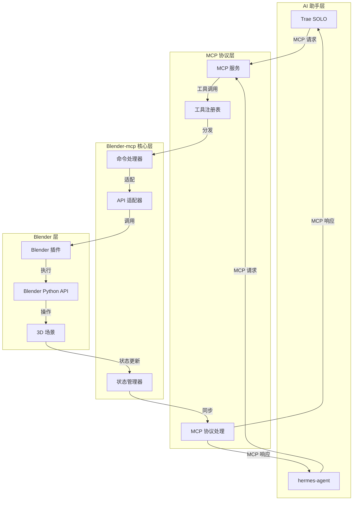
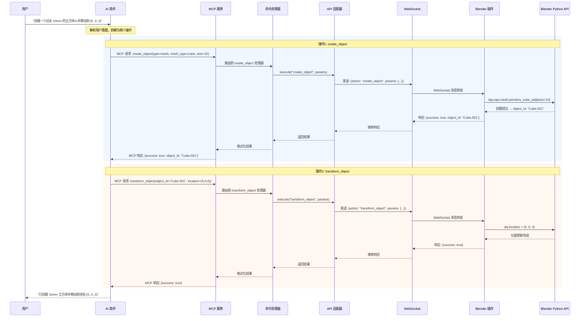

# Blender-mcp 客户端系统架构文档

> **文档编号**：SAD-001
> **文档版本**：v1.4
> **最后更新**：2026-05-25
> **作者**：Blender-mcp 项目组
> **审核状态**：已审核
> **关联文档**：[需求文档](./需求文档.md) | [开发计划](./开发计划.md)

---

## 目录

- [1. 架构设计](#1-架构设计)
- [2. 技术选型](#2-技术选型)
- [3. 模块划分](#3-模块划分)
- [4. MCP 工具定义](#4-mcp-工具定义)
- [5. 通信协议](#5-通信协议)
- [6. 数据模型](#6-数据模型)
- [7. 部署与运行](#7-部署与运行)
- [8. 安全性设计](#8-安全性设计)
- [9. 错误处理策略](#9-错误处理策略)
- [10. 日志与监控策略](#10-日志与监控策略)
- [11. 配置管理](#11-配置管理)
- [12. 依赖项版本清单](#12-依赖项版本清单)
- [13. API 适配器详细设计](#13-api适配器详细设计)
- [14. WebSocket 连接协议细节](#14-websocket-连接协议细节)
- [15. MCP 工具注册机制](#15-mcp-工具注册机制)
- [16. 性能优化方案](#16-性能优化方案)
- [17. 扩展性设计](#17-扩展性设计)
- [18. 优雅降级策略](#18-优雅降级策略)
- [19. 事务性操作设计](#19-事务性操作设计)
- [术语表](#术语表)

---

## 1. 架构设计



## 2. 技术选型

### 2.1 核心技术栈
- **编程语言**：Python 3.x（与 Blender 内置 Python 一致）
- **MCP 框架**：Model Context Protocol SDK
- **通信方式**：WebSocket / stdio
- **Blender 集成**：bpy（Blender Python API）

### 2.2 依赖库
- `mcp`：MCP 协议实现
- `bpy`：Blender Python API（Blender 内置）
- `asyncio`：异步处理
- `json`：数据序列化

## 3. 模块划分

### 3.1 目录结构
```
blender-mcp/
├── mcp_server/          # MCP 服务
│   ├── __init__.py
│   ├── server.py        # MCP 服务入口
│   ├── tools.py         # 工具定义
│   └── schemas.py       # 数据模型
├── blender_plugin/      # Blender 插件
│   ├── __init__.py
│   ├── addon.py         # 插件注册
│   ├── connection.py    # 连接管理
│   └── operators.py     # Blender 操作封装
├── core/                # 核心逻辑
│   ├── command.py       # 命令处理器
│   ├── adapter.py       # API 适配器
│   └── state.py         # 状态管理
├── config/              # 配置
│   └── settings.py
├── tests/               # 测试
├── requirements.txt
└── README.md
```

### 3.2 核心模块职责

| 模块 | 职责 |
|------|------|
| mcp_server/server.py | 启动 MCP 服务，注册工具，处理请求 |
| mcp_server/tools.py | 定义 MCP 工具接口，参数验证 |
| blender_plugin/addon.py | Blender 插件的注册与注销 |
| blender_plugin/connection.py | 管理与 MCP 服务的连接 |
| core/command.py | 将 MCP 工具调用转换为内部命令 |
| core/adapter.py | 适配 Blender Python API |
| core/state.py | 管理 Blender 场景状态，提供查询接口 |

## 4. MCP 工具定义

> 📎 **关联文档**：工具对应的功能需求详见 [需求文档 §13 - 需求追踪矩阵](./需求文档.md#13-需求追踪矩阵)；工具的开发实现顺序参见 [开发计划 - 阶段二](./开发计划.md#阶段二3D 打印建模核心功能开发)。

### 4.1 工具列表（按优先级排序）
| 工具名称 | 描述 | 优先级 |
|----------|------|--------|
| ping | 连接验证与心跳检测 | 高 |
| create_object | 创建 3D 对象 | 高 |
| transform_object | 变换对象（移动、旋转、缩放） | 高 |
| modify_mesh | 修改网格（布尔运算、倒角、挤出、实体化等） | 高 |
| export_model | 导出模型（优先支持 STL/OBJ 3D 打印格式） | 高 |
| import_model | 导入模型（支持 STL/OBJ） | 高 |
| check_model | 检查3D 打印模型（非流形、法线、壁厚） | 高 |
| repair_model | 修复3D 打印模型问题 | 高 |
| detect_overhangs | 检测悬垂面 | 高 |
| optimize_orientation | 优化打印方向 | 高 |
| rotate_to_orientation | 旋转模型到指定方向 | 高 |
| set_shrinkage_compensation | 设置收缩补偿 | 高 |
| validate_printability | 验证可打印性 | 高 |
| delete_object | 删除对象 | 高 |
| save_project | 保存项目 | 中 |
| open_project | 打开项目 | 中 |
| get_scene_info | 获取场景信息 | 中 |
| list_objects | 列出场景中的对象 | 中 |
| generate_support_preview | 生成支撑结构预览 | 中 |
| export_slicer_preset | 导出切片器预设 | 中 |
| undo | 撤销操作 | 中 |
| redo | 重做操作 | 中 |
| set_material | 设置材质 | 低 |
| render_scene | 渲染场景 | 低 |

### 4.2 工具接口示例
```typescript
// 创建对象工具
interface CreateObjectParams {
  type: 'mesh' | 'curve';
  name?: string;
  location?: [number, number, number];
  rotation?: [number, number, number];
  scale?: [number, number, number];
  mesh_type?: 'cube' | 'sphere' | 'cylinder' | 'plane' | 'cone' | 'torus';
}

interface CreateObjectResult {
  success: boolean;
  object_id: string;
  name: string;
  message?: string;
}

// 导出模型工具（3D 打印优先）
interface ExportModelParams {
  object_id?: string;
  format: 'stl' | 'obj';
  filepath: string;
  options?: {
    scale?: number;
    use_selection?: boolean;
    ascii?: boolean;
  };
}

interface ExportModelResult {
  success: boolean;
  filepath: string;
  message?: string;
}

// 检查模型工具
interface CheckModelParams {
  object_id: string;
  checks?: ('non_manifold' | 'normals' | 'thickness')[];
  min_thickness?: number;
}

interface CheckModelResult {
  success: boolean;
  issues: {
    type: string;
    count: number;
    details?: string;
  }[];
  is_printable: boolean;
}

// 修改网格工具
interface ModifyMeshParams {
  object_id: string;
  operation: 'boolean_union' | 'boolean_difference' | 'boolean_intersect' | 'bevel' | 'extrude' | 'solidify';
  target_object_id?: string;
  parameters?: {
    [key: string]: any;
  };
}

interface ModifyMeshResult {
  success: boolean;
  object_id: string;
  message?: string;
}
```

## 5. 通信协议

### 5.1 连接方式
- **主模式**：MCP 服务通过 stdio 与 AI 助手通信
- **Blender 连接**：Blender 插件通过 WebSocket 与 MCP 服务通信

### 5.2 消息格式
```json
{
  "id": "unique-message-id",
  "type": "request|response|event",
  "action": "create_object|transform_object|...",
  "payload": {},
  "timestamp": "2024-01-01T00:00:00Z"
}
```

### 5.3 典型交互时序图

以下展示一次 `create_object` + `transform_object` 的完整交互时序：



> 📎 **关联文档**：异常分支的时序处理详见 [需求文档 §5.1 - 异常分支流程](./需求文档.md#51-异常分支流程)。

## 6. 数据模型

### 6.1 场景对象模型
```python
@dataclass
class SceneObject:
    id: str
    name: str
    type: str
    location: Tuple[float, float, float]
    rotation: Tuple[float, float, float]
    scale: Tuple[float, float, float]
    parent_id: Optional[str] = None
    material_ids: List[str] = field(default_factory=list)
```

### 6.2 材质模型
```python
@dataclass
class Material:
    id: str
    name: str
    base_color: Tuple[float, float, float, float]
    roughness: float
    metallic: float
```

## 7. 部署与运行

### 7.1 部署方式
1. **Blender 插件安装**：将 `blender_plugin` 目录复制到 Blender 插件目录
2. **MCP 服务配置**：在 Trae SOLO/hermes-agent 配置文件中添加 MCP 服务

### 7.1.1 部署拓扑图

```mermaid
graph TB
    subgraph "用户工作站"
        User["👤 用户"]
    end

    subgraph "AI 助手运行时"
        Trae["Trae SOLO"]
        Hermes["hermes-agent"]
        MCP_Client["MCP 客户端 (stdio)"]
    end

    subgraph "Blender-mcp 中间件"
        MCP_Server["MCP 服务\n(Python 进程)"]
        Tool_Registry["工具注册表"]
        Command_Handler["命令处理器"]
        API_Adapter["API 适配器"]
        State_Manager["状态管理器"]
    end

    subgraph "Blender 运行时"
        Blender_Plugin["Blender 插件\n(addon.py)"]
        WebSocket_Server["WebSocket 服务\n(127.0.0.1:8765)"]
        Blender_Core["Blender 内核\n(Python bpy API)"]
        Scene["3D 场景数据"]
    end

    subgraph "文件系统"
        Model_Files["STL/OBJ 文件"]
        Project_Files[".blend 项目文件"]
        Config_Files["配置文件\n(config.yaml)"]
    end

    User -->|自然语言指令| Trae
    User -->|自然语言指令| Hermes
    Trae -->|MCP 协议 (stdio)| MCP_Client
    Hermes -->|MCP 协议 (stdio)| MCP_Client
    MCP_Client <-->|MCP 请求/响应| MCP_Server
    MCP_Server --> Tool_Registry
    Tool_Registry --> Command_Handler
    Command_Handler --> API_Adapter
    API_Adapter -->|WebSocket| WebSocket_Server
    WebSocket_Server <--> Blender_Plugin
    Blender_Plugin --> Blender_Core
    Blender_Core --> Scene
    Scene -->|状态变更| State_Manager
    State_Manager -->|状态同步| MCP_Server
    Blender_Core -->|读写| Model_Files
    Blender_Core -->|读写| Project_Files
    MCP_Server -->|读取| Config_Files
```

> 📎 **关联文档**：部署拓扑中的组件职责详见 [需求文档 §2 - 核心功能](./需求文档.md#2-核心功能)。

### 7.2 启动流程
1. 启动 Blender，启用 Blender-mcp 插件
2. 配置插件连接参数
3. 在 AI 助手中配置并启动 MCP 客户端
4. 开始使用自然语言控制 Blender

### 7.3 export_model 数据流图

以下展示一次 `export_model`（STL 格式导出）操作的数据变换路径：

```mermaid
flowchart LR
    subgraph "请求层"
        NAT["AI 助手自然语言指令\n'导出为 STL'"]
        MCP_REQ["MCP 请求\n{action: export_model, format: stl, filepath: ...}"]
    end

    subgraph "处理层"
        VALIDATE["参数校验\n(schemas.py)"]
        RESOLVE["路径解析与白名单校验\n(security.py)"]
        PREPARE["导出前准备\n(adapter.py)"]
    end

    subgraph "Blender 执行层"
        APPLY_MOD["应用修改器\n(apply_modifiers)"]
        TRIANGULATE["三角化\n(triangulate)"]
        CHECK_WATERTIGHT["水密性检查\n(check_watertight)"]
        WRITE_STL["写入 STL 文件\n(bpy.ops.export_mesh.stl)"]
    end

    subgraph "响应层"
        VERIFY["验证导出结果\n(文件大小 > 0, STL 头正确)"]
        RESULT["MCP 响应\n{success: true, filepath: ..., file_size: ...}"]
        FEEDBACK["AI 助手反馈\n'已成功导出到...'"]
    end

    subgraph "文件系统"
        STL_FILE["STL 文件\n(.stl binary/ascii)"]
    end

    NAT --> MCP_REQ
    MCP_REQ --> VALIDATE
    VALIDATE -->|校验通过| RESOLVE
    VALIDATE -->|校验失败| RESULT
    RESOLVE -->|路径合法| PREPARE
    RESOLVE -->|路径非法| RESULT
    PREPARE --> APPLY_MOD
    APPLY_MOD --> TRIANGULATE
    TRIANGULATE --> CHECK_WATERTIGHT
    CHECK_WATERTIGHT -->|通过| WRITE_STL
    CHECK_WATERTIGHT -->|警告| WRITE_STL
    WRITE_STL --> STL_FILE
    STL_FILE --> VERIFY
    VERIFY --> RESULT
    RESULT --> FEEDBACK
```



> 📎 **关联文档**：导出参数约束详见 [需求文档 §11.1.4 - export_model 参数约束](./需求文档.md#1114-exportmodel-参数约束)。

## 8. 安全性设计

### 8.1 安全策略总则
- 所有通信严格限制在本地回环地址（127.0.0.1），不绑定外部网络接口
- WebSocket 服务仅监听 localhost，不暴露到局域网或公网
- 不传输任何用户敏感数据（密钥、令牌、个人身份信息）

### 8.2 通信安全

| 层级 | 措施 | 说明 |
|------|------|------|
| 网络层 | 绑定 127.0.0.1 | 禁止外部访问 |
| 传输层 | 可选 TLS | 本地通信默认明文，预留 TLS 支持 |
| 应用层 | 消息校验 | 校验 MCP 消息格式和参数合法性 |

### 8.3 文件系统安全

```python
# 文件访问白名单配置
ALLOWED_PATHS = [
    "~/blender-projects/",
    "~/Downloads/",
    "~/Desktop/",
    "/tmp/blender-mcp/",
]

# 路径规范化与校验
def validate_path(filepath: str) -> bool:
    resolved = os.path.realpath(os.path.expanduser(filepath))
    return any(resolved.startswith(os.path.realpath(os.path.expanduser(p)))
               for p in ALLOWED_PATHS)
```

### 8.4 输入验证

- 所有 MCP 工具参数在 `tools.py` 层进行类型和范围校验
- 字符串参数进行长度限制，防止注入攻击
- 数值参数进行范围校验（如缩放比例限制在 0.001 ~ 1000 之间）
- 文件路径必须通过白名单校验后才允许读写

### 8.5 操作审计

- 记录所有 MCP 工具调用的发起方、时间戳、参数摘要和执行结果
- 审计日志存储在本地，不通过网络传输
- 默认保留最近 30 天的操作记录

## 9. 错误处理策略

### 9.1 错误分类

| 错误类型 | 示例 | 处理策略 |
|----------|------|----------|
| 参数错误 | 无效的对象类型、越界的坐标值 | 返回明确的错误码和描述，指引用户修正输入 |
| 连接错误 | WebSocket 断开、Blender 未响应 | 自动重连（最多 3 次），超时后通知用户 |
| 操作错误 | 对象不存在、操作不允许 | 返回错误详情，包含当前可用对象列表 |
| 内部错误 | Blender API 异常、Python 运行时错误 | 捕获异常、记录堆栈、返回通用错误信息 |
| 资源错误 | 内存不足、磁盘空间不足 | 预检资源，提前返回警告 |

### 9.2 错误响应格式

```json
{
  "success": false,
  "error": {
    "code": "OBJECT_NOT_FOUND",
    "message": "对象 'Cube.001' 不存在，当前场景包含以下对象：Cube, Sphere, Cylinder",
    "details": {
      "object_id": "Cube.001",
      "available_objects": ["Cube", "Sphere", "Cylinder"]
    },
    "recoverable": true
  }
}
```

### 9.3 错误码定义

| 错误码 | HTTP 类比 | 说明 |
|--------|-----------|------|
| `INVALID_PARAMETER` | 400 | 参数格式或值无效 |
| `OBJECT_NOT_FOUND` | 404 | 指定的对象不存在 |
| `OPERATION_NOT_ALLOWED` | 403 | 操作不被允许（如对只读对象修改） |
| `CONNECTION_ERROR` | 503 | 与 Blender 通信异常 |
| `INTERNAL_ERROR` | 500 | 内部运行时错误 |
| `RESOURCE_EXHAUSTED` | 507 | 资源不足 |
| `UNSUPPORTED_FORMAT` | 415 | 不支持的文件格式 |

### 9.4 异常处理流程

```python
try:
    result = execute_blender_operation(params)
    return {"success": True, "data": result}
except ObjectNotFoundError as e:
    return error_response("OBJECT_NOT_FOUND", str(e), recoverable=True)
except InvalidParameterError as e:
    return error_response("INVALID_PARAMETER", str(e), recoverable=True)
except ConnectionError as e:
    logger.error(f"Blender connection lost: {e}")
    reconnect()
    return error_response("CONNECTION_ERROR", "正在尝试重新连接...", recoverable=True)
except Exception as e:
    logger.exception("Unexpected internal error")
    return error_response("INTERNAL_ERROR", "操作失败，请稍后重试", recoverable=False)
```

## 10. 日志与监控策略

### 10.1 日志架构

```
blender-mcp/
├── logs/
│   ├── mcp_server.log      # MCP 服务日志
│   ├── blender_plugin.log  # Blender 插件日志
│   └── audit.log           # 操作审计日志
```

### 10.2 日志级别与使用规范

| 级别 | 使用场景 | 示例 |
|------|----------|------|
| DEBUG | 开发调试信息，参数详情 | `create_object 参数: type=mesh, mesh_type=cube, location=(0,0,0)` |
| INFO | 关键操作节点 | `MCP 服务启动成功，监听 127.0.0.1:8765` |
| WARN | 可恢复的异常 | `WebSocket 连接断开，正在重试 (1/3)` |
| ERROR | 操作失败、异常 | `导出 STL 失败: 权限不足` |

### 10.3 日志格式

```python
LOG_FORMAT = "%(asctime)s [%(levelname)s] %(module)s:%(lineno)d - %(message)s"
LOG_DATE_FORMAT = "%Y-%m-%d %H:%M:%S"
```

日志示例：
```
2025-05-25 14:30:01 [INFO] server:42 - MCP 服务启动成功，监听 127.0.0.1:8765
2025-05-25 14:30:05 [INFO] tools:18 - 工具调用: create_object, type=mesh, mesh_type=cube
2025-05-25 14:30:05 [DEBUG] adapter:55 - bpy.ops.mesh.primitive_cube_add(size=2.0, location=(0,0,0))
2025-05-25 14:30:06 [INFO] tools:25 - create_object 完成: object_id=Cube.001, time=0.85s
```

### 10.4 日志轮转策略

- 按文件大小轮转：单文件最大 10MB
- 保留最近 5 个归档文件
- 审计日志按天轮转，保留 30 天

### 10.5 监控指标

| 指标 | 采集方式 | 用途 |
|------|----------|------|
| 工具调用次数 | 计数器 | 评估功能使用频率 |
| 工具调用延迟 | 直方图 | 性能分析 |
| 错误率 | 计数器 | 稳定性监控 |
| WebSocket 连接状态 | 指标 | 连接健康检测 |
| Blender 场景复杂度 | 快照 | 性能预警 |

### 10.6 日志配置

```python
import logging
from logging.handlers import RotatingFileHandler

def setup_logging(log_dir: str, level: str = "INFO"):
    handler = RotatingFileHandler(
        f"{log_dir}/mcp_server.log",
        maxBytes=10 * 1024 * 1024,
        backupCount=5
    )
    logging.basicConfig(
        level=getattr(logging, level.upper()),
        format="%(asctime)s [%(levelname)s] %(name)s:%(lineno)d - %(message)s",
        handlers=[handler, logging.StreamHandler()]
    )
```

## 11. 配置管理

### 11.1 配置文件结构

```yaml
# config.yaml
server:
  host: "127.0.0.1"
  port: 8765
  ws_max_message_size: 10485760  # 10MB
  ws_ping_interval: 30           # 秒
  ws_ping_timeout: 10            # 秒

blender:
  plugin_auto_connect: true
  reconnect_max_retries: 3
  reconnect_delay: 2             # 秒

logging:
  level: "INFO"                  # DEBUG|INFO|WARN|ERROR
  dir: "./logs"
  audit_retention_days: 30

security:
  allowed_paths:
    - "~/blender-projects/"
    - "~/Downloads/"
    - "~/Desktop/"
  max_file_size_mb: 500
  enable_audit_log: true

limits:
  max_objects_per_scene: 1000
  max_export_file_size_mb: 500
  operation_timeout_seconds: 60
```

### 11.2 配置加载流程

1. 默认配置：`config/defaults.yaml` 提供所有配置项的默认值
2. 用户配置：`config/config.yaml` 覆盖默认值
3. 环境变量：`BLENDER_MCP_*` 前缀的环境变量最高优先级

```python
import os
import yaml

def load_config():
    config = load_defaults("config/defaults.yaml")
    user_config = load_yaml("config/config.yaml")
    config.update(user_config)

    # 环境变量覆盖
    for key, value in os.environ.items():
        if key.startswith("BLENDER_MCP_"):
            config_key = key[12:].lower()
            config[config_key] = value

    return config
```

### 11.3 配置校验

- 启动时校验所有必填配置项是否存在
- 端口号范围检查（1024-65535）
- 路径合法性检查
- 日志级别有效性检查
- 配置错误时使用默认值并输出 WARN 日志，不中断启动

## 12. 依赖项版本清单

### 12.1 Python 运行时依赖

| 包名 | 版本要求 | 用途 | 是否必需 |
|------|----------|------|----------|
| `mcp` | >=1.0.0, <2.0.0 | MCP 协议核心 SDK | 是 |
| `bpy` | Blender 4.2+ 内置 | Blender Python API | 是 |
| `websockets` | >=12.0, <14.0 | WebSocket 通信 | 是 |
| `pyyaml` | >=6.0, <7.0 | 配置文件解析 | 是 |
| `numpy` | >=1.24, <2.0 | 网格数据处理 | 是 |
| `trimesh` | >=4.0, <5.0 | STL/OBJ 网格处理与修复 | 是 |
| `pydantic` | >=2.0, <3.0 | 数据模型校验 | 是 |
| `psutil` | >=5.9, <7.0 | 系统资源监控 | 否 |

### 12.2 开发依赖

| 包名 | 版本要求 | 用途 | 是否必需 |
|------|----------|------|----------|
| `pytest` | >=8.0, <9.0 | 单元测试框架 | 是 |
| `pytest-asyncio` | >=0.23, <1.0 | 异步测试支持 | 是 |
| `pytest-cov` | >=5.0, <6.0 | 测试覆盖率 | 是 |
| `pylint` | >=3.0, <4.0 | 代码静态分析 | 是 |
| `black` | >=24.0, <25.0 | 代码格式化 | 是 |
| `mypy` | >=1.8, <2.0 | 类型检查 | 是 |

### 12.3 系统依赖

| 依赖 | 版本要求 | 说明 |
|------|----------|------|
| Blender | >=4.2, 推荐 4.3+ | 底层 3D 引擎 |
| Python | 跟随 Blender 内置版本 | Blender 4.2 内置 Python 3.11 |
| 操作系统 | Windows 10+ / macOS 12+ / Ubuntu 22.04+ | 跨平台支持 |

### 12.4 requirements.txt 示例

```
mcp>=1.0.0,<2.0.0
websockets>=12.0,<14.0
pyyaml>=6.0,<7.0
numpy>=1.24,<2.0
trimesh>=4.0,<5.0
pydantic>=2.0,<3.0
psutil>=5.9,<7.0
```

## 13. API适配器详细设计

### 13.1 bpy上下文切换策略

Blender Python API 的核心约束是：大部分 `bpy.ops.*` 操作必须在正确的 **上下文（Context）** 中执行，否则会抛出 `RuntimeError: Operator bpy.ops.xxx.poll() failed`。

#### 13.1.1 两种上下文切换模式对比

| 特性 | `context_override` | `temp_override` (4.0+) |
|------|-------------------|------------------------|
| 引入版本 | Blender 2.8 | Blender 4.0 |
| 修改原始context | 是（原地修改） | 否（创建临时副本） |
| 线程安全性 | 低（共享可变状态） | 高（不可变副本） |
| 恢复方式 | 手动恢复 | 自动恢复（with语句退出时） |
| API风格 | 命令式 | 上下文管理器 |
| 侧边栏UI兼容 | 可能残留状态 | 完全隔离 |
| 推荐场景 | 兼容旧版Blender | Blender 4.0+ 新代码 |

#### 13.1.2 上下文切换实现

```python
import bpy
from contextlib import contextmanager
from typing import Optional, Any
import logging

logger = logging.getLogger(__name__)

class BlenderContextAdapter:
    """
    bpy上下文管理器，自动选择 override 或 temp_override 策略。
    Blender 4.0+ 优先使用 temp_override，旧版回退到手动 override。
    """

    HAS_TEMP_OVERRIDE = hasattr(bpy.types.Context, 'temp_override')

    @staticmethod
    def _build_override_context(
        area_type: str = 'VIEW_3D',
        region_type: str = 'WINDOW',
        space_type: str = 'VIEW_3D'
    ) -> dict:
        """
        构造上下文覆盖字典。
        遍历当前屏幕的所有区域，找到匹配的 area/region/space_data。
        """
        for window in bpy.context.window_manager.windows:
            screen = window.screen
            for area in screen.areas:
                if area.type == area_type:
                    for region in area.regions:
                        if region.type == region_type:
                            override = {
                                'window': window,
                                'screen': screen,
                                'area': area,
                                'region': region,
                                'space_data': area.spaces.active,
                            }
                            # 可选：设置3D视图特定属性
                            if space_type == 'VIEW_3D':
                                override['scene'] = bpy.context.scene
                                override['view_layer'] = bpy.context.view_layer
                            return override
        raise RuntimeError(
            f"无法找到匹配的上下文: area={area_type}, region={region_type}"
        )

    @classmethod
    @contextmanager
    def override_context(
        cls,
        area_type: str = 'VIEW_3D',
        region_type: str = 'WINDOW',
        space_type: str = 'VIEW_3D'
    ):
        """
        上下文管理器：为块内代码提供有效的 bpy 上下文。

        用法:
            with BlenderContextAdapter.override_context() as ctx:
                bpy.ops.mesh.primitive_cube_add()  # 安全执行
        """
        if cls.HAS_TEMP_OVERRIDE:
            # Blender 4.0+: 使用 temp_override
            override = cls._build_override_context(
                area_type, region_type, space_type
            )
            with bpy.context.temp_override(**override):
                yield bpy.context
        else:
            # Blender 3.x: 手动 override + 恢复
            original_context = {}
            ctx = bpy.context
            override = cls._build_override_context(
                area_type, region_type, space_type
            )
            for key, value in override.items():
                original = getattr(ctx, key, None)
                original_context[key] = original
                try:
                    setattr(ctx, key, value)
                except AttributeError:
                    pass
            try:
                yield ctx
            finally:
                for key, original_value in original_context.items():
                    if original_value is not None:
                        try:
                            setattr(ctx, key, original_value)
                        except AttributeError:
                            pass

    @classmethod
    def execute_in_context(cls, func, *args, **kwargs):
        """
        在正确的上下文中执行任意函数。
        自动检测并处理常见的上下文错误。

        Args:
            func: 需要在正确上下文中执行的callable
            *args, **kwargs: 传递给func的参数

        Returns:
            func的返回值

        Raises:
            RuntimeError: 上下文不可用且无法恢复时
        """
        try:
            return func(*args, **kwargs)
        except RuntimeError as e:
            if 'poll() failed' in str(e) or 'context is incorrect' in str(e):
                logger.debug(f"上下文不匹配，尝试切换: {e}")
                with cls.override_context():
                    return func(*args, **kwargs)
            raise
```

#### 13.1.3 上下文切换的决策树

```
操作请求
    │
    ├─ 是否是 bpy.ops.* 操作？ ──否──→ 直接执行（bpy.data / bpy.context 属性读写）
    │
    └─ 是
        │
        ├─ 在 Blender 交互模式下？ ──否──→ 使用 override_context() 包装
        │   （如：后台渲染无UI上下文）
        │
        └─ 是
            │
            ├─ 当前 area.type 是否匹配？ ──是──→ 直接执行 bpy.ops.xxx()
            │
            └─ 否 ──→ 使用 override_context(area_type=...) 包装
```

### 13.2 模态操作的异步化处理

Blender 的模态操作（如 `bpy.ops.transform.translate('INVOKE_DEFAULT')`）会阻塞执行线程直到用户交互结束。在 MCP 远程调用场景中，必须将其转为非模态操作。

#### 13.2.1 模态操作分类与处理策略

```python
from enum import Enum
import bpy

class ModalHandling(Enum):
    """模态操作的三种处理策略"""
    DIRECT = "direct"       # 直接调用 EXEC 上下文，跳过交互
    SIMULATE = "simulate"   # 通过数值参数模拟模态行为
    REJECT = "reject"       # 不支持，返回明确错误

# 模态操作映射表
MODAL_OPERATOR_MAP = {
    'transform.translate': {
        'strategy': ModalHandling.SIMULATE,
        'replacement': lambda obj, value: setattr(
            obj, 'location', (
                obj.location[0] + value[0],
                obj.location[1] + value[1],
                obj.location[2] + value[2],
            )
        ),
        'note': '通过直接设置 location 属性替代',
    },
    'transform.rotate': {
        'strategy': ModalHandling.SIMULATE,
        'replacement': lambda obj, value: setattr(
            obj, 'rotation_euler', value
        ),
        'note': '通过直接设置 rotation_euler 属性替代',
    },
    'transform.resize': {
        'strategy': ModalHandling.SIMULATE,
        'replacement': lambda obj, value: setattr(
            obj, 'scale', value
        ),
        'note': '通过直接设置 scale 属性替代',
    },
    'view3d.modal_operator': {
        'strategy': ModalHandling.REJECT,
        'note': '视图导航不支持远程调用，请使用 set_view 工具',
    },
    'mesh.knife_tool': {
        'strategy': ModalHandling.REJECT,
        'note': '刻刀工具不支持远程调用，请使用布尔差运算替代',
    },
    'object.mode_set': {
        'strategy': ModalHandling.DIRECT,
        'note': '通过切换 mode 属性直接执行（在上下文包装内）',
    },
}


class ModalOperatorHandler:
    """模态操作调度器"""

    @classmethod
    def execute(
        cls, operator_id: str, params: dict
    ) -> dict:
        """
        执行操作符，自动处理模态/非模态差异。

        Args:
            operator_id: 操作符ID，如 'transform.translate'
            params: 操作参数字典

        Returns:
            {'success': bool, 'result': Any, 'note': str}
        """
        if operator_id not in MODAL_OPERATOR_MAP:
            # 未知操作符：尝试 EXEC_DEFAULT
            try:
                op_func = eval(f'bpy.ops.{operator_id}')
                result = op_func('EXEC_DEFAULT', **params)
                return {'success': True, 'result': result, 'note': ''}
            except Exception as e:
                return {'success': False, 'result': str(e),
                        'note': f'操作符 {operator_id} 执行失败'}

        handler = MODAL_OPERATOR_MAP[operator_id]

        if handler['strategy'] == ModalHandling.DIRECT:
            try:
                op_func = eval(f'bpy.ops.{operator_id}')
                result = op_func('EXEC_DEFAULT', **params)
                return {'success': True, 'result': result, 'note': ''}
            except Exception as e:
                return {'success': False, 'result': str(e),
                        'note': handler.get('note', '')}

        elif handler['strategy'] == ModalHandling.SIMULATE:
            # 用属性赋值替代模态操作
            obj_name = params.get('object_name')
            obj = bpy.data.objects.get(obj_name)
            if obj is None:
                return {'success': False, 'result': '对象不存在',
                        'note': f'对象 {obj_name} 未找到'}
            try:
                replacement = handler['replacement']
                # 获取数值参数
                if 'value' in params:
                    replacement(obj, params['value'])
                else:
                    replacement(obj, params)
                return {'success': True, 'result': 'ok',
                        'note': handler.get('note', '')}
            except Exception as e:
                return {'success': False, 'result': str(e),
                        'note': handler.get('note', '')}

        elif handler['strategy'] == ModalHandling.REJECT:
            return {'success': False, 'result': '不支持的操作',
                    'note': handler.get('note', '')}
```

### 13.3 撤销/重做集成设计

Blender 的 undo/redo 系统基于全局的 undo stack，MCP 的远程调用必须与这个系统正确交互。

#### 13.3.1 操作分组策略

```python
import bpy
from typing import List, Callable
from dataclasses import dataclass, field
from contextlib import contextmanager

@dataclass
class UndoStep:
    """一个undo步骤的元数据"""
    description: str
    operations: List[str] = field(default_factory=list)
    timestamp: float = 0.0

class UndoIntegration:
    """
    撤销/重做集成管理器。
    每个工具调用可能包含多个bpy操作，需要将它们分组为一个逻辑undo步骤。
    """

    def __init__(self):
        self._undo_stack_depth = 0
        self._pending_step: UndoStep | None = None

    @contextmanager
    def grouped_undo(self, description: str):
        """
        将上下文管理器内的所有 bpy 操作合并为一个 undo 步骤。

        用法:
            with undo_integration.grouped_undo("创建螺栓孔"):
                bpy.ops.mesh.primitive_cylinder_add(...)
                bpy.ops.object.modifier_add(type='BOOLEAN')
                bpy.ops.object.modifier_apply(...)

        当用户在Blender中按 Ctrl+Z 时，上述三个操作会一起撤销。
        """
        step = UndoStep(description=description)
        self._pending_step = step
        try:
            # Blender 2.9+ 支持 undo group
            if hasattr(bpy.ops.ed, 'undo_push'):
                bpy.ops.ed.undo_push(message=description)
            yield step
        finally:
            self._pending_step = None
            # 操作完成后推送最终状态到undo栈
            if hasattr(bpy.ops.ed, 'undo_push'):
                bpy.ops.ed.undo_push(message=f"{description} (完成)")

    def make_undoable(self, func: Callable) -> Callable:
        """
        装饰器：将函数内的所有 bpy 操作标记为可撤销的原子操作。

        Args:
            func: 需要撤销支持的函数

        Returns:
            包装后的函数
        """

        def wrapper(*args, **kwargs):
            desc = kwargs.pop('_undo_description',
                              f'工具操作: {func.__name__}')
            with self.grouped_undo(desc):
                result = func(*args, **kwargs)
            return result

        return wrapper

    @staticmethod
    def get_undo_stack_info() -> dict:
        """获取当前undo栈的状态信息"""
        try:
            # Blender没有直接暴露undo栈的公开API
            # 通过preferences获取最大undo步数
            prefs = bpy.context.preferences.edit
            return {
                'undo_steps_max': prefs.undo_steps,
                'undo_memory_limit': prefs.undo_memory_limit,
                'global_undo_enabled': prefs.use_global_undo,
            }
        except Exception:
            return {
                'undo_steps_max': 32,
                'undo_memory_limit': 0,
                'global_undo_enabled': True,
            }

    @staticmethod
    def undo():
        """执行一次撤销操作"""
        if hasattr(bpy.ops.ed, 'undo'):
            bpy.ops.ed.undo()

    @staticmethod
    def redo():
        """执行一次重做操作"""
        if hasattr(bpy.ops.ed, 'redo'):
            bpy.ops.ed.redo()

    @staticmethod
    def clear_undo_history():
        """清除undo历史（可用于敏感操作后清理）"""
        if hasattr(bpy.ops.ed, 'undo_history'):
            # 先push一个空步骤
            bpy.ops.ed.undo_push(message="清理点")
            bpy.ops.ed.undo()
            # 注意：Blender的undo栈不支持直接清空，
            # 这里通过撤销到清理点来间接实现
```

#### 13.3.2 Undo/Redo 工具接口

```typescript
// MCP工具: undo / redo
interface UndoRedoParams {
  steps?: number;  // 撤销/重做步数，默认1
}

interface UndoRedoResult {
  success: boolean;
  steps_performed: number;
  remaining_steps: number;  // 剩余可撤销步数
  description?: string;     // 撤销的操作描述
}
```

### 13.4 编辑器模式自动切换

Blender 的编辑器模式（`bpy.context.mode`）决定了哪些操作可用。MCP 工具调用前必须确保处于正确的模式。

#### 13.4.1 模式兼容矩阵

| 当前模式 | 可执行操作 | 不可执行操作 |
|----------|-----------|-------------|
| `OBJECT` | 对象选择/变换/修改器/导入导出 | 顶点编辑/面操作/UV编辑 |
| `EDIT_MESH` | 顶点/边/面编辑、挤出、倒角 | 对象级变换、修改器应用 |
| `EDIT_CURVE` | 曲线控制点编辑 | 网格编辑操作 |
| `POSE` | 骨架姿势调整 | 网格编辑、对象变换 |
| `SCULPT` | 雕刻工具 | 几乎所有常规编辑操作 |
| `WEIGHT_PAINT` | 权重绘制 | 顶点编辑、变换 |
| `TEXTURE_PAINT` | 纹理绘制 | 网格编辑 |

#### 13.4.2 模式自动切换实现

```python
import bpy
from enum import Enum
from typing import Optional

class BlenderMode(Enum):
    OBJECT = 'OBJECT'
    EDIT_MESH = 'EDIT'
    EDIT_CURVE = 'EDIT_CURVE'
    POSE = 'POSE'
    SCULPT = 'SCULPT'
    WEIGHT_PAINT = 'WEIGHT_PAINT'
    TEXTURE_PAINT = 'TEXTURE_PAINT'

# 工具操作 → 所需模式的映射表
TOOL_MODE_REQUIREMENTS = {
    'create_object': BlenderMode.OBJECT,
    'transform_object': BlenderMode.OBJECT,
    'export_model': BlenderMode.OBJECT,
    'import_model': BlenderMode.OBJECT,
    'check_model': BlenderMode.OBJECT,
    'repair_model': BlenderMode.OBJECT,
    'modify_mesh': BlenderMode.OBJECT,      # 修改器在OBJECT模式操作
    'extrude_faces': BlenderMode.EDIT_MESH,  # 挤出需要EDIT模式
    'bevel_edges': BlenderMode.EDIT_MESH,    # 倒角需要EDIT模式
    'set_material': BlenderMode.OBJECT,
    'render_scene': BlenderMode.OBJECT,
}

class ModeSwitcher:
    """编辑器模式自动切换器"""

    @classmethod
    def ensure_mode(
        cls,
        required_mode: BlenderMode,
        target_object: Optional[bpy.types.Object] = None
    ) -> bool:
        """
        确保Blender处于所需模式，自动切换。

        Args:
            required_mode: 目标模式
            target_object: 目标对象（用于EDIT/POSE模式时指定对象）

        Returns:
            是否成功切换到目标模式
        """
        current_mode = bpy.context.mode

        # OBJECT模式是基础模式，总是可以安全切换回去
        if required_mode == BlenderMode.OBJECT:
            if current_mode != 'OBJECT':
                bpy.ops.object.mode_set(mode='OBJECT')
            return True

        # 需要EDIT_MESH模式
        if required_mode == BlenderMode.EDIT_MESH:
            if target_object is None:
                target_object = bpy.context.active_object
            if target_object is None:
                return False
            if target_object.type != 'MESH':
                return False  # 只有MESH对象支持Edit模式
            if current_mode == 'EDIT_MESH':
                # 验证当前编辑的是否为目标对象
                if bpy.context.edit_object == target_object:
                    return True
                # 否则需要切换到OBJECT再回到EDIT
                bpy.ops.object.mode_set(mode='OBJECT')
            bpy.context.view_layer.objects.active = target_object
            bpy.ops.object.mode_set(mode='EDIT')
            return True

        # POSE模式
        if required_mode == BlenderMode.POSE:
            if target_object is None:
                target_object = bpy.context.active_object
            if target_object is None or target_object.type != 'ARMATURE':
                return False
            if current_mode != 'OBJECT':
                bpy.ops.object.mode_set(mode='OBJECT')
            bpy.context.view_layer.objects.active = target_object
            bpy.ops.object.mode_set(mode='POSE')
            return True

        # 编辑曲线、雕刻、权重绘制等——类似逻辑
        # ...（省略，模式类似EDIT_MESH）

        return False

    @classmethod
    def restore_mode(cls, original_mode: str):
        """恢复到操作前的原始模式"""
        if bpy.context.mode != original_mode:
            try:
                bpy.ops.object.mode_set(mode=original_mode)
            except RuntimeError:
                # 某些模式下无法直接切换（如无对象时）
                pass

    @classmethod
    def with_mode(
        cls,
        required_mode: BlenderMode,
        target_object: Optional[bpy.types.Object] = None
    ):
        """
        上下文管理器装饰器：在函数执行期间临时切换模式。

        用法:
            @ModeSwitcher.with_mode(BlenderMode.EDIT_MESH, target_obj)
            def edit_vertices():
                bpy.ops.mesh.select_all(action='SELECT')
                bpy.ops.mesh.delete(type='VERT')
        """
        def decorator(func):
            def wrapper(*args, **kwargs):
                original = bpy.context.mode
                cls.ensure_mode(required_mode, target_object)
                try:
                    return func(*args, **kwargs)
                finally:
                    cls.restore_mode(original)
            return wrapper
        return decorator
```

---

## 14. WebSocket 连接协议细节

### 14.1 心跳机制规范

#### 14.1.1 心跳参数配置

```yaml
# 心跳相关配置
websocket:
  heartbeat:
    ping_interval: 15        # 客户端每15秒发送一次Ping
    pong_timeout: 10         # 等待Pong响应的超时时间10秒
    max_missed_heartbeats: 3 # 连续丢失3次心跳判定断开
    graceful_close_timeout: 5 # 优雅关闭等待时间
```

#### 14.1.2 心跳协议帧

心跳使用 WebSocket 标准 Ping/Pong 控制帧，不占用消息通道。同时在应用层定义可选的心跳消息，用于携带额外状态信息。

**WebSocket控制帧层（底层）：**
```
客户端 → 服务端:  [WebSocket Ping Frame, payload=timestamp_bytes]
服务端 → 客户端:  [WebSocket Pong Frame, payload=same_timestamp_bytes]
```

**应用层心跳（可选，携带状态）：**
```json
// 客户端 → 服务端 (每ping_interval秒)
{
  "type": "heartbeat",
  "direction": "ping",
  "timestamp": "2025-05-25T14:30:00.000Z",
  "sequence": 42,
  "status": {
    "mode": "OBJECT",
    "active_object": "Cube.001",
    "scene_objects_count": 15,
    "memory_mb": 340.5
  }
}

// 服务端 → 客户端 (pong响应)
{
  "type": "heartbeat",
  "direction": "pong",
  "timestamp": "2025-05-25T14:30:00.015Z",
  "sequence": 42,
  "server_status": {
    "uptime_seconds": 3600,
    "pending_commands": 0,
    "connection_count": 1
  }
}
```

#### 14.1.3 心跳实现

```python
import asyncio
import time
import struct
from typing import Optional

class HeartbeatManager:
    """WebSocket心跳管理器"""

    def __init__(
        self,
        ping_interval: float = 15.0,
        pong_timeout: float = 10.0,
        max_missed: int = 3
    ):
        self.ping_interval = ping_interval
        self.pong_timeout = pong_timeout
        self.max_missed = max_missed

        self._last_pong_time: float = time.monotonic()
        self._missed_count: int = 0
        self._running: bool = False
        self._on_connection_lost: Optional[callable] = None

    @property
    def is_alive(self) -> bool:
        """连接是否仍然存活"""
        return self._missed_count < self.max_missed

    @property
    def latency_ms(self) -> float:
        """估算的往返延迟（毫秒）"""
        return (time.monotonic() - self._last_pong_time) * 1000

    async def send_ping(self, websocket) -> bool:
        """
        发送Ping帧并等待Pong响应。

        Returns:
            True表示收到Pong，False表示超时
        """
        if not self._running:
            return False

        try:
            ping_data = struct.pack('!d', time.time())
            pong_waiter = await websocket.ping(ping_data)
            await asyncio.wait_for(pong_waiter, timeout=self.pong_timeout)
            self._last_pong_time = time.monotonic()
            self._missed_count = 0
            return True
        except asyncio.TimeoutError:
            self._missed_count += 1
            if self._missed_count >= self.max_missed:
                if self._on_connection_lost:
                    self._on_connection_lost()
            return False
        except Exception:
            self._missed_count += 1
            return False

    async def run(self, websocket):
        """启动心跳循环"""
        self._running = True
        while self._running:
            await self.send_ping(websocket)
            await asyncio.sleep(self.ping_interval)

    def stop(self):
        """停止心跳"""
        self._running = False
```

### 14.2 断线重连状态机

#### 14.2.1 状态转换图

```
                    ┌─────────────────────────────────────┐
                    │                                     │
                    ▼                                     │
              ┌──────────┐    connect()    ┌─────────────┐
     ────────▶│DISCONNECTED│──────────────▶│ CONNECTING  │
              └──────────┘                └──────┬──────┘
                    ▲                            │
                    │                ┌────────────┴──────────┐
                    │                │                       │
                    │                ▼                       ▼
                    │         ┌──────────┐           ┌──────────────┐
                    │         │CONNECTED │           │CONNECT_FAILED│
                    │         └────┬─────┘           └──────┬───────┘
                    │              │                        │
                    │    ┌─────────┴─────────┐              │
                    │    │                   │              │
                    │    ▼                   ▼              │
                    │ ┌──────────┐    ┌──────────────┐     │
                    │ │ HEARTBEAT│    │DISCONNECTING │     │
                    │ │ _LOST    │    │  (优雅关闭)   │     │
                    │ └────┬─────┘    └──────┬───────┘     │
                    │      │                 │              │
                    │      ▼                 │              │
                    │ ┌──────────────┐       │              │
                    │ │ RECONNECTING │       │              │
                    │ └──────┬───────┘       │              │
                    │        │               │              │
                    │   ┌────┴────┐          │              │
                    │   │         │          │              │
                    │   ▼         ▼          ▼              │
                    │ ┌────┐  ┌────────┐  ┌──────────┐     │
                    │ │成功│  │重试耗尽│  │正常断开  │     │
                    │ └──┬─┘  └───┬────┘  └──────────┘     │
                    │    │        │                         │
                    │    ▼        │                         │
                    │ ┌──────────┐│                         │
                    └─│CONNECTED ││                         │
                      └──────────┘│                         │
                            ┌─────┘                         │
                            ▼                               │
                      ┌──────────┐                          │
                      │DISCONNECTED│◄────────────────────────┘
                      │ (永久断开) │
                      └──────────┘
```

#### 14.2.2 状态机实现

```python
from enum import Enum, auto
import asyncio
from dataclasses import dataclass, field
from typing import Optional, Callable, Awaitable

class ConnectionState(Enum):
    DISCONNECTED = auto()
    CONNECTING = auto()
    CONNECTED = auto()
    CONNECT_FAILED = auto()
    HEARTBEAT_LOST = auto()
    RECONNECTING = auto()
    DISCONNECTING = auto()

@dataclass
class ReconnectConfig:
    """重连策略配置"""
    max_retries: int = 5              # 最大重试次数
    base_delay: float = 1.0           # 基础延迟（秒）
    max_delay: float = 30.0           # 最大延迟（秒）
    backoff_multiplier: float = 2.0    # 退避乘数
    jitter: float = 0.1               # 抖动因子（0-1）
    reset_after_connected: float = 60.0  # 成功连接后N秒重置重试计数

    def get_delay(self, attempt: int) -> float:
        """
        计算第N次重试的等待时间（指数退避 + 随机抖动）。

        公式: delay = min(base * multiplier^(attempt-1), max) * (1 + jitter * random)
        """
        import random
        delay = min(
            self.base_delay * (self.backoff_multiplier ** (attempt - 1)),
            self.max_delay
        )
        jitter_amount = delay * self.jitter * random.random()
        return delay + jitter_amount


class ReconnectStateMachine:
    """WebSocket断线重连状态机"""

    def __init__(
        self,
        config: ReconnectConfig | None = None,
        on_state_change: Optional[Callable[[ConnectionState, ConnectionState], Awaitable[None]]] = None
    ):
        self.config = config or ReconnectConfig()
        self._state = ConnectionState.DISCONNECTED
        self._retry_count = 0
        self._connected_at: Optional[float] = None
        self._on_state_change = on_state_change

        # 状态转换表: (当前状态, 事件) → (新状态, 动作)
        self._transitions = {
            (ConnectionState.DISCONNECTED, 'connect_request'):
                (ConnectionState.CONNECTING, self._action_connect),
            (ConnectionState.CONNECTING, 'connect_success'):
                (ConnectionState.CONNECTED, self._action_on_connected),
            (ConnectionState.CONNECTING, 'connect_failure'):
                (ConnectionState.CONNECT_FAILED, self._action_on_connect_failed),
            (ConnectionState.CONNECTED, 'heartbeat_lost'):
                (ConnectionState.HEARTBEAT_LOST, self._action_on_heartbeat_lost),
            (ConnectionState.CONNECTED, 'disconnect_request'):
                (ConnectionState.DISCONNECTING, self._action_disconnect),
            (ConnectionState.HEARTBEAT_LOST, 'reconnect_request'):
                (ConnectionState.RECONNECTING, self._action_reconnect),
            (ConnectionState.CONNECT_FAILED, 'retry_request'):
                (ConnectionState.RECONNECTING, self._action_reconnect),
            (ConnectionState.RECONNECTING, 'reconnect_success'):
                (ConnectionState.CONNECTED, self._action_on_connected),
            (ConnectionState.RECONNECTING, 'reconnect_failure'):
                (ConnectionState.CONNECT_FAILED, self._action_on_connect_failed),
            (ConnectionState.DISCONNECTING, 'disconnect_complete'):
                (ConnectionState.DISCONNECTED, self._action_on_disconnected),
        }

    @property
    def state(self) -> ConnectionState:
        return self._state

    async def transition(self, event: str) -> bool:
        """
        触发状态转换。

        Args:
            event: 事件名称

        Returns:
            True 表示转换成功，False 表示无效的转换

        Raises:
            RuntimeError: 重试次数耗尽时
        """
        key = (self._state, event)
        if key not in self._transitions:
            return False  # 无效的状态转换

        new_state, action = self._transitions[key]
        old_state = self._state
        self._state = new_state

        if self._on_state_change:
            await self._on_state_change(old_state, new_state)

        if action:
            await action()

        return True

    async def _action_connect(self):
        """执行连接动作"""
        self._retry_count = 0

    async def _action_on_connected(self):
        """连接成功后的动作"""
        self._connected_at = asyncio.get_event_loop().time()
        # 成功连接后经过reset_after_connected秒，重置重试计数
        if (self._connected_at is not None and
            asyncio.get_event_loop().time() - self._connected_at
                > self.config.reset_after_connected):
            self._retry_count = 0

    async def _action_on_connect_failed(self):
        """连接失败时的动作"""
        self._retry_count += 1
        if self._retry_count > self.config.max_retries:
            self._state = ConnectionState.DISCONNECTED
            raise RuntimeError(
                f"重连尝试已达上限 ({self.config.max_retries})，连接永久断开"
            )
        delay = self.config.get_delay(self._retry_count)
        await asyncio.sleep(delay)

    async def _action_on_heartbeat_lost(self):
        """心跳丢失时的动作"""
        pass  # 状态转换后的重连由调用方触发

    async def _action_reconnect(self):
        """执行重连（延迟等待由 _action_on_connect_failed 处理）"""
        pass  # 实际重连由 ConnectionManager 执行

    async def _action_disconnect(self):
        """执行断开"""
        pass

    async def _action_on_disconnected(self):
        """断开完成后的清理"""
        self._retry_count = 0
```

### 14.3 消息队列与背压处理

#### 14.3.1 队列架构

```
发送方（AI 助手）                   MCP服务                         Blender插件
    │                               │                                │
    │  请求1, 请求2, 请求3...       │                                │
    │ ───────────────────────────▶  │                                │
    │                               │  ┌──────────────────────┐      │
    │                               │  │   PriorityQueue      │      │
    │                               │  │  ┌─────────────────┐ │      │
    │                               │  │  │ 高优先级:        │ │      │
    │                               │  │  │ get_scene_info   │ │      │
    │                               │  │  │ list_objects     │ │      │
    │                               │  │  ├─────────────────┤ │      │
    │                               │  │  │ 中优先级:        │ │      │
    │                               │  │  │ create_object    │ │      │
    │                               │  │  │ transform_object │ │      │
    │                               │  │  ├─────────────────┤ │      │
    │                               │  │  │ 低优先级:        │ │      │
    │                               │  │  │ check_model      │ │      │
    │                               │  │  │ repair_model     │ │      │
    │                               │  │  │ export_model     │ │      │
    │                               │  │  └─────────────────┘ │      │
    │                               │  └──────────┬───────────┘      │
    │                               │             │                  │
    │                               │      逐个发送(顺序出队)         │
    │                               │ ─────────────────────────────▶ │
    │                               │                                │
    │                               │  ◀── ACK/NACK ─────────────── │
    │                               │                                │
    │  ◀── 响应(按完成顺序) ──────  │                                │
```

#### 14.3.2 背压控制实现

```python
import asyncio
from collections import deque
from dataclasses import dataclass, field
from enum import Enum
from typing import Any, Optional
import time


class MessagePriority(Enum):
    HIGH = 0    # 状态查询、连接管理
    MEDIUM = 1  # 对象创建、变换
    LOW = 2     # 模型检查、导出


@dataclass(order=True)
class QueuedMessage:
    """优先级队列中的消息"""
    priority: int
    sequence_id: int
    timestamp: float = field(compare=False)
    payload: dict = field(compare=False)
    future: asyncio.Future = field(compare=False)


class BackpressureController:
    """
    背压控制器。
    当Blender处理速度跟不上消息到达速度时，实施流量控制。
    """

    def __init__(
        self,
        high_watermark: int = 100,
        low_watermark: int = 20,
        max_queue_size: int = 500
    ):
        self.high_watermark = high_watermark    # 高水位线：开始施加背压
        self.low_watermark = low_watermark       # 低水位线：解除背压
        self.max_queue_size = max_queue_size     # 绝对上限：拒绝新消息

        self._queue: deque[QueuedMessage] = deque()
        self._backpressure_active: bool = False
        self._sequence_counter: int = 0
        self._dropped_count: int = 0
        self._total_processed: int = 0

        # 处理速率追踪（用于自适应背压）
        self._recent_process_times: deque[float] = deque(maxlen=20)
        self._avg_process_time_ms: float = 0

    @property
    def queue_depth(self) -> int:
        return len(self._queue)

    @property
    def is_backpressure_active(self) -> bool:
        return self._backpressure_active

    @property
    def estimated_wait_ms(self) -> float:
        """估算新消息的等待时间（毫秒）"""
        return self.queue_depth * self._avg_process_time_ms

    def enqueue(
        self,
        payload: dict,
        priority: MessagePriority = MessagePriority.MEDIUM
    ) -> Optional[asyncio.Future]:
        """
        将消息加入队列。

        Returns:
            asyncio.Future: 调用方等待此Future获取结果
            None: 队列已满，消息被拒绝
        """
        if self.queue_depth >= self.max_queue_size:
            self._dropped_count += 1
            return None  # 拒绝消息

        self._sequence_counter += 1
        future: asyncio.Future = asyncio.get_event_loop().create_future()
        msg = QueuedMessage(
            priority=priority.value,
            sequence_id=self._sequence_counter,
            timestamp=time.time(),
            payload=payload,
            future=future,
        )

        # 按优先级插入（简单实现：线性插入；优化方案：使用heapq）
        insert_idx = 0
        for i, existing in enumerate(self._queue):
            if msg.priority < existing.priority:
                insert_idx = i
                break
            insert_idx = i + 1
        self._queue.insert(insert_idx, msg)

        # 检查水位线
        if (self.queue_depth >= self.high_watermark
                and not self._backpressure_active):
            self._backpressure_active = True

        return future

    async def dequeue(self) -> Optional[QueuedMessage]:
        """从队列取出下一条待处理消息"""
        while len(self._queue) == 0:
            await asyncio.sleep(0.01)  # 空队列时等待

        msg = self._queue.popleft()
        self._total_processed += 1

        # 记录处理时间用于估算
        elapsed = (time.time() - msg.timestamp) * 1000
        self._recent_process_times.append(elapsed)
        if self._recent_process_times:
            self._avg_process_time_ms = (
                sum(self._recent_process_times)
                / len(self._recent_process_times)
            )

        # 检查低水位线
        if (self.queue_depth <= self.low_watermark
                and self._backpressure_active):
            self._backpressure_active = False

        return msg

    def get_stats(self) -> dict:
        """获取队列统计信息"""
        return {
            'queue_depth': self.queue_depth,
            'backpressure_active': self._backpressure_active,
            'total_processed': self._total_processed,
            'dropped_count': self._dropped_count,
            'avg_process_time_ms': round(self._avg_process_time_ms, 2),
            'estimated_wait_ms': round(self.estimated_wait_ms, 2),
            'high_watermark': self.high_watermark,
            'low_watermark': self.low_watermark,
        }
```

### 14.4 消息确认机制（ACK/NACK）

```python
import asyncio
from enum import Enum
from dataclasses import dataclass
from typing import Optional

class AckStatus(Enum):
    ACK = "ack"           # 消息已接收并开始处理
    NACK = "nack"         # 消息被拒绝（格式错误、队列满等）
    COMPLETED = "completed"  # 消息处理完成
    FAILED = "failed"     # 消息处理失败


@dataclass
class MessageAck:
    message_id: str
    status: AckStatus
    timestamp: float
    error_code: Optional[str] = None
    error_detail: Optional[str] = None


class AckManager:
    """
    ACK/NACK 消息确认管理器。
    每条消息都有唯一的 message_id，发送方等待确认后继续。
    """

    def __init__(self, ack_timeout: float = 30.0):
        self.ack_timeout = ack_timeout
        self._pending: dict[str, asyncio.Future] = {}
        self._ack_history: dict[str, MessageAck] = {}

    def register_message(self, message_id: str) -> asyncio.Future:
        """
        注册一条待确认的消息。

        Returns:
            Future，当收到ACK/NACK时resolve
        """
        future: asyncio.Future = asyncio.get_event_loop().create_future()
        self._pending[message_id] = future

        # 设置超时
        async def timeout_handler():
            await asyncio.sleep(self.ack_timeout)
            if not future.done():
                future.set_exception(
                    TimeoutError(f"消息 {message_id} 确认超时")
                )

        asyncio.ensure_future(timeout_handler())
        return future

    def acknowledge(self, message_id: str, status: AckStatus,
                    error_code: str = None, error_detail: str = None):
        """处理收到的ACK/NACK"""
        ack = MessageAck(
            message_id=message_id,
            status=status,
            timestamp=asyncio.get_event_loop().time(),
            error_code=error_code,
            error_detail=error_detail,
        )
        self._ack_history[message_id] = ack

        future = self._pending.pop(message_id, None)
        if future and not future.done():
            if status in (AckStatus.ACK, AckStatus.COMPLETED):
                future.set_result(ack)
            else:
                future.set_exception(
                    RuntimeError(f"消息 {message_id} 处理失败: {error_detail}")
                )

    async def wait_for_ack(self, message_id: str) -> MessageAck:
        """等待指定消息的确认"""
        if message_id in self._pending:
            return await self._pending[message_id]
        if message_id in self._ack_history:
            return self._ack_history[message_id]
        raise KeyError(f"未知消息ID: {message_id}")

# ACK/NACK 应用层消息格式
# 请求消息中携带 ack_required 字段
# {
#   "id": "msg-001",
#   "type": "request",
#   "action": "create_object",
#   "ack_required": true,     // 是否需要ACK确认
#   "ack_timeout_ms": 30000,  // 可选：自定义超时
#   "payload": { ... }
# }
#
# 响应ACK消息:
# {
#   "id": "ack-msg-001",
#   "type": "ack",
#   "refers_to": "msg-001",
#   "status": "completed",    // ack | nack | completed | failed
#   "timestamp": "2025-05-25T14:30:01.000Z"
# }
```

---

## 15. MCP工具注册机制

### 15.1 工具懒加载策略

为避免启动时一次性加载所有工具的完整实现（部分工具实现依赖重型库或Blender上下文），采用懒加载（Lazy Loading）设计。

```python
import importlib
import logging
from typing import Dict, Callable, Any, Optional
from dataclasses import dataclass, field

logger = logging.getLogger(__name__)

@dataclass
class ToolDescriptor:
    """工具描述符：分离元数据与实际实现"""
    name: str
    description: str
    input_schema: dict
    priority: int
    # 懒加载：存储模块路径和函数名，而非直接引用
    module_path: str           # 如 "tools.create_object"
    function_name: str         # 如 "execute"
    _implementation: Optional[Callable] = field(default=None, repr=False, init=False)
    enabled: bool = True
    version: str = "1.0.0"
    # 依赖检查
    requires_context: bool = False  # 是否需要bpy上下文
    min_blender_version: Optional[str] = None

    def get_implementation(self) -> Callable:
        """懒加载工具实现"""
        if self._implementation is None:
            try:
                module = importlib.import_module(self.module_path)
                self._implementation = getattr(module, self.function_name)
            except (ImportError, AttributeError) as e:
                logger.error(f"工具 {self.name} 加载失败: {e}")
                raise RuntimeError(f"无法加载工具 {self.name}: {e}")
        return self._implementation

    def unload(self):
        """卸载实现，释放内存"""
        self._implementation = None
        if self.module_path in importlib.sys.modules:
            del importlib.sys.modules[self.module_path]


class LazyToolRegistry:
    """支持懒加载的工具注册表"""

    def __init__(self):
        self._tools: Dict[str, ToolDescriptor] = {}
        self._category_index: Dict[str, list[str]] = {}

    def register(self, descriptor: ToolDescriptor) -> None:
        """注册工具（仅元数据，不加载实现）"""
        if descriptor.name in self._tools:
            logger.warning(f"工具 {descriptor.name} 已存在，将被覆盖")
        self._tools[descriptor.name] = descriptor

    def unregister(self, tool_name: str) -> bool:
        """注销工具"""
        if tool_name in self._tools:
            self._tools[tool_name].unload()
            del self._tools[tool_name]
            return True
        return False

    def get_tool(self, name: str) -> Optional[ToolDescriptor]:
        """获取工具描述符"""
        return self._tools.get(name)

    def list_tools(self, include_disabled: bool = False) -> list[dict]:
        """列出所有工具（仅元数据，不触发加载）"""
        result = []
        for tool in self._tools.values():
            if not include_disabled and not tool.enabled:
                continue
            result.append({
                'name': tool.name,
                'description': tool.description,
                'input_schema': tool.input_schema,
                'version': tool.version,
                'enabled': tool.enabled,
            })
        return result

    def invoke(self, tool_name: str, params: dict) -> Any:
        """调用工具（首次调用时触发懒加载）"""
        tool = self._tools.get(tool_name)
        if tool is None:
            raise ValueError(f"未知工具: {tool_name}")
        if not tool.enabled:
            raise RuntimeError(f"工具 {tool_name} 已被禁用")

        impl = tool.get_implementation()
        return impl(**params)

    def preload_category(self, category_prefix: str) -> int:
        """
        预加载某一类工具（如所有 'create_*' 工具）。
        用于批处理场景提前准备。
        """
        count = 0
        for name, tool in self._tools.items():
            if name.startswith(category_prefix):
                try:
                    tool.get_implementation()
                    count += 1
                except Exception as e:
                    logger.error(f"预加载 {name} 失败: {e}")
        return count
```

### 15.2 工具动态禁用/启用

```python
from enum import Enum

class ToolDisableReason(Enum):
    MANUAL = "manual"                   # 手动禁用
    VERSION_INCOMPATIBLE = "version"    # Blender版本不兼容
    MISSING_DEPENDENCY = "dependency"   # 缺少依赖库
    CONTEXT_UNAVAILABLE = "context"     # 所需上下文不可用
    DEPRECATED = "deprecated"           # 已弃用
    ERROR_LIMIT = "error_limit"         # 错误次数超限


class DynamicToolManager:
    """
    工具动态管理器。
    支持运行时根据环境条件动态禁用/启用工具。
    """

    def __init__(self, registry: LazyToolRegistry):
        self.registry = registry
        self._disable_reasons: Dict[str, ToolDisableReason] = {}
        self._error_counters: Dict[str, int] = {}
        self._max_errors_before_disable: int = 10  # 连续错误阈值

        # 环境条件检查器
        self._condition_checks: Dict[str, Callable[[], bool]] = {}

    def register_condition(self, name: str, check: Callable[[], bool]):
        """注册环境条件检查器"""
        self._condition_checks[name] = check

    def run_environment_check(self) -> list[str]:
        """
        运行时环境检查，自动禁用不适用的工具。
        返回被禁用的工具列表。
        """
        disabled = []
        for name, tool in self.registry._tools.items():
            if tool.min_blender_version:
                if not self._check_blender_version(tool.min_blender_version):
                    self.disable_tool(name, ToolDisableReason.VERSION_INCOMPATIBLE)
                    disabled.append(name)
                    continue

            if tool.requires_context:
                if not self._check_context_available():
                    self.disable_tool(name, ToolDisableReason.CONTEXT_UNAVAILABLE)
                    disabled.append(name)
                    continue

        return disabled

    def disable_tool(self, name: str, reason: ToolDisableReason):
        """禁用工具"""
        tool = self.registry.get_tool(name)
        if tool:
            tool.enabled = False
            self._disable_reasons[name] = reason
            logger.info(f"工具 {name} 已禁用: {reason.value}")

    def enable_tool(self, name: str) -> bool:
        """尝试重新启用工具"""
        tool = self.registry.get_tool(name)
        if tool is None:
            return False

        # 检查禁用原因是否已解决
        reason = self._disable_reasons.pop(name, None)
        if reason == ToolDisableReason.VERSION_INCOMPATIBLE:
            if tool.min_blender_version and not self._check_blender_version(
                    tool.min_blender_version):
                self._disable_reasons[name] = reason
                return False  # 版本问题未解决

        tool.enabled = True
        self._error_counters[name] = 0
        logger.info(f"工具 {name} 已重新启用")
        return True

    def record_error(self, tool_name: str):
        """记录工具执行错误，连续错误超阈值自动禁用"""
        self._error_counters[tool_name] = (
            self._error_counters.get(tool_name, 0) + 1
        )
        if self._error_counters[tool_name] >= self._max_errors_before_disable:
            self.disable_tool(tool_name, ToolDisableReason.ERROR_LIMIT)

    def record_success(self, tool_name: str):
        """记录成功，重置错误计数器"""
        self._error_counters[tool_name] = 0

    @staticmethod
    def _check_blender_version(min_version: str) -> bool:
        """检查Blender版本是否满足最低要求"""
        import bpy
        current = tuple(map(int, bpy.app.version_string.split('.')))
        required = tuple(map(int, min_version.split('.')))
        return current >= required

    @staticmethod
    def _check_context_available() -> bool:
        """检查bpy上下文是否可用"""
        try:
            import bpy
            _ = bpy.context.scene
            return True
        except Exception:
            return False
```

### 15.3 工具版本管理

```python
import semver  # 假设使用 semver 库
from typing import Optional

class ToolVersionManager:
    """
    工具版本管理器。
    支持工具的语义化版本管理和兼容性检查。
    """

    def __init__(self):
        self._versions: Dict[str, list[ToolDescriptor]] = {}

    def register_version(self, descriptor: ToolDescriptor):
        """注册工具的一个版本"""
        name = descriptor.name
        if name not in self._versions:
            self._versions[name] = []
        self._versions[name].append(descriptor)
        # 按版本降序排列（最新在前）
        self._versions[name].sort(
            key=lambda d: semver.VersionInfo.parse(d.version),
            reverse=True
        )

    def get_latest(self, name: str) -> Optional[ToolDescriptor]:
        """获取最新版本"""
        versions = self._versions.get(name, [])
        return versions[0] if versions else None

    def get_compatible(self, name: str,
                       client_version: str) -> Optional[ToolDescriptor]:
        """
        获取与客户端版本兼容的最高版本工具。
        主版本号必须匹配，次版本号客户端不能高于服务端。
        """
        client_ver = semver.VersionInfo.parse(client_version)
        versions = self._versions.get(name, [])
        for descriptor in versions:
            tool_ver = semver.VersionInfo.parse(descriptor.version)
            if (tool_ver.major == client_ver.major
                    and tool_ver.minor >= client_ver.minor):
                return descriptor
        return None

    def deprecate(self, name: str, version: str,
                  migration_hint: str = ""):
        """标记某个版本为弃用"""
        for descriptor in self._versions.get(name, []):
            if descriptor.version == version:
                descriptor.description += (
                    f" [DEPRECATED] {migration_hint}"
                )
                break

    def get_changelog(self, name: str) -> list[dict]:
        """获取工具的版本变更历史"""
        versions = self._versions.get(name, [])
        return [
            {
                'version': d.version,
                'description': d.description,
                'enabled': d.enabled,
            }
            for d in versions
        ]
```

### 15.4 工具参数热更新

工具参数的热更新允许在不重启Blender插件的情况下修改工具的参数Schema，适用于参数调优场景。

```python
import json
import os
from typing import Any
from watchdog.observers import Observer  # 文件监控
from watchdog.events import FileSystemEventHandler

class ToolSchemaHotReloader(FileSystemEventHandler):
    """
    工具Schema文件热更新器。
    监控配置目录中的 schema 文件变更，自动热重载。
    """

    def __init__(self, registry: LazyToolRegistry,
                 schema_dir: str = "./config/schemas"):
        self.registry = registry
        self.schema_dir = schema_dir
        self._observer = Observer()
        self._file_mtimes: dict[str, float] = {}

    def start(self):
        """启动文件监控"""
        if not os.path.exists(self.schema_dir):
            os.makedirs(self.schema_dir, exist_ok=True)
        self._observer.schedule(self, self.schema_dir, recursive=False)
        self._observer.start()
        logger.info(f"Schema热更新监控已启动: {self.schema_dir}")

    def stop(self):
        """停止文件监控"""
        self._observer.stop()
        self._observer.join()

    def on_modified(self, event):
        """文件修改事件处理"""
        if event.is_directory:
            return
        filepath = event.src_path
        if not filepath.endswith('.schema.json'):
            return

        # 防抖：避免短时间内重复触发
        current_mtime = os.path.getmtime(filepath)
        last_mtime = self._file_mtimes.get(filepath, 0)
        if current_mtime - last_mtime < 1.0:  # 1秒内已处理
            return
        self._file_mtimes[filepath] = current_mtime

        logger.info(f"检测到Schema变更: {filepath}")
        try:
            self._reload_schema(filepath)
        except Exception as e:
            logger.error(f"Schema热更新失败 {filepath}: {e}")

    def _reload_schema(self, filepath: str):
        """重新加载单个Schema文件"""
        with open(filepath, 'r', encoding='utf-8') as f:
            schema_data = json.load(f)

        tool_name = schema_data.get('tool_name',
                                     os.path.splitext(os.path.basename(filepath))[0])

        tool = self.registry.get_tool(tool_name)
        if tool is None:
            logger.warning(f"Schema对应的工具不存在: {tool_name}")
            return

        # 更新工具Schema（保留其他属性不变）
        tool.input_schema = schema_data.get('input_schema', tool.input_schema)
        tool.description = schema_data.get('description', tool.description)

        # 参数更新通知（通过WebSocket推送）
        logger.info(f"工具 {tool_name} 参数已热更新")

    def update_parameter(self, tool_name: str,
                         param_updates: dict[str, Any]):
        """
        编程式参数更新（不依赖文件系统）。

        Args:
            tool_name: 工具名称
            param_updates: 参数更新字典，如:
                {
                    'input_schema.properties.size.minimum': 0.001,
                    'input_schema.properties.size.maximum': 1000.0,
                }
        """
        tool = self.registry.get_tool(tool_name)
        if tool is None:
            raise ValueError(f"工具不存在: {tool_name}")

        for path, value in param_updates.items():
            self._set_nested(tool.input_schema, path, value)

        # 持久化到文件
        schema_file = os.path.join(
            self.schema_dir, f"{tool_name}.schema.json"
        )
        with open(schema_file, 'w', encoding='utf-8') as f:
            json.dump({
                'tool_name': tool_name,
                'description': tool.description,
                'input_schema': tool.input_schema,
                'version': tool.version,
            }, f, indent=2, ensure_ascii=False)

    @staticmethod
    def _set_nested(obj: dict, path: str, value: Any):
        """按点号分隔的路径设置嵌套字典值"""
        keys = path.split('.')
        for key in keys[:-1]:
            if key not in obj:
                obj[key] = {}
            obj = obj[key]
        obj[keys[-1]] = value
```

---

## 16. 性能优化方案

### 16.1 大场景数据增量同步机制

在包含数百个对象的场景中，全量状态同步会消耗大量带宽和时间。增量同步仅传输变化的部分。

#### 16.1.1 增量同步协议

```python
import hashlib
import json
from dataclasses import dataclass, field
from typing import Optional, Set
from enum import Enum

class ChangeType(Enum):
    CREATED = "created"
    MODIFIED = "modified"
    DELETED = "deleted"
    PARENT_CHANGED = "parent_changed"
    MATERIAL_CHANGED = "material_changed"

@dataclass
class ObjectSnapshot:
    """对象快照：用于变更检测"""
    id: str
    name: str
    type: str
    location: tuple
    rotation: tuple
    scale: tuple
    parent_id: Optional[str]
    material_ids: list[str]
    _hash: str = field(init=False)

    def __post_init__(self):
        self._hash = self._compute_hash()

    def _compute_hash(self) -> str:
        """计算对象状态的哈希值"""
        data = json.dumps({
            'id': self.id,
            'location': self.location,
            'rotation': self.rotation,
            'scale': self.scale,
            'parent_id': self.parent_id,
            'material_ids': sorted(self.material_ids),
        }, sort_keys=True)
        return hashlib.sha256(data.encode()).hexdigest()[:16]


class IncrementalSyncManager:
    """
    增量同步管理器。
    通过对象哈希比较，仅同步发生变化的对象。
    """

    def __init__(self):
        self._snapshots: dict[str, ObjectSnapshot] = {}
        self._full_sync_interval: int = 10  # 每10次增量同步做一次全量校验

    def detect_changes(self, current_objects: list[dict]) -> dict:
        """
        检测场景变更。

        Args:
            current_objects: 当前场景中的对象列表

        Returns:
            {
                'changes': [...],  # 变更列表
                'is_full_sync': bool,
                'stats': {'added': int, 'modified': int, 'deleted': int}
            }
        """
        changes = []
        current_ids: Set[str] = set()
        stats = {'added': 0, 'modified': 0, 'deleted': 0}

        for obj_data in current_objects:
            obj_id = obj_data['id']
            current_ids.add(obj_id)
            snapshot = ObjectSnapshot(
                id=obj_id,
                name=obj_data['name'],
                type=obj_data['type'],
                location=tuple(obj_data['location']),
                rotation=tuple(obj_data['rotation']),
                scale=tuple(obj_data['scale']),
                parent_id=obj_data.get('parent_id'),
                material_ids=obj_data.get('material_ids', []),
            )

            if obj_id not in self._snapshots:
                changes.append({
                    'type': ChangeType.CREATED.value,
                    'object': obj_data,
                })
                stats['added'] += 1
            elif snapshot._hash != self._snapshots[obj_id]._hash:
                changes.append({
                    'type': ChangeType.MODIFIED.value,
                    'object': obj_data,
                    'previous_hash': self._snapshots[obj_id]._hash,
                })
                stats['modified'] += 1

            self._snapshots[obj_id] = snapshot

        # 检测删除的对象
        deleted_ids = set(self._snapshots.keys()) - current_ids
        for obj_id in deleted_ids:
            changes.append({
                'type': ChangeType.DELETED.value,
                'object_id': obj_id,
            })
            stats['deleted'] += 1
            del self._snapshots[obj_id]

        return {
            'changes': changes,
            'is_full_sync': False,
            'stats': stats,
        }

    def force_full_sync(self):
        """强制下次同步执行全量刷新"""
        self._snapshots.clear()
```

### 16.2 命令批处理设计

当AI 助手连续发出多个独立操作时，通过批处理减少往返次数和上下文切换开销。

```python
from dataclasses import dataclass
from typing import List, Any

@dataclass
class BatchCommand:
    """批处理中的单个命令"""
    tool: str
    params: dict
    depends_on: Optional[int] = None  # 依赖的前置命令索引
    ignore_errors: bool = False       # 失败后是否继续执行


class CommandBatcher:
    """
    命令批处理器。
    将多个命令合并为一次调用，减少RTT开销。
    支持命令间的简单依赖关系。
    """

    def __init__(self, max_batch_size: int = 20):
        self.max_batch_size = max_batch_size

    def execute_batch(
        self, commands: List[BatchCommand], registry: LazyToolRegistry
    ) -> dict:
        """
        批量执行命令。

        命令间依赖：如果 command.depends_on 指定了前置命令索引，
        则该命令会等待前置命令完成后再执行。

        Returns:
            {
                'results': [
                    {'index': 0, 'success': True, 'data': ...},
                    ...
                ],
                'summary': {'total': int, 'succeeded': int, 'failed': int},
                'execution_time_ms': float
            }
        """
        import time
        start_time = time.time()
        results = [None] * len(commands)
        completed: set[int] = set()

        # 检测循环依赖
        self._check_cycles(commands)

        for i, cmd in enumerate(commands):
            # 等待依赖完成
            if cmd.depends_on is not None:
                dep_idx = cmd.depends_on
                if dep_idx not in completed:
                    raise RuntimeError(
                        f"命令 {i} 依赖的命令 {dep_idx} 尚未完成"
                    )

            try:
                result = registry.invoke(cmd.tool, cmd.params)
                results[i] = {
                    'index': i,
                    'success': True,
                    'data': result,
                }
            except Exception as e:
                results[i] = {
                    'index': i,
                    'success': False,
                    'error': str(e),
                }
                if not cmd.ignore_errors:
                    # 中断后续命令
                    break

            completed.add(i)

        elapsed = (time.time() - start_time) * 1000
        succeeded = sum(1 for r in results[:len(completed)]
                        if r and r['success'])
        failed = len(completed) - succeeded

        return {
            'results': results,
            'summary': {
                'total': len(commands),
                'executed': len(completed),
                'succeeded': succeeded,
                'failed': failed,
            },
            'execution_time_ms': round(elapsed, 2),
        }

    @staticmethod
    def _check_cycles(commands: List[BatchCommand]):
        """简单循环依赖检测"""
        for i, cmd in enumerate(commands):
            if cmd.depends_on is not None:
                if cmd.depends_on >= i:
                    raise ValueError(
                        f"命令 {i} 只能依赖索引更小的命令"
                    )

# MCP工具接口: execute_batch
# Params:
#   commands: [
#       {
#           "tool": "create_object",
#           "params": {"type": "mesh", "mesh_type": "cube", ...},
#           "ignore_errors": false
#       },
#       {
#           "tool": "transform_object",
#           "params": {"object_id": "$prev.name", ...},
#           "depends_on": 0   // 依赖第一个命令的结果
#       }
#   ]
```

### 16.3 异步操作队列设计

```python
import asyncio
from collections import deque
from dataclasses import dataclass
from typing import Callable, Awaitable

@dataclass
class AsyncOperation:
    """异步操作描述"""
    id: str
    name: str
    coroutine: Callable[[], Awaitable]
    priority: int = 0
    timeout: float = 60.0  # 超时时间（秒）
    cancel_on_dependency_failure: bool = True


class AsyncOperationQueue:
    """
    异步操作队列。
    将耗时较长的操作（如模型导入、修复）放入队列异步执行，
    并支持操作取消和进度回调。
    """

    def __init__(self, max_concurrent: int = 2):
        self.max_concurrent = max_concurrent
        self._pending: deque[AsyncOperation] = deque()
        self._running: dict[str, asyncio.Task] = {}
        self._results: dict[str, Any] = {}
        self._progress_callbacks: dict[str, Callable] = {}

    def submit(self, operation: AsyncOperation,
               on_progress: Optional[Callable] = None) -> str:
        """提交异步操作"""
        if on_progress:
            self._progress_callbacks[operation.id] = on_progress
        self._pending.append(operation)
        asyncio.ensure_future(self._process_queue())
        return operation.id

    async def _process_queue(self):
        """处理队列中的操作"""
        while self._pending and len(self._running) < self.max_concurrent:
            op = self._pending.popleft()
            task = asyncio.ensure_future(self._execute(op))
            self._running[op.id] = task

    async def _execute(self, op: AsyncOperation):
        """执行单个操作"""
        try:
            result = await asyncio.wait_for(
                op.coroutine(),
                timeout=op.timeout
            )
            self._results[op.id] = {
                'status': 'completed',
                'result': result,
            }
        except asyncio.TimeoutError:
            self._results[op.id] = {
                'status': 'timeout',
                'error': f'操作超时 ({op.timeout}s)',
            }
        except asyncio.CancelledError:
            self._results[op.id] = {
                'status': 'cancelled',
                'error': '操作已取消',
            }
        except Exception as e:
            self._results[op.id] = {
                'status': 'failed',
                'error': str(e),
            }
        finally:
            self._running.pop(op.id, None)
            asyncio.ensure_future(self._process_queue())

    def get_status(self, operation_id: str) -> dict:
        """查询操作状态"""
        if operation_id in self._running:
            return {'status': 'running'}
        if operation_id in self._results:
            return self._results[operation_id]
        # 仍在队列中
        for op in self._pending:
            if op.id == operation_id:
                return {'status': 'pending', 'queue_position': list(self._pending).index(op)}
        return {'status': 'unknown'}

    def cancel(self, operation_id: str) -> bool:
        """取消操作"""
        task = self._running.get(operation_id)
        if task:
            task.cancel()
            return True
        # 从挂起队列中移除
        for i, op in enumerate(self._pending):
            if op.id == operation_id:
                del self._pending[i]
                return True
        return False

    def get_pending_count(self) -> int:
        return len(self._pending) + len(self._running)
```

### 16.4 缓存策略

```python
import time
from functools import lru_cache
from typing import Optional, Tuple

class MeshDataCache:
    """
    网格数据缓存。
    缓存经常查询但很少变化的网格属性（顶点数、面数、体积、包围盒等）。
    """

    def __init__(self, ttl_seconds: float = 5.0, max_size: int = 100):
        self.ttl = ttl_seconds
        self._cache: dict[str, Tuple[float, dict]] = {}  # key → (expiry, data)
        self._max_size = max_size

    def get(self, object_name: str, key: str) -> Optional[any]:
        """获取缓存的网格属性"""
        cache_key = f"{object_name}:{key}"
        entry = self._cache.get(cache_key)
        if entry is None:
            return None
        expiry, data = entry
        if time.time() > expiry:
            del self._cache[cache_key]
            return None
        return data

    def set(self, object_name: str, key: str, value: any):
        """设置缓存"""
        # LRU淘汰
        if len(self._cache) >= self._max_size:
            oldest_key = min(self._cache.keys(),
                             key=lambda k: self._cache[k][0])
            del self._cache[oldest_key]

        cache_key = f"{object_name}:{key}"
        self._cache[cache_key] = (time.time() + self.ttl, value)

    def invalidate(self, object_name: str = None):
        """使缓存失效"""
        if object_name:
            keys_to_delete = [
                k for k in self._cache
                if k.startswith(f"{object_name}:")
            ]
            for k in keys_to_delete:
                del self._cache[k]
        else:
            self._cache.clear()

    def get_or_compute(
        self, object_name: str, key: str, compute_func: callable
    ):
        """获取缓存值，未命中时计算并缓存"""
        cached = self.get(object_name, key)
        if cached is not None:
            return cached
        value = compute_func()
        self.set(object_name, key, value)
        return value


# 网格属性计算函数（被缓存包装）
def compute_bounding_box(obj) -> dict:
    """计算对象的包围盒"""
    import bpy
    import numpy as np

    mesh = obj.data
    vertices = np.array([v.co for v in mesh.vertices])
    obj_matrix = np.array(obj.matrix_world)

    # 应用世界变换
    world_verts = vertices @ obj_matrix[:3, :3].T + obj_matrix[:3, 3]

    return {
        'min': world_verts.min(axis=0).tolist(),
        'max': world_verts.max(axis=0).tolist(),
        'center': world_verts.mean(axis=0).tolist(),
        'dimensions': (world_verts.max(axis=0) - world_verts.min(axis=0)).tolist(),
    }


def compute_mesh_stats(obj) -> dict:
    """计算网格统计信息"""
    mesh = obj.data
    return {
        'vertices': len(mesh.vertices),
        'edges': len(mesh.edges),
        'faces': len(mesh.polygons),
        'is_manifold': all(e.is_manifold for e in mesh.edges),
    }
```

---

## 17. 扩展性设计

### 17.1 第三方工具扩展的插件体系

```python
import importlib
import inspect
import os
from abc import ABC, abstractmethod
from typing import List, Dict, Type
from dataclasses import dataclass


@dataclass
class PluginMetadata:
    """插件元数据"""
    name: str
    version: str
    author: str
    description: str
    min_blender_version: str = "4.2"
    dependencies: List[str] = None  # 依赖的其他插件名称

    def __post_init__(self):
        if self.dependencies is None:
            self.dependencies = []


class BlenderMCPPlugin(ABC):
    """
    第三方插件基类。
    所有扩展必须继承此类并实现对应的抽象方法。
    """

    @property
    @abstractmethod
    def metadata(self) -> PluginMetadata:
        """返回插件元数据"""
        ...

    @abstractmethod
    def get_tools(self) -> List[ToolDescriptor]:
        """
        返回此插件提供的工具描述符列表。
        支持懒加载（ToolDescriptor 中的 module_path 指向插件内部）。
        """
        ...

    def on_load(self, registry: LazyToolRegistry):
        """
        插件加载时的回调。
        可以在此注册自定义工具、添加事件监听器等。

        Args:
            registry: MCP工具注册表实例
        """
        for tool in self.get_tools():
            registry.register(tool)

    def on_unload(self, registry: LazyToolRegistry):
        """
        插件卸载时的回调。
        清理资源、注销工具。
        """
        for tool in self.get_tools():
            registry.unregister(tool.name)

    def on_scene_change(self, event_type: str, data: dict):
        """
        场景变更事件回调。
        插件可以根据场景变化执行自定义逻辑（如自动保存、参数校验）。

        Args:
            event_type: 事件类型（object_added, object_removed, etc.）
            data: 事件数据
        """
        pass  # 默认无操作

    def get_custom_operators(self) -> List[dict]:
        """
        返回自定义的Blender操作符（bpy.types.Operator）定义。
        用于在Blender UI中暴露扩展功能。
        """
        return []


class PluginManager:
    """
    插件管理器。
    负责插件的发现、加载、生命周期管理和依赖解析。
    """

    def __init__(self, plugin_dirs: List[str] = None):
        self.plugin_dirs = plugin_dirs or [
            os.path.expanduser("~/.blender-mcp/plugins/"),
            "./plugins/",
        ]
        self._plugins: Dict[str, BlenderMCPPlugin] = {}
        self._loaded_modules: set = set()
        self._registry: Optional[LazyToolRegistry] = None

    def set_registry(self, registry: LazyToolRegistry):
        """绑定工具注册表"""
        self._registry = registry

    def discover_plugins(self) -> List[str]:
        """
        扫描插件目录，发现可用插件。
        返回发现的插件名称列表。
        """
        discovered = []
        for plugin_dir in self.plugin_dirs:
            if not os.path.isdir(plugin_dir):
                continue
            for entry in os.listdir(plugin_dir):
                full_path = os.path.join(plugin_dir, entry)
                if (os.path.isdir(full_path)
                        and os.path.exists(os.path.join(full_path, 'plugin.py'))):
                    discovered.append(entry)
                elif (entry.endswith('.py') and entry != '__init__.py'):
                    discovered.append(entry[:-3])
        return discovered

    def load_plugin(self, name: str) -> bool:
        """
        加载指定插件。

        Returns:
            是否加载成功
        """
        if name in self._plugins:
            return True  # 已加载

        # 查找插件文件
        module_path = self._find_plugin_module(name)
        if module_path is None:
            logger.error(f"未找到插件: {name}")
            return False

        try:
            spec = importlib.util.spec_from_file_location(
                f"blender_mcp_plugin_{name}", module_path
            )
            module = importlib.util.module_from_spec(spec)
            spec.loader.exec_module(module)

            # 查找 BlenderMCPPlugin 的子类
            plugin_instance = None
            for _, obj in inspect.getmembers(module):
                if (inspect.isclass(obj)
                        and issubclass(obj, BlenderMCPPlugin)
                        and obj is not BlenderMCPPlugin):
                    plugin_instance = obj()
                    break

            if plugin_instance is None:
                logger.error(f"插件 {name} 未找到 BlenderMCPPlugin 子类")
                return False

            # 检查依赖
            metadata = plugin_instance.metadata
            for dep in metadata.dependencies:
                if dep not in self._plugins:
                    logger.warning(
                        f"插件 {name} 依赖 {dep}，尝试自动加载"
                    )
                    if not self.load_plugin(dep):
                        logger.error(f"无法满足依赖: {dep}")
                        return False

            # 注册到工具注册表
            if self._registry:
                plugin_instance.on_load(self._registry)

            self._plugins[name] = plugin_instance
            self._loaded_modules.add(module)
            logger.info(f"插件 {name} v{metadata.version} 加载成功")
            return True

        except Exception as e:
            logger.exception(f"加载插件 {name} 失败: {e}")
            return False

    def unload_plugin(self, name: str) -> bool:
        """卸载指定插件"""
        plugin = self._plugins.pop(name, None)
        if plugin is None:
            return False

        if self._registry:
            plugin.on_unload(self._registry)

        logger.info(f"插件 {name} 已卸载")
        return True

    def list_loaded(self) -> List[PluginMetadata]:
        """列出已加载的插件"""
        return [p.metadata for p in self._plugins.values()]

    def _find_plugin_module(self, name: str) -> Optional[str]:
        """在插件目录中查找插件模块文件"""
        for plugin_dir in self.plugin_dirs:
            # 优先查找目录形式的插件
            dir_path = os.path.join(plugin_dir, name)
            plugin_py = os.path.join(dir_path, 'plugin.py')
            if os.path.isfile(plugin_py):
                return plugin_py
            # 其次查找单文件插件
            file_path = os.path.join(plugin_dir, f"{name}.py")
            if os.path.isfile(file_path):
                return file_path
        return None
```

#### 17.1.1 第三方插件开发示例

```python
# my_custom_tools/plugin.py - 第三方插件示例

from blender_mcp_core import BlenderMCPPlugin, PluginMetadata, ToolDescriptor

class MaterialPresetsPlugin(BlenderMCPPlugin):
    """
    自定义材质预设插件。
    为3D 打印建模提供常用的材料预设（PLA、ABS、PETG等外观）。
    """

    @property
    def metadata(self) -> PluginMetadata:
        return PluginMetadata(
            name="material-presets",
            version="1.0.0",
            author="community",
            description="3D 打印材料颜色预设（PLA/ABS/PETG/TPU等）",
            min_blender_version="4.2",
        )

    def get_tools(self):
        return [
            ToolDescriptor(
                name="apply_material_preset",
                description="为对象应用3D 打印材料外观预设",
                input_schema={
                    "type": "object",
                    "properties": {
                        "object_id": {"type": "string"},
                        "material_type": {
                            "type": "string",
                            "enum": ["pla", "abs", "petg", "tpu", "resin"]
                        },
                        "color": {"type": "string", "description": "十六进制颜色"},
                        "transparency": {"type": "number", "default": 0.0},
                    },
                    "required": ["object_id", "material_type"],
                },
                priority=2,
                module_path="my_custom_tools.material_presets",
                function_name="apply_preset",
            ),
        ]
```

### 17.2 自定义修改器脚本注入接口

允许通过 MCP 工具执行用户自定义的 Python 脚本片段，对网格应用自定义变换或修改器链。

```python
import bpy
import ast
import builtins
from typing import Any, Optional
import numpy as np


# MCP 工具安全执行环境
SCRIPT_WHITELIST = {
    # 允许的模块
    'bpy': bpy,
    'math': __import__('math'),
    'numpy': np,
    # 允许的内置函数
    'len': len,
    'range': range,
    'enumerate': enumerate,
    'zip': zip,
    'min': min,
    'max': max,
    'sum': sum,
    'abs': abs,
    'round': round,
    'int': int,
    'float': float,
    'str': str,
    'list': list,
    'dict': dict,
    'tuple': tuple,
    'bool': bool,
    'True': True,
    'False': False,
    'None': None,
}

# 禁止的AST节点类型（安全审计）
FORBIDDEN_AST_NODES = {
    ast.Import,        # 禁止 import
    ast.ImportFrom,    # 禁止 from ... import
    ast.Exec,           # 禁止 exec()
    ast.Global,         # 禁止 global
    ast.Nonlocal,       # 禁止 nonlocal
    ast.AsyncFunctionDef,  # 禁止异步函数（简化安全模型）
}


class ScriptSecurityError(Exception):
    """脚本安全检查失败"""
    pass


class ScriptSecurityAuditor:
    """脚本安全审计器"""

    @classmethod
    def audit(cls, script: str) -> None:
        """
        审计脚本安全性。
        检查不合法的AST节点。

        Raises:
            ScriptSecurityError: 检测到不安全代码
        """
        try:
            tree = ast.parse(script)
        except SyntaxError as e:
            raise ScriptSecurityError(f"脚本语法错误: {e}")

        for node in ast.walk(tree):
            # 检查禁止的节点
            for forbidden_type in FORBIDDEN_AST_NODES:
                if isinstance(node, forbidden_type):
                    raise ScriptSecurityError(
                        f"禁止的语法: {type(node).__name__}"
                    )

            # 检查函数调用中的危险函数
            if isinstance(node, ast.Call):
                if isinstance(node.func, ast.Name):
                    if node.func.id in ('exec', 'eval', 'compile', 'open',
                                        '__import__', 'getattr', 'setattr',
                                        'delattr'):
                        raise ScriptSecurityError(
                            f"禁止调用的函数: {node.func.id}"
                        )


class CustomModifierRunner:
    """
    自定义修改器脚本执行器。
    在安全的受限环境中执行用户提供的修改器脚本。
    """

    def __init__(self, max_execution_time: float = 10.0,
                 max_memory_mb: int = 100):
        self.max_execution_time = max_execution_time
        self.max_memory_mb = max_memory_mb

    def execute_on_object(
        self,
        object_id: str,
        script: str,
        script_params: Optional[dict] = None
    ) -> dict:
        """
        在指定对象上执行自定义修改脚本。

        Args:
            object_id: 目标对象ID
            script: Python脚本字符串
            script_params: 传递给脚本的参数

        Returns:
            执行结果字典
        """
        # 安全审计
        ScriptSecurityAuditor.audit(script)

        # 获取目标对象
        obj = bpy.data.objects.get(object_id)
        if obj is None:
            return {
                'success': False,
                'error': f'对象 {object_id} 不存在',
            }

        # 构建执行环境
        exec_globals = {
            **SCRIPT_WHITELIST,
            'target_object': obj,
            'params': script_params or {},
            '__builtins__': {
                k: builtins.__dict__[k]
                for k in SCRIPT_WHITELIST
                if k in builtins.__dict__
            },
        }

        try:
            import signal
            import resource

            # 设置资源限制
            resource.setrlimit(
                resource.RLIMIT_AS,
                (self.max_memory_mb * 1024 * 1024, -1)
            )

            def timeout_handler(signum, frame):
                raise TimeoutError(f"脚本执行超时 ({self.max_execution_time}s)")

            signal.signal(signal.SIGALRM, timeout_handler)
            signal.alarm(int(self.max_execution_time))

            try:
                exec(compile(script, '<custom_modifier>', 'exec'), exec_globals)
                result = exec_globals.get('result', {})
            finally:
                signal.alarm(0)  # 取消超时

            return {
                'success': True,
                'object_id': object_id,
                'result': result,
            }

        except ScriptSecurityError as e:
            return {'success': False, 'error': f'安全审计失败: {e}'}
        except TimeoutError as e:
            return {'success': False, 'error': str(e)}
        except Exception as e:
            return {'success': False, 'error': f'脚本执行错误: {e}'}


# MCP 工具接口: execute_custom_script
# {
#   "tool": "execute_custom_script",
#   "params": {
#     "object_id": "Cube.001",
#     "script": "import bpy\nobj = target_object\n# 创建自定义修改器链...",
#     "params": {"bevel_width": 0.5, "segments": 3}
#   }
# }

# 脚本模板示例（用户可通过AI生成）:
CUSTOM_SCRIPT_TEMPLATE = '''
# 自定义修改器脚本模板
# 可用变量:
#   target_object - 目标 bpy.types.Object
#   params        - 参数字典
#   bpy           - Blender Python API
#   math          - Python math模块
#   numpy         - NumPy (np)

obj = target_object
p = params

# === 用户自定义逻辑 ===

# 示例：批量添加修改器
import bpy

# 1. 添加倒角修改器
bevel = obj.modifiers.new(name="CustomBevel", type='BEVEL')
bevel.width = p.get('bevel_width', 0.1)
bevel.segments = p.get('segments', 1)

# 2. 添加实体化修改器
if p.get('add_thickness', False):
    solidify = obj.modifiers.new(name="CustomSolidify", type='SOLIDIFY')
    solidify.thickness = p.get('wall_thickness', 2.0)

# 3. 返回结果
result = {
    'modifiers_added': len(obj.modifiers),
    'modifier_names': [m.name for m in obj.modifiers],
}
'''

---

## 18. 优雅降级策略

系统的不同运行环境和资源条件下，不是所有功能都能正常工作。优雅降级策略确保系统在受限条件下仍能提供尽可能多的可用功能，而非完全不可用。

### 18.1 Blender无头模式（Headless）下的功能降级

Blender在 `--background`（无头/headless）模式下缺少UI上下文（无窗口、无区域、无3D视图），导致大量依赖 `bpy.ops.*` 的操作不可用。

#### 18.1.1 无头模式功能可用性矩阵

| 功能模块 | 功能 | 无头模式下可用性 | 降级行为 |
|---------|------|:---:|---------|
| 连接管理 | WebSocket连接 | ✅ 完全可用 | - |
| 连接管理 | MCP服务注册 | ✅ 完全可用 | - |
| 3D 打印建模 | `create_object`（通过 `bpy.data` 而非 `bpy.ops`） | ✅ 完全可用 | 使用底层API：`bpy.data.meshes.new()` + `bpy.data.objects.new()` |
| 3D 打印建模 | `transform_object`（属性赋值） | ✅ 完全可用 | 直接设置 `obj.location` / `obj.rotation_euler` / `obj.scale` |
| 3D 打印建模 | `modify_mesh` 修改器添加 | ✅ 完全可用 | 使用 `obj.modifiers.new()` 添加修改器 |
| 3D 打印建模 | `modify_mesh` 修改器应用 | ⚠️ 部分可用 | 需通过 `bpy.ops.object.modifier_apply()` 但在无头模式下可能失败；降级为通过 `temp_override` 模拟上下文 |
| 3D 打印建模 | `modify_mesh` 布尔运算 | ⚠️ 部分可用 | 布尔修改器可添加，但 `apply` 需要上下文；降级为使用 `trimesh` 库在外部执行布尔运算 |
| 3D 打印建模 | `check_model` | ✅ 完全可用 | 基于 `trimesh` 和网格数据分析，不依赖UI |
| 3D 打印建模 | `repair_model` | ✅ 完全可用 | 基于 `trimesh` 修复算法，不依赖UI |
| 文件管理 | `import_model`（STL/OBJ） | ✅ 完全可用 | 使用 `bpy.ops.import_mesh.*`，这些导入操作在无头模式下可用 |
| 文件管理 | `export_model`（STL/OBJ） | ✅ 完全可用 | 使用 `bpy.ops.export_mesh.*`，这些导出操作在无头模式下可用 |
| 文件管理 | `save_project` / `open_project` | ✅ 完全可用 | 使用 `bpy.ops.wm.save_as_mainfile()` / `bpy.ops.wm.open_mainfile()` |
| 状态同步 | `get_scene_info` | ✅ 完全可用 | 通过 `bpy.data.objects` 遍历，不依赖UI |
| 状态同步 | `list_objects` | ✅ 完全可用 | 同上 |
| 材质与渲染 | `set_material` | ✅ 完全可用 | 通过 `bpy.data.materials` 操作，不依赖UI |
| 材质与渲染 | `render_scene` | ⚠️ 部分可用 | 可渲染但输出有限制（无viewport预览）；降级为仅支持文件输出渲染 |
| 3D 打印适配 | `detect_overhangs` | ✅ 完全可用 | 基于面法线分析计算 |
| 3D 打印适配 | `optimize_orientation` | ✅ 完全可用 | 数值计算，不依赖UI |
| 3D 打印适配 | `generate_support_preview` | ❌ 不可用 | 需要3D视图预览；降级为返回支撑结构的数值描述（位置/体积/面积） |
| 视图相关 | 任何涉及 `bpy.ops.view3d.*` 的操作 | ❌ 不可用 | 返回明确的功能不可用提示 |

#### 18.1.2 无头模式API降级适配器

```python
class HeadlessAPIAdapter:
    """
    无头模式API适配器。
    自动将依赖 bpy.ops 的调用降级为底层数据操作。
    """

    _headless_mode: bool = None

    @classmethod
    def is_headless(cls) -> bool:
        """检测当前是否为无头模式"""
        if cls._headless_mode is None:
            import bpy
            cls._headless_mode = (
                bpy.app.background
                or not bpy.context.window_manager.windows
            )
        return cls._headless_mode

    @classmethod
    def create_mesh_object(
        cls, mesh_type: str, name: str = None,
        location: tuple = (0, 0, 0)
    ) -> str:
        """
        创建网格对象——无头模式兼容版本。
        在headless模式下使用 bpy.data API 而非 bpy.ops。
        """
        import bpy
        import bmesh

        if mesh_type == 'cube':
            bm = bmesh.new()
            bmesh.ops.create_cube(bm, size=2.0)
            mesh_name = name or "Cube"
        elif mesh_type == 'sphere':
            bm = bmesh.new()
            bmesh.ops.create_uvsphere(bm, u_segments=32, v_segments=16, radius=1.0)
            mesh_name = name or "Sphere"
        elif mesh_type == 'cylinder':
            bm = bmesh.new()
            bmesh.ops.create_cone(
                bm, cap_ends=True, cap_tris=False,
                segments=32, radius1=1.0, radius2=1.0, depth=2.0
            )
            mesh_name = name or "Cylinder"
        elif mesh_type == 'plane':
            bm = bmesh.new()
            bmesh.ops.create_grid(bm, x_segments=1, y_segments=1, size=2.0)
            mesh_name = name or "Plane"
        elif mesh_type == 'cone':
            bm = bmesh.new()
            bmesh.ops.create_cone(
                bm, cap_ends=True, cap_tris=False,
                segments=32, radius1=1.0, radius2=0.0, depth=2.0
            )
            mesh_name = name or "Cone"
        elif mesh_type == 'torus':
            bm = bmesh.new()
            bmesh.ops.create_circle(bm, cap_ends=False, segments=32, radius=0.5)
            mesh_name = name or "Torus"
        else:
            raise ValueError(f"不支持的网格类型: {mesh_type}")

        mesh = bpy.data.meshes.new(mesh_name)
        bm.to_mesh(mesh)
        bm.free()

        obj = bpy.data.objects.new(mesh_name, mesh)
        obj.location = location

        # 获取当前激活场景的集合
        collection = bpy.context.scene.collection
        collection.objects.link(obj)

        return obj.name

    @classmethod
    def get_available_features(cls) -> dict:
        """
        返回当前环境下各功能的可用性状态。
        供MCP服务在工具列表响应中告知AI 助手哪些功能当前不可用。
        """
        is_headless = cls.is_headless()
        return {
            'headless': is_headless,
            'features': {
                'create_object': {'available': True},
                'transform_object': {'available': True},
                'modify_mesh': {
                    'available': True,
                    'limitations': (
                        ['布尔运算apply可能失败，使用trimesh降级']
                        if is_headless else []
                    ),
                },
                'export_model': {'available': True},
                'import_model': {'available': True},
                'check_model': {'available': True},
                'repair_model': {'available': True},
                'save_project': {'available': True},
                'open_project': {'available': True},
                'get_scene_info': {'available': True},
                'list_objects': {'available': True},
                'set_material': {'available': True},
                'render_scene': {
                    'available': True,
                    'limitations': (
                        ['仅支持文件输出渲染，无viewport预览']
                        if is_headless else []
                    ),
                },
                'generate_support_preview': {
                    'available': not is_headless,
                    'fallback': (
                        '返回支撑结构数值描述'
                        if is_headless else None
                    ),
                },
                'detect_overhangs': {'available': True},
                'optimize_orientation': {'available': True},
            },
        }
```

### 18.2 依赖缺失时的功能降级策略

系统的部分功能依赖可选的外部库。当这些库不可用时，相关功能应优雅降级而非崩溃。

#### 18.2.1 依赖分层与降级映射

| 依赖库 | 必需性 | 依赖的功能 | 缺失时的降级行为 |
|--------|:---:|-----------|----------------|
| `mcp` | **必需** | MCP协议核心 | 整个服务无法启动，退出并提示安装 |
| `websockets` | **必需** | WebSocket通信 | 整个服务无法启动，退出并提示安装 |
| `bpy` | **必需** | Blender API | 部分工具（仅纯数据处理工具）可在Blender外部运行 |
| `numpy` | **必需** | 网格数据处理 | 整个服务无法启动，退出并提示安装 |
| `pyyaml` | **必需** | 配置解析 | 使用JSON格式配置作为降级方案 |
| `pydantic` | **必需** | 参数校验 | 降级为手动参数校验 |
| `trimesh` | **强烈推荐** | STL/OBJ解析、网格修复 | 降级为仅使用Blender内置导入导出（功能受限） |
| `psutil` | **可选** | 系统监控、进程身份校验 | 跳过系统监控和PID校验功能 |

#### 18.2.2 依赖检测与降级启用

```python
class DependencyManager:
    """
    依赖管理器。
    启动时检测所有依赖的可用性，自动启用降级策略。
    """

    REQUIRED = {'mcp', 'websockets', 'bpy', 'numpy'}
    STRONGLY_RECOMMENDED = {'trimesh', 'pyyaml', 'pydantic'}
    OPTIONAL = {'psutil'}

    def __init__(self):
        self._available: dict[str, bool] = {}
        self._degraded_features: list[str] = []

    def check_all(self) -> dict:
        """
        检测所有依赖的可用性。
        返回检测报告和降级启用的功能列表。
        """
        self._available = {}
        self._degraded_features = []

        for pkg in self.REQUIRED:
            self._available[pkg] = self._import_check(pkg)

        missing_required = [
            pkg for pkg in self.REQUIRED
            if not self._available[pkg]
        ]
        if missing_required:
            raise RuntimeError(
                f"缺少必需依赖: {', '.join(missing_required)}"
            )

        for pkg in self.STRONGLY_RECOMMENDED:
            self._available[pkg] = self._import_check(pkg)
            if not self._available[pkg]:
                self._handle_missing_recommended(pkg)

        for pkg in self.OPTIONAL:
            self._available[pkg] = self._import_check(pkg)

        return {
            'available': self._available,
            'degraded_features': self._degraded_features,
            'status': 'degraded' if self._degraded_features else 'full',
        }

    def _handle_missing_recommended(self, pkg: str):
        """处理强烈推荐依赖缺失时的降级"""
        degradations = {
            'trimesh': [
                'repair_model: 仅使用Blender内置修复（功能受限）',
                'check_model: 水密性检查精度降低',
                'import_model: 仅支持Blender原生支持的格式变体',
            ],
            'pyyaml': [
                '配置管理: 仅支持JSON格式配置文件',
            ],
            'pydantic': [
                '参数校验: 使用手动校验（可能遗漏边界条件）',
            ],
        }
        self._degraded_features.extend(degradations.get(pkg, []))

    @staticmethod
    def _import_check(pkg: str) -> bool:
        try:
            __import__(pkg)
            return True
        except ImportError:
            return False

    def get_tool_capability(self, tool_name: str) -> dict:
        """
        获取指定工具在当前依赖环境下的能力级别。

        Returns:
            {
                'available': bool,
                'mode': 'full' | 'degraded' | 'unavailable',
                'limitations': [...]
            }
        """
        tool_deps = {
            'repair_model': ['trimesh'],
            'check_model': ['trimesh'],
            'import_model': ['trimesh'],
            'export_model': [],
            'create_object': [],
        }

        deps = tool_deps.get(tool_name, [])
        missing = [d for d in deps if not self._available.get(d, False)]

        if not missing:
            return {'available': True, 'mode': 'full', 'limitations': []}

        # 检查是否有硬依赖（必需库）
        hard_missing = [d for d in missing if d in self.REQUIRED]
        if hard_missing:
            return {
                'available': False,
                'mode': 'unavailable',
                'limitations': [f'缺少必需依赖: {", ".join(hard_missing)}'],
            }

        return {
            'available': True,
            'mode': 'degraded',
            'limitations': [f'{d} 不可用，功能降级' for d in missing],
        }
```

### 18.3 性能不足时的自动简化策略

当模型复杂度过高导致计算时间超过可接受阈值时，系统应自动采用简化策略。

#### 18.3.1 按面数自动分级策略

| 模型面数 | 策略等级 | 建模操作 | 检查操作 | 修复操作 | 导出操作 |
|---------|:-----:|---------|---------|---------|---------|
| < 10,000 | **标准** | 完全精度 | 完全精度 | 完全精度 | 完全精度 |
| 10,000 ~ 50,000 | **标准** | 完全精度 | 完全精度 | 完全精度 | 完全精度 |
| 50,000 ~ 200,000 | **注意** | 完全精度 | 增加超时60s | 对关键区域执行（采样检测） | 完全精度（可能较慢） |
| 200,000 ~ 1,000,000 | **简化** | 操作前提示用户面数较高 | 壁厚检查改为采样（每10个面检测1个） | 仅修复非流形边，跳过全局孔洞填充 | 提示用户考虑减面 |
| > 1,000,000 | **限制** | 操作前强烈建议减面 | 仅执行非流形边检测 | 仅报告问题，不自动修复 | 提示导出时间可能超过5分钟 |

#### 18.3.2 自动减面策略

```python
class AutoDecimationStrategy:
    """
    自动减面策略。
    当模型面数超过阈值时，自动建议或执行减面。
    """

    # 面数阈值与建议的减面比例
    DECIMATION_THRESHOLDS = [
        (1_000_000, 0.5),    # 100万面以上 → 减面到50%
        (500_000, 0.7),      # 50万面以上 → 减面到70%
        (200_000, 0.85),     # 20万面以上 → 减面到85%
    ]

    @classmethod
    def should_suggest_decimation(cls, face_count: int) -> tuple[bool, float]:
        """
        判断是否建议减面及目标比例。

        Returns:
            (是否建议减面, 目标比例)
        """
        for threshold, ratio in cls.DECIMATION_THRESHOLDS:
            if face_count >= threshold:
                return True, ratio
        return False, 1.0

    @classmethod
    def estimate_operation_time(
        cls, face_count: int, operation_type: str
    ) -> dict:
        """
        估计操作时间，超过阈值时返回警告。

        Returns:
            {
                'estimated_seconds': float,
                'warning': str | None,
                'suggestion': str | None
            }
        """
        # 基于经验公式估算时间
        ESTIMATES = {
            'boolean': 0.00001 * face_count ** 1.3,
            'check_non_manifold': 0.000005 * face_count,
            'check_thickness': 0.0001 * face_count,
            'repair_fill_holes': 0.00002 * face_count ** 1.2,
            'export_stl': 0.000001 * face_count,
            'import_stl': 0.000003 * face_count,
        }

        base_time = ESTIMATES.get(operation_type, 0.00001 * face_count)
        estimated = min(base_time, 300)  # 最多估计5分钟

        warning = None
        suggestion = None

        if estimated > 60:
            warning = f"预计操作时间 {estimated:.0f} 秒，可能较长"
            should, ratio = cls.should_suggest_decimation(face_count)
            if should:
                suggestion = f"建议先将模型减面到 {ratio*100:.0f}%（当前 {face_count} 面 → {int(face_count*ratio)} 面）以获得更好的性能"

        return {
            'estimated_seconds': round(estimated, 1),
            'warning': warning,
            'suggestion': suggestion,
        }
```

#### 18.3.3 检查操作的自适应采样

```python
class AdaptiveMeshChecker:
    """
    自适应网格检查器。
    根据模型面数自动调整检查精度，确保在合理时间内完成。
    """

    @staticmethod
    def get_sampling_rate(face_count: int, max_time_seconds: float = 60.0) -> float:
        """
        根据面数和期望最大检查时间计算采样率。

        采样率在 1.0（全量检查）到 0.01（1%采样）之间。
        """
        PROFILE = 0.00001  # 每个面约0.01ms的检查时间

        estimated_time = face_count * PROFILE
        if estimated_time <= max_time_seconds:
            return 1.0

        required_rate = max_time_seconds / estimated_time
        return max(0.01, min(1.0, required_rate))

    @classmethod
    def check_wall_thickness_adaptive(
        cls, mesh, min_thickness: float, max_time: float = 60.0
    ) -> dict:
        """
        自适应壁厚检查。
        面数少时全量检查，面数多时均匀采样。
        """
        import numpy as np

        face_count = len(mesh.polygons)
        sampling_rate = cls.get_sampling_rate(face_count, max_time)

        if sampling_rate >= 1.0:
            # 全量检查
            sampled_indices = range(face_count)
        else:
            # 均匀采样
            step = int(1.0 / sampling_rate)
            sampled_indices = range(0, face_count, step)

        thin_spots = 0
        total_checked = 0
        for idx in sampled_indices:
            # 执行壁厚检查...
            total_checked += 1

        return {
            'sampling_rate': sampling_rate,
            'faces_checked': total_checked,
            'total_faces': face_count,
            'thin_spots_found': thin_spots,
            'is_estimate': sampling_rate < 1.0,
            'confidence': sampling_rate,  # 置信度 ≈ 采样率
        }
```

---

## 19. 事务性操作设计

多步骤操作需要保证原子性——要么全部成功，要么全部回滚。在3D 打印建模场景中，这意味着"创建切割体→布尔运算→删除切割体"三步要么全部产生预期结果，要么全部撤销。

### 19.1 事务设计原则

| 原则 | 说明 | 实现方式 |
|------|------|---------|
| **ACID-lite** | 在Blender场景中实现轻量级事务特性 | 不追求完整的ACID，但保证原子性和一致性 |
| **操作前快照** | 事务开始前保存场景状态 | 通过Blender undo系统 + 自定义元数据快照 |
| **逆向回滚** | 事务失败时从最后成功步骤逆序撤销 | 每步注册回滚函数 |
| **回滚失败保护** | 回滚本身也可能失败，需要多级降级 | 保留预事务快照作为最后防线 |
| **事务边界明确** | AI 助手通过 `begin_transaction` / `commit_transaction` 明确事务边界 | MCP工具提供事务控制接口 |

### 19.2 事务控制MCP工具

```typescript
// 开始事务
interface BeginTransactionParams {
  label?: string;  // 事务标签（用于日志和回滚描述）
}

interface BeginTransactionResult {
  success: boolean;
  transaction_id: string;
  snapshot_id: string;
}

// 提交事务
interface CommitTransactionParams {
  transaction_id: string;
}

interface CommitTransactionResult {
  success: boolean;
  steps_committed: number;
}

// 回滚事务
interface RollbackTransactionParams {
  transaction_id: string;
}

interface RollbackTransactionResult {
  success: boolean;
  steps_rolled_back: number;
  rollback_errors?: string[];
}
```

### 19.3 事务管理器实现

```python
import bpy
import uuid
import time
from dataclasses import dataclass, field
from typing import Optional, Callable
from contextlib import contextmanager

@dataclass
class TransactionStep:
    """事务中的一个步骤"""
    description: str
    execute_fn: Callable[[], dict]
    rollback_fn: Callable[[], None]
    executed: bool = False
    result: Optional[dict] = None

@dataclass
class Transaction:
    """一个事务"""
    id: str
    label: str
    steps: list[TransactionStep] = field(default_factory=list)
    status: str = "pending"  # pending | executing | committed | rolled_back | rollback_failed
    created_at: float = field(default_factory=time.time)
    snapshot_id: Optional[str] = None


class TransactionManager:
    """
    事务管理器。
    提供MCP工具调用级别的事务控制。
    AI 助手可以通过 begin/commit/rollback 工具控制事务边界。
    """

    def __init__(self, snapshot_manager=None):
        self._active_transaction: Optional[Transaction] = None
        self._transaction_counter: int = 0
        self._snapshot_manager = snapshot_manager
        self._history: list[Transaction] = []  # 最近的事务历史

    @property
    def is_in_transaction(self) -> bool:
        return self._active_transaction is not None

    def begin_transaction(self, label: str = "") -> Transaction:
        """
        开始一个新事务。
        如果已有活跃事务，自动提交旧事务。
        """
        if self._active_transaction:
            self.commit_transaction()

        self._transaction_counter += 1
        txn_id = f"txn-{self._transaction_counter:04d}-{uuid.uuid4().hex[:6]}"

        txn = Transaction(id=txn_id, label=label)
        self._active_transaction = txn

        # 通过Blender undo系统创建恢复点
        if hasattr(bpy.ops.ed, 'undo_push'):
            bpy.ops.ed.undo_push(message=f"事务开始: {label or txn_id}")

        # 创建元数据快照
        if self._snapshot_manager:
            txn.snapshot_id = self._snapshot_manager.create_snapshot(
                f"transaction:{txn_id}"
            )

        txn.status = "executing"
        return txn

    def add_step(self, description: str,
                  execute_fn: Callable[[], dict],
                  rollback_fn: Callable[[], None]):
        """向当前事务添加一个步骤"""
        if not self._active_transaction:
            raise RuntimeError("没有活跃的事务")

        step = TransactionStep(
            description=description,
            execute_fn=execute_fn,
            rollback_fn=rollback_fn,
        )
        self._active_transaction.steps.append(step)

    def execute_step(self, step_index: int) -> dict:
        """执行事务中的某个步骤"""
        if not self._active_transaction:
            raise RuntimeError("没有活跃的事务")

        step = self._active_transaction.steps[step_index]
        step.result = step.execute_fn()
        step.executed = True
        return step.result

    def commit_transaction(self) -> dict:
        """
        提交当前事务。
        事务中的所有步骤已经执行成功，提交意味着确认这些更改。
        在Blender undo栈中标记为原子操作组。
        """
        txn = self._active_transaction
        if txn is None:
            return {'success': False, 'error': '没有活跃的事务'}

        executed_count = sum(1 for s in txn.steps if s.executed)
        txn.status = "committed"

        # 在undo栈中标记事务边界
        if hasattr(bpy.ops.ed, 'undo_push'):
            bpy.ops.ed.undo_push(
                message=f"事务完成: {txn.label or txn.id}"
            )

        result = {
            'success': True,
            'transaction_id': txn.id,
            'steps_committed': executed_count,
        }

        self._history.append(txn)
        self._active_transaction = None
        return result

    def rollback_transaction(self) -> dict:
        """
        回滚当前事务。
        逆序执行所有已执行步骤的回滚函数。
        如果回滚失败，尝试通过Blender undo恢复。
        """
        txn = self._active_transaction
        if txn is None:
            return {'success': False, 'error': '没有活跃的事务'}

        executed_steps = [
            (i, s) for i, s in enumerate(txn.steps) if s.executed
        ]

        rollback_errors = []

        # 逆序回滚
        for i, step in reversed(executed_steps):
            try:
                step.rollback_fn()
            except Exception as e:
                rollback_errors.append(
                    f"步骤 {i} ({step.description}) 回滚失败: {e}"
                )

        if rollback_errors:
            # 回滚失败，尝试通过Blender undo恢复
            txn.status = "rollback_failed"
            try:
                if hasattr(bpy.ops.ed, 'undo'):
                    # 回退到事务开始前的状态
                    steps_to_undo = len(executed_steps) + 1
                    for _ in range(steps_to_undo):
                        bpy.ops.ed.undo()
            except Exception as undo_err:
                rollback_errors.append(
                    f"Blender undo恢复也失败: {undo_err}"
                )

            result = {
                'success': False,
                'transaction_id': txn.id,
                'steps_rolled_back': len(executed_steps) - len(rollback_errors),
                'rollback_errors': rollback_errors,
                'status': 'rollback_failed',
            }
        else:
            txn.status = "rolled_back"
            result = {
                'success': True,
                'transaction_id': txn.id,
                'steps_rolled_back': len(executed_steps),
                'rollback_errors': None,
            }

        self._history.append(txn)
        self._active_transaction = None
        return result

    @contextmanager
    def transaction(self, label: str = ""):
        """
        事务上下文管理器，支持 with 语句。

        用法:
            with tx_manager.transaction("创建螺栓孔"):
                create_cutter_cylinder()
                execute_boolean_difference()
                delete_cutter_cylinder()
            # 如果with块内任何操作抛出异常，自动回滚
        """
        txn = self.begin_transaction(label)
        try:
            yield txn
            self.commit_transaction()
        except Exception:
            self.rollback_transaction()
            raise
```

### 19.4 操作补偿（Compensation）与回滚（Rollback）设计

#### 19.4.1 补偿操作 vs 回滚操作

| 对比维度 | 回滚（Rollback） | 补偿（Compensation） |
|---------|-----------------|---------------------|
| **适用场景** | 事务中的操作失败 | 事务已提交但发现后续操作需要撤销 |
| **时机** | 事务提交前 | 事务提交后 |
| **实现方式** | 执行注册的回滚函数 | 执行逆向操作（undo_xxx工具） |
| **状态要求** | 恢复到操作前完全一致的状态 | 达到逻辑等价的最终状态即可 |
| **复杂度** | 较低（有undo栈支持） | 较高（需业务逻辑指导） |

#### 19.4.2 常见操作的补偿策略

| 操作 | 回滚方式（事务内） | 补偿方式（事务外） |
|------|------------------|-------------------|
| `create_object` | 删除创建的对象 | 调用 `delete_object` |
| `transform_object` | 恢复到变换前的属性值 | 重新设置属性到原始值 |
| `modify_mesh` (布尔) | Blender undo退回到操作前 | 不可逆（需从备份恢复） |
| `import_model` | 删除导入的对象 | 调用 `delete_object` |
| `export_model` | 删除导出的文件 | 删除导出文件并通知用户 |
| `delete_object` | 从undo恢复对象 | 不可逆（需从备份导入） |
| `set_material` | 恢复对象的原材质引用 | 重新设置材质 |
| `apply_modifier` | Blender undo | **不可逆**（需警告用户） |

#### 19.4.3 不可逆操作的保护机制

```python
class IrreversibleOperationGuard:
    """
    不可逆操作保护器。
    在执行不可逆操作前强制执行额外的安全措施：
    1. 确认用户意图
    2. 创建备份快照
    3. 记录详细的操作日志
    """

    IRREVERSIBLE_OPERATIONS = {
        'apply_modifier': '应用修改器',
        'delete_object': '删除对象',
        'modify_mesh_apply': '应用网格修改（布尔运算apply）',
    }

    @classmethod
    def is_irreversible(cls, operation: str) -> bool:
        return operation in cls.IRREVERSIBLE_OPERATIONS

    @classmethod
    def guard(cls, operation: str, object_name: str,
              autosave_manager=None) -> dict:
        """
        执行不可逆操作前的保护流程。

        Returns:
            {
                'allowed': bool,          # 是否允许继续
                'warning': str,           # 警告信息
                'backup_path': str | None, # 备份文件路径
                'require_confirmation': bool  # 是否需要用户确认
            }
        """
        if not cls.is_irreversible(operation):
            return {'allowed': True, 'warning': None,
                    'backup_path': None, 'require_confirmation': False}

        warning = (
            f"警告：操作 '{cls.IRREVERSIBLE_OPERATIONS[operation]}' "
            f"对对象 '{object_name}' 是不可逆的。"
        )

        backup_path = None
        if autosave_manager:
            backup_path = autosave_manager.save_before_destructive_op(
                operation
            )

        return {
            'allowed': True,
            'warning': warning,
            'backup_path': backup_path,
            'require_confirmation': True,
        }
```

#### 19.4.4 补偿操作链设计

对于已提交的事务需要补偿时，使用补偿链模式：

```python
class CompensationChain:
    """
    补偿操作链。
    已提交的事务需要撤销时，按顺序执行补偿操作。
    每个补偿操作是原操作的逻辑逆操作。
    """

    def __init__(self, reason: str = ""):
        self.reason = reason
        self._compensations: list[tuple[str, Callable]] = []

    def add_compensation(self, description: str, compensate_fn: Callable):
        self._compensations.append((description, compensate_fn))

    def execute(self) -> dict:
        """
        按顺序执行所有补偿操作。

        Returns:
            {
                'success': bool,
                'compensated': int,
                'failed_at': int | None,
                'errors': list[str]
            }
        """
        errors = []
        compensated = 0

        for i, (desc, fn) in enumerate(self._compensations):
            try:
                fn()
                compensated += 1
            except Exception as e:
                errors.append(f"补偿步骤 {i} ({desc}) 失败: {e}")

        return {
            'success': len(errors) == 0,
            'compensated': compensated,
            'total': len(self._compensations),
            'failed_at': compensated if errors else None,
            'errors': errors if errors else None,
        }
```

---

## 术语表

> 本术语表与 [需求文档](./需求文档.md#术语表) 和 [开发计划](./开发计划.md#术语表) 保持一致。

| 术语 | 英文 | 定义 |
|------|------|------|
| **Blender** | Blender | 开源 3D 创作软件，提供建模、渲染、动画等全套功能 |
| **Blender Python API (bpy)** | Blender Python API | Blender 内置的 Python 接口，允许通过脚本控制 Blender 的全部功能 |
| **MCP (Model Context Protocol)** | Model Context Protocol | AI 助手与外部工具/服务之间的标准通信协议 |
| **MCP 服务** | MCP Server | 实现 MCP 协议的服务端程序，负责注册工具、处理请求、返回响应 |
| **MCP 工具** | MCP Tool | 通过 MCP 协议暴露给 AI 助手的可调用功能单元 |
| **Blender-mcp** | Blender-mcp | 本项目的名称，指连接 Blender 与 AI 助手的中间件系统 |
| **Trae SOLO** | Trae SOLO | 目标 AI 助手平台之一，支持 MCP 协议集成 |
| **hermes-agent** | hermes-agent | 目标 AI 助手平台之一，支持 MCP 协议集成 |
| **AI 助手** | AI Assistant | 泛指通过 MCP 协议与 Blender-mcp 交互的 AI 客户端 |
| **WebSocket** | WebSocket | 全双工通信协议，用于 Blender 插件与 MCP 服务之间的实时通信 |
| **stdio** | Standard I/O | 标准输入输出流，MCP 协议的一种传输方式 |
| **bpy** | Blender Python | Blender 内置 Python API 的模块名 |
| **上下文 (Context)** | bpy Context | bpy 操作执行所需的环境状态（活动对象、选区、当前区域等） |
| **temp_override** | Temporary Context Override | Blender 4.0+ 提供的临时上下文切换机制 |
| **修改器 (Modifier)** | Modifier | Blender 中非破坏性地修改对象几何体的工具 |
| **布尔运算** | Boolean Operation | 通过并集、差集、交集组合网格的 3D 建模操作 |
| **STL** | STereoLithography | 3D 打印最常用的文件格式，存储三角网格数据 |
| **OBJ** | Wavefront OBJ | 通用的 3D 模型交换格式，支持多边形网格和材质信息 |
| **3D 打印** | 3D Printing | 增材制造技术，本项目的核心应用场景 |
| **非流形几何体** | Non-Manifold Geometry | 不满足流形条件的网格结构，会导致 3D 打印切片错误 |
| **水密性** | Watertight | 网格完全封闭且无孔洞的特性 |
| **无头模式 (Headless)** | Headless Mode | Blender 在无 GUI 环境下的运行模式 |
| **背压 (Backpressure)** | Backpressure | 当处理速度跟不上请求速度时的流量控制机制 |
| **原子操作组** | Atomic Operation Group | 不可分割的多步骤操作序列 |
| **增量同步** | Incremental Sync | 仅同步自上次同步以来发生变化的数据 |
| **懒加载** | Lazy Loading | 延迟加载工具实现直到首次调用，减少启动开销 |
| **ACK/NACK** | Acknowledge/Negative Acknowledge | 消息确认机制 |


--- 文档结束 ---
