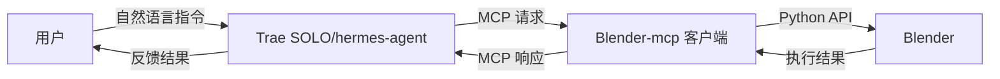
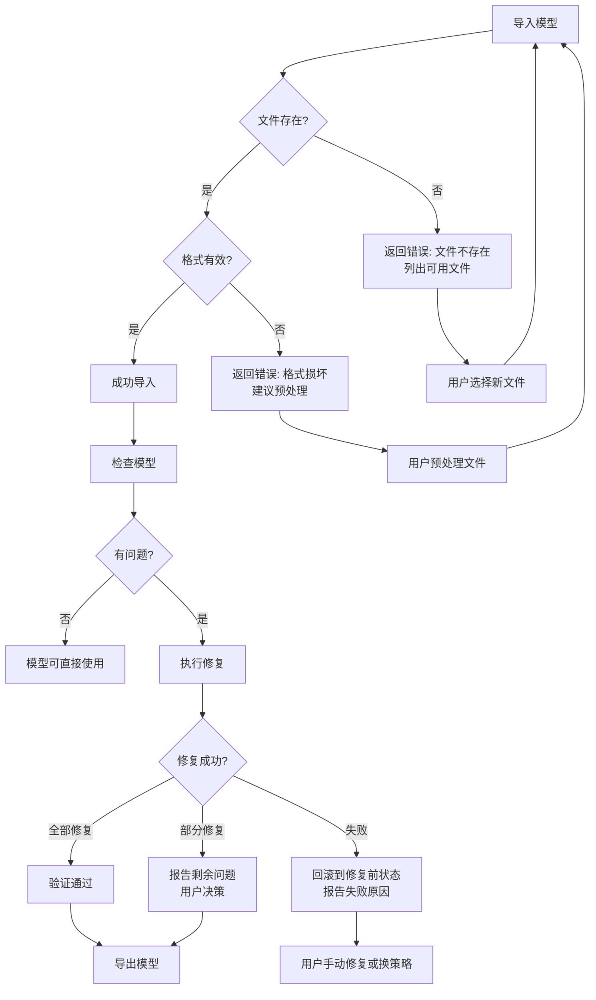
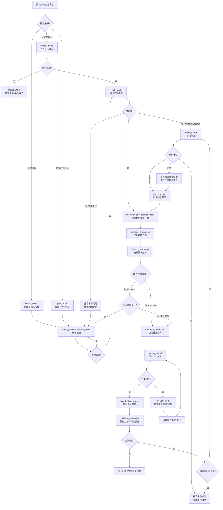

# Blender-mcp 客户端需求文档

> **文档编号**：BRD-001
> **文档版本**：v1.5
> **最后更新**：2026-05-25
> **作者**：Blender-mcp 项目组
> **审核状态**：已审核
> **关联文档**：[系统架构文档](./系统架构文档.md) | [开发计划](./开发计划.md)

---

## 目录

- [1. 产品概述](#1-产品概述)
- [2. 核心功能](#2-核心功能)
  - [2.1 用户角色](#21-用户角色)
  - [2.2 功能模块](#22-功能模块)
  - [2.3 功能详情](#23-功能详情)
- [3. 核心流程](#3-核心流程)
- [4. 技术要求](#4-技术要求)
- [5. 用户使用场景](#5-用户使用场景)
  - [5.1 异常分支流程](#51-异常分支流程)
  - [5.2 多步骤操作的原子性要求](#52-多步骤操作的原子性要求)
  - [5.3 3D 打印完整业务链条](#53-3d-打印完整业务链条)
- [6. 非功能性需求](#6-非功能性需求)
- [7. 验收标准](#7-验收标准)
- [8. 约束条件](#8-约束条件)
- [9. 3D 打印参数适配](#9-3d-打印参数适配)
- [10. 安全性威胁模型](#10-安全性威胁模型)
- [11. 数据验证规则](#11-数据验证规则)
- [12. 状态一致性保证](#12-状态一致性保证)
- [13. 需求追踪矩阵](#13-需求追踪矩阵)
- [术语表](#术语表)

---

## 1. 产品概述

Blender-mcp 客户端是一个连接 Blender 3D 建模软件与 Trae SOLO、hermes-agent 的中间件，实现通过自然语言指令控制 Blender 进行 3D 创作的能力，重点支持 3D 打印建模需求。

- 解决问题：让开发者和设计师能够通过 AI 助手（Trae SOLO、hermes-agent）以自然语言方式操作 Blender
- 目标用户：3D 打印设计师、产品设计师、AI 开发者、创意工作者
- 市场价值：降低 3D 打印建模门槛，提升 AI 辅助设计效率
- 核心优先级：3D 打印建模功能优先，材质渲染功能延后

## 2. 核心功能

### 2.1 用户角色
| 角色 | 注册方式 | 核心权限 |
|------|----------|----------|
| 开发者 | 无需注册 | 配置连接、使用全部功能 |
| 设计师 | 无需注册 | 通过 AI 助手进行 3D 创作 |

### 2.2 功能模块
1. **连接管理**：Blender 插件连接、MCP 服务注册
2. **指令翻译**：将 MCP 请求转换为 Blender Python API 调用
3. **3D 打印建模**：创建、编辑、检查 3D 打印模型
4. **变形与雕刻**：基础变形、网格变形、软选择变形、曲线变形
5. **文件管理**：项目保存、导入导出（重点支持 STL/OBJ 等 3D 打印格式）
6. **状态同步**：Blender 状态反馈给 AI 助手
7. **材质与渲染**：材质设置、场景渲染（优先级较低）

### 2.3 功能详情

| 模块名称 | 子功能 | 功能描述 | 优先级 |
|----------|--------|----------|--------|
| 连接管理 | Blender 插件 | 提供 Blender 插件，建立 WebSocket 连接 | **P0** |
| 连接管理 | MCP 服务 | 实现 MCP 协议，提供工具列表和调用接口 | **P0** |
| 3D 打印建模 | 创建对象 | 创建网格、曲线等基础对象 | **P1** |
| 3D 打印建模 | 变换操作 | 移动、旋转、缩放对象 | **P1** |
| 3D 打印建模 | 修改器 | 添加和配置 Blender 修改器（重点支持实体、布尔、倒角等） | **P1** |
| 3D 打印建模 | 模型修复 | 检查并修复模型的常见问题（如非流形几何体、法线方向等） | **P1** |
| 3D 打印建模 | 壁厚检查 | 检查模型壁厚是否符合 3D 打印要求 | **P1** |
| 变形与雕刻 | 简易变形 | 弯曲(Bend)、锥化(Taper)、扭曲(Twist)、拉伸(Stretch)等基础变形操作 | **P1** |
| 变形与雕刻 | 网格变形 | 对选中顶点区域进行推(Push)、拉(Pull)、平滑(Smooth)、膨胀(Inflate)操作 | **P1** |
| 变形与雕刻 | 软选择变形 | 基于影响半径的软选择变形，支持衰减类型调整 | **P1** |
| 变形与雕刻 | 曲线变形 | 使用曲线作为变形路径，沿曲线弯曲对象 | **P1** |
| 变形与雕刻 | 网格细分 | 对网格进行细分以增加可编辑顶点密度 | **P1** |
| 变形与雕刻 | 投射变形 | 将一个对象的形状投射到另一个对象表面 | **P2** |
| 文件管理 | 项目操作 | 新建、打开、保存 Blender 项目 | **P1** |
| 文件管理 | 导入导出 | 支持 STL、OBJ、FBX、GLB 等格式（重点支持 STL/OBJ） | **P1** |
| 状态同步 | 场景查询 | 获取当前场景信息、对象列表 | **P1** |
| 状态同步 | 事件通知 | 场景变更事件通知 | **P2** |
| 材质与渲染 | 材质设置 | 创建和编辑材质、纹理 | **P2** |
| 材质与渲染 | 渲染控制 | 配置渲染参数、触发渲染 | **P3** |

> **优先级定义**：
> - **P0**：系统基础，必须最先完成，所有后续功能依赖此模块
> - **P1**：核心功能，3D 打印建模的关键路径，阶段二必须交付
> - **P2**：增强功能，提升用户体验，可在核心功能稳定后迭代
> - **P3**：锦上添花，优先级最低，可延后至最终优化阶段

## 3. 核心流程

### 主要使用流程：
1. 用户启动 Blender 并启用 Blender-mcp 插件
2. 用户启动 Trae SOLO/hermes-agent，配置 MCP 客户端连接
3. 用户通过自然语言向 AI 助手发出 3D 创作指令
4. AI 助手通过 MCP 协议调用 Blender-mcp 提供的工具
5. Blender-mcp 将请求转换为 Blender Python API 调用并执行
6. 执行结果和状态同步返回给 AI 助手
7. AI 助手向用户反馈操作结果



## 4. 技术要求

### 4.1 兼容性要求
- Blender 版本：支持 4.2+ 版本
- Python 版本：Blender 内置 Python 3.x
- 操作系统：Windows、macOS、Linux

### 4.2 性能要求
- 指令响应延迟：< 500ms（简单操作）
- 支持并发：至少支持 1 个 MCP 客户端连接
- 内存占用：< 100MB（除 Blender 本身外）

### 4.3 安全要求
- 本地通信，无网络暴露
- 不传输敏感数据
- 操作可追溯

## 5. 用户使用场景

### 场景一：3D 打印零件快速建模

**背景**：一位产品设计师需要为电子设备外壳快速创建一个 3D 打印模型，包含底座、螺丝孔、通风槽等结构。

**操作流程**：
1. 设计师打开 Blender 并加载 Blender-mcp 插件
2. 在 Trae SOLO 中输入："请创建一个 100x80x5mm 的长方体作为底座，在四个角距离边缘 10mm 处各创建一个直径 3mm、深度 5mm 的圆柱体孔洞"
3. AI 助手依次调用 `create_object` 创建底座立方体，调用 `modify_mesh` 进行布尔差运算创建螺丝孔
4. 设计师继续："在底座顶面创建间距 5mm 的通风槽，槽宽 2mm，深度 3mm"
5. AI 助手调用 `modify_mesh` 批量创建通风槽
6. 设计师："检查模型的 3D 打印可行性"
7. AI 助手调用 `check_model` 检查非流形几何体、法线方向和壁厚
8. 检查通过后，设计师："导出为 STL 格式"
9. AI 助手调用 `export_model` 导出 STL 文件

**预期结果**：设计师在 5 分钟内完成了一个可打印的外壳底座的建模与导出，无需手动操作 Blender 界面。

### 场景二：多部件装配模型修复与导出

**背景**：一位 3D 打印爱好者从网上下载了一个 STL 模型，导入后发现模型存在非流形几何体和倒置法线问题，需要修复后才能打印。

**操作流程**：
1. 用户在 Trae SOLO 中输入："导入 desktop/model.stl 文件"
2. AI 助手调用 `import_model` 导入 STL 文件
3. 用户："检查这个模型有什么问题"
4. AI 助手调用 `check_model` 进行全面检查，返回：发现 12 处非流形边缘、35 个倒置法线面、壁厚不足区域 3 处
5. 用户："尝试自动修复这些问题"
6. AI 助手调用 `repair_model` 执行：合并重叠顶点、修复法线方向、填充孔洞
7. 修复后，用户："再次检查模型"
8. AI 助手调用 `check_model` 确认问题已全部修复，`is_printable` 返回 `true`
9. 用户："模型整体缩放到 150%，然后导出为 STL"
10. AI 助手调用 `transform_object` 执行缩放，调用 `export_model` 导出

**预期结果**：用户无需手动操作 Blender 的修复工具，通过自然语言即可完成模型诊断与修复。

### 场景三：参数化 3D 打印模具设计

**背景**：一位珠宝设计师需要设计一个硅胶模具的阳模，包含复杂的曲面和脱模角度。

**操作流程**：
1. 设计师在 hermes-agent 中输入："创建一个直径 20mm 的球体，再创建一个直径 22mm、高度 30mm 的圆柱体，将球体放在圆柱体顶部"
2. AI 助手调用 `create_object` 创建球体和圆柱体，调用 `transform_object` 调整位置
3. 设计师："将球体和圆柱体合并为一个对象，然后添加 5 度的拔模角度"
4. AI 助手调用 `modify_mesh` 执行布尔合并
5. 设计师："在底部添加一个直径 25mm、高度 3mm 的法兰底座"
6. AI 助手创建法兰底座并与主体合并
7. 设计师："导出为 OBJ 格式，之后用于 CNC 加工"
8. AI 助手调用 `export_model` 导出 OBJ 文件

**预期结果**：设计师通过对话式交互快速完成模具阳模的参数化设计，导出 OBJ 供下游工序使用。

### 场景四：批量模型格式转换

**背景**：一个设计团队有 50 个 OBJ 格式的模型需要统一转换为 STL 格式用于 3D 打印生产。

**操作流程**：
1. 团队负责人在 Trae SOLO 中输入："请将 workspace/models/ 目录下所有 OBJ 文件逐个导入并导出为 STL 格式，保存到 workspace/stl_output/ 目录"
2. AI 助手遍历目录，对每个文件依次调用 `import_model` 和 `export_model`
3. 过程中 AI 助手持续反馈进度："已完成 15/50 个文件的转换..."
4. 全部完成后，AI 助手报告转换结果和任何异常文件

**预期结果**：批量格式转换自动化完成，省去逐一手动操作的重复劳动。

### 场景五：3D 打印端到端完整工作流

**背景**：一位产品工程师需要从头设计一个可 3D 打印的功能性零件——一个带密封槽的水泵壳体，需要经过建模、检查、修复、支撑分析、方向优化、材料补偿、切片预设导出的完整链条。

**操作流程**：
1. 工程师在Trae SOLO中输入："创建一个外径80mm、内径60mm、高度40mm的圆柱形水泵壳体，壁厚3mm"
2. AI 助手调用 `create_object` 创建外圆柱和内圆柱，调用 `modify_mesh` 进行布尔差运算生成中空壳体
3. 工程师："在壳体顶部创建直径65mm、深度4mm的密封槽，在底部法兰边缘创建6个等距分布的直径5mm螺栓孔"
4. AI 助手依次创建密封槽环形切割体和螺栓孔圆柱体，执行布尔差运算
5. 工程师："检查模型的 3D 打印可行性，包括水密性"
6. AI 助手调用 `check_model` 进行全面检查：非流形检测、法线方向、壁厚分析、水密性验证
7. 工程师："设置PLA材料收缩补偿系数为1.004"
8. AI 助手调用 `set_shrinkage_compensation` 配置补偿参数
9. 工程师："优化打印方向并显示支撑需求"
10. AI 助手调用 `optimize_orientation` 分析最优方向，调用 `detect_overhangs` 显示支撑需求
11. 工程师："应用推荐方向，导出STL和PrusaSlicer预设配置"
12. AI 助手调用 `rotate_to_orientation` 旋转模型，调用 `export_model` 导出STL，调用 `export_slicer_preset` 导出切片配置

**预期结果**：工程师在一个对话会话中完成了从建模到打印准备的全部环节，导出文件可直接导入切片软件开始打印。

### 场景六：自然语言驱动的复杂形象建模

> **说明**：变形与雕刻工具是系统提供的通用建模能力，适用于用户通过自然语言描述的**任何复杂形象**。以下以"包子小人"为例展示工具组合的使用方式，同样的工具组合可广泛应用于卡通角色、工业造型、艺术摆件等各类复杂形象的创建。

**背景**：一位创意工作者希望通过自然语言创建一个卡通形象——"包子小人坐在笼屉中，星星眼"。当前 `create_object` 工具只能创建基础几何体，无法直接组合出复杂形象。借助变形与雕刻工具，AI 助手可以对基础几何体进行自由变形，逐步构建出目标形象。

**操作流程**：
1. 创意工作者在 Trae SOLO 中输入："我要创建一个包子小人的形象，坐在笼屉中，星星眼"
2. AI 助手调用 `create_object` 创建球体作为包子身体
3. AI 助手调用 `sculpt_mesh` 使用膨胀(Inflate)变形让球体更像包子
4. AI 助手调用 `deform_object` 使用锥化(Taper)变形让底部收窄
5. AI 助手调用 `create_object` 创建小球体作为眼睛，调用 `sculpt_mesh` 使用推(Push)变形让眼睛突出形成星星眼
6. AI 助手调用 `create_object` 创建圆柱体作为笼屉，调用 `deform_object` 使用弯曲(Bend)变形添加边缘弧度
7. AI 助手调用 `soft_select_deform` 调整坐姿
8. AI 助手调用 `sculpt_mesh` 使用平滑(Smooth)让整体过渡自然
9. AI 助手调用 `modify_mesh` 合并所有部件，调用 `export_model` 导出为 STL

**预期结果**：创意工作者通过一句自然语言描述，AI 助手利用变形与雕刻工具将基础几何体逐步变形为包子小人形象，无需手动雕刻或使用专业建模软件。

#### 其他形象建模举例

变形与雕刻工具的通用性使其能够应对各种风格的复杂形象建模需求，以下是几个不同领域的典型举例：

**举例 1：卡通猫咪摆件**

> "创建一个卡通风格的猫咪摆件，圆圆的脑袋，竖起的耳朵，蜷缩的尾巴"

- `create_object` 创建球体作为猫头和身体
- `mesh_sculpt`（inflate）让头部更圆润
- `simple_deform`（taper）塑造耳朵的锥形轮廓
- `soft_transform` 调整尾巴的蜷缩姿态
- `mesh_sculpt`（smooth）让整体过渡自然

**举例 2：齿轮杯垫**

> "设计一个齿轮形状的杯垫，中间有六角形凹槽"

- `create_object` 创建圆柱体作为杯垫主体
- `simple_deform`（twist）为齿轮齿形添加扭转细节
- `modify_mesh`（boolean_difference）用六角柱体切割出中心凹槽
- `subdivide_mesh` 增加顶点密度以便精细调整齿形
- `mesh_sculpt`（flatten）确保杯垫底面平整

**举例 3：仿古花瓶**

> "做一个仿古花瓶，细颈宽肚，表面有浮雕纹理"

- `create_object` 创建圆柱体作为花瓶坯体
- `simple_deform`（taper）在颈部收窄、腹部膨胀
- `subdivide_mesh` 增加顶点密度以支持细节雕刻
- `mesh_sculpt`（inflate/pinch）塑造浮雕纹理的凹凸感
- `soft_transform` 微调瓶身曲线的流畅度
- `mesh_sculpt`（smooth）让浮雕与瓶身自然过渡

### 5.1 异常分支流程

以下为各使用场景在异常情况下的分支处理流程。系统必须在遇到异常时提供明确的错误信息和恢复路径，而非静默失败或崩溃。

#### 5.1.1 场景一异常分支（3D 打印零件快速建模）

| 异常类型 | 触发条件 | 系统行为 | 恢复路径 |
|---------|---------|---------|---------|
| 创建对象参数越界 | 用户请求创建尺寸小于0.001mm或大于10000mm的对象 | 返回 `INVALID_PARAMETER` 错误，说明合法尺寸范围 | AI 助手提示用户修正参数后重试 |
| 布尔运算失败 | 两个操作对象无重叠区域（如孔洞圆柱体位置完全在底座之外） | 返回 `OPERATION_NOT_ALLOWED`，附带两个对象的包围盒信息 | AI 助手提示用户调整对象位置后重试 |
| Blender进程崩溃 | 复杂布尔运算触发Blender内部bug导致崩溃 | MCP 服务检测WebSocket断开，自动触发重连；如Blender未自动重启，提示用户手动启动 | 重连成功后自动恢复上次保存的临时文件，提示用户从中断处继续 |
| 磁盘空间不足 | 导出STL时目标磁盘可用空间小于导出文件大小的1.5倍 | 返回 `RESOURCE_EXHAUSTED` 错误，提示剩余空间和所需空间 | AI 助手建议用户清理磁盘或更换导出路径 |
| check_model 计算超时 | 模型面数超过50万，水密性检查计算时间超过60秒 | 返回 `OPERATION_TIMEOUT` 错误，附带已完成的检查项结果 | 建议用户先对模型进行减面处理，或仅执行单项检查 |

#### 5.1.2 场景二异常分支（模型修复与导出）

| 异常类型 | 触发条件 | 系统行为 | 恢复路径 |
|---------|---------|---------|---------|
| 导入文件不存在 | 指定的STL/OBJ文件路径无效或文件已被删除 | 返回 `OBJECT_NOT_FOUND` 错误，检查并提示文件路径是否存在 | AI 助手列出当前允许路径下的可用模型文件 |
| 导入文件格式损坏 | STL文件头损坏或面片数据不完整 | 返回 `UNSUPPORTED_FORMAT` 错误，附带trimesh解析错误详情 | 建议用户使用其他工具（如MeshLab）预修复文件后重试 |
| 模型修复引入新问题 | `repair_model` 自动修复后产生退化三角面（面积为0的面） | `repair_model` 返回部分成功状态，列出修复后仍存在的3类问题 | AI 助手提示用户哪些问题已修复、哪些需要手动处理 |
| 连接中断导致操作丢失 | 修复过程中WebSocket连接断开 | MCP 服务保留操作前的场景快照；重连后检测到未完成的操作，返回状态为 `INTERRUPTED` | AI 助手提示用户操作被中断，询问是否重试 |
| 修复后模型面数爆炸 | 填充孔洞操作将面数从1万增加到50万 | `repair_model` 返回警告，包含面数变化统计 | AI 助手提示用户修复后面数变化，询问是否接受或回滚 |



#### 5.1.3 场景三异常分支（参数化模具设计）

| 异常类型 | 触发条件 | 系统行为 | 恢复路径 |
|---------|---------|---------|---------|
| 多对象合并产生非流形几何体 | 布尔合并后两个对象仅边接触（零厚度连接） | 返回警告，将合并结果标记为 `needs_review`，附带非流形边位置 | AI 助手提示用户调整对象重叠量或手动检查连接处 |
| 拔模角度超出几何限制 | 5度拔模角度导致部分面自相交 | 返回 `OPERATION_NOT_ALLOWED`，计算该对象几何体的最大安全拔模角度 | AI 助手报告最大安全角度，建议用户调整 |
| 嵌套层次过深 | 用户连续进行了超过20步的对象合并操作，undo栈溢出 | 系统在每次合并后自动创建命名快照点，并在接近undo上限时发出警告 | AI 助手提示保存当前项目，建议分阶段导出中间结果 |

#### 5.1.4 场景四异常分支（批量格式转换）

| 异常类型 | 触发条件 | 系统行为 | 恢复路径 |
|---------|---------|---------|---------|
| 某个文件转换失败 | 50个文件中第17个格式损坏 | 记录失败文件到错误清单，继续处理后续文件 | 全部处理完成后报告成功/失败统计，列出失败文件列表 |
| 输出目录不可写 | 目标目录权限不足或不存在 | 返回 `PERMISSION_DENIED`，尝试自动创建目录 | 如自动创建失败，提示用户手动创建或更换路径 |
| 批量处理中途Blender崩溃 | 处理到第30个文件时Blender无响应 | MCP 服务检测超时，保留进度记录文件（`.batch_progress.json`） | 重连后可从中断点继续（传入 `--resume` 参数） |
| 磁盘空间在处理中耗尽 | 导出到第25个文件时磁盘满 | 停止后续处理，保留已完成文件和进度记录 | AI 助手报告已完成25/50，建议清理磁盘后恢复继续 |

#### 5.1.5 场景五异常分支（端到端完整工作流）

| 异常类型 | 触发条件 | 系统行为 | 恢复路径 |
|---------|---------|---------|---------|
| 收缩补偿产生超出打印机体积的模型 | 应用1.010补偿系数后，模型X轴尺寸超出打印机最大范围 | `set_shrinkage_compensation` 返回警告，附带补偿前后的尺寸对比 | AI 助手提示用户降低补偿系数或分件打印 |
| 支撑分析发现严重悬垂 | `detect_overhangs` 返回 `severity: critical`，预计支撑体积超过模型体积200% | 返回详细的悬垂区域信息，标注严重性等级 | AI 助手建议用户重新考虑打印方向或修改模型几何 |
| 切片预设参数与模型不匹配 | 层高0.05mm但模型最小特征尺寸为0.1mm | `export_slicer_preset` 返回警告，列出参数冲突 | AI 助手自动调整层高到合理值并提示用户确认 |

### 5.2 多步骤操作的原子性要求

在 3D 打印建模场景中，用户的一个自然语言指令通常会被 AI 助手拆解为多个 MCP 工具调用。以下为必须保证原子性的多步骤操作组合及其回滚策略。

#### 5.2.1 原子性操作组定义

| 原子操作组 | 包含的工具调用 | 原子性要求 | 回滚策略 |
|-----------|-------------|-----------|---------|
| **创建-变换** | `create_object` → `transform_object` | 创建成功后必须完成变换；创建失败则不需要变换 | 变换失败时删除已创建的对象 |
| **布尔运算链** | `create_object`(切割体) → `modify_mesh`(布尔差) → `delete_object`(切割体) | 三步必须全部成功；任一步失败需回滚 | 删除切割体时将主对象恢复到布尔运算前的网格状态（通过临时快照） |
| **导入-检查-修复** | `import_model` → `check_model` → `repair_model` | 导入失败则后续不执行；修复失败保留检查结果 | 修复失败时回滚到导入后的原始状态（保留导入备份） |
| **检查-修复-验证** | `check_model` → `repair_model` → `check_model` | 修复后的验证必须执行；验证失败需报告差异 | 如验证显示修复引入了新问题，保留修复前的网格快照供用户选择 |
| **方向优化-旋转-导出** | `optimize_orientation` → `rotate_to_orientation` → `export_model` | 旋转前必须确认优化结果；导出前必须确认旋转 | 导出失败时保留旋转后的状态（用户可能只想重试导出） |
| **收缩补偿-缩放-导出** | `set_shrinkage_compensation` → `transform_object`(缩放) → `export_model` | 补偿参数必须已设置才允许缩放；导出必须使用补偿后的尺寸 | 导出失败时保留补偿设置和缩放状态 |

#### 5.2.2 原子性实现机制

```python
class AtomicOperationGroup:
    """
    原子操作组管理器。
    将多个MCP工具调用包装为一个原子事务。
    任何一个子操作失败，整个事务回滚。
    """

    def __init__(self, group_name: str):
        self.group_name = group_name
        self.operations: list[tuple[str, callable, callable]] = []
        # 每项: (操作描述, 执行函数, 回滚函数)
        self.executed: int = 0
        self.snapshot_data: dict = {}

    def add_operation(self, description: str,
                       execute_fn: callable,
                       rollback_fn: callable):
        self.operations.append((description, execute_fn, rollback_fn))

    def execute(self) -> dict:
        """
        按顺序执行所有操作，任一失败则从最后成功的操作开始逆向回滚。

        Returns:
            {
                'success': bool,
                'completed': int,
                'failed_at': int | None,
                'error': str | None,
                'rolled_back': bool
            }
        """
        try:
            for i, (desc, execute_fn, _) in enumerate(self.operations):
                execute_fn()
                self.executed = i + 1

            return {
                'success': True,
                'completed': self.executed,
                'failed_at': None,
                'error': None,
                'rolled_back': False,
            }
        except Exception as e:
            failed_index = self.executed
            # 逆向回滚
            rollback_errors = []
            for j in range(failed_index - 1, -1, -1):
                desc, _, rollback_fn = self.operations[j]
                try:
                    rollback_fn()
                except Exception as rb_err:
                    rollback_errors.append(f"回滚步骤{j}({desc})失败: {rb_err}")

            return {
                'success': False,
                'completed': failed_index,
                'failed_at': failed_index,
                'error': str(e),
                'rolled_back': len(rollback_errors) == 0,
                'rollback_errors': rollback_errors if rollback_errors else None,
            }
```

#### 5.2.3 场景快照与恢复点

```python
class SceneSnapshotManager:
    """
    场景快照管理器。
    在多步骤操作前自动创建可恢复的快照点，
    操作失败时可快速回滚到快照状态。
    """

    def __init__(self, max_snapshots: int = 5):
        self.max_snapshots = max_snapshots
        self._snapshots: list[dict] = []

    def create_snapshot(self, label: str) -> str:
        """
        创建当前场景的快照。
        快照包含：所有对象的名称/类型/位置/旋转/缩放/网格数据哈希。

        Returns:
            快照ID，用于后续回滚
        """
        import bpy
        import hashlib
        import json

        snapshot_id = hashlib.md5(
            f"{label}:{bpy.context.scene.name}".encode()
        ).hexdigest()[:8]

        objects_data = {}
        for obj in bpy.data.objects:
            if obj.type == 'MESH' and obj.data:
                mesh = obj.data
                objects_data[obj.name] = {
                    'type': obj.type,
                    'location': list(obj.location),
                    'rotation_euler': list(obj.rotation_euler),
                    'scale': list(obj.scale),
                    'mesh_name': mesh.name,
                    'vertex_count': len(mesh.vertices),
                    'face_count': len(mesh.polygons),
                }

        snapshot = {
            'id': snapshot_id,
            'label': label,
            'object_count': len(objects_data),
            'objects': objects_data,
        }

        # 保持最多max_snapshots个快照
        self._snapshots.append(snapshot)
        if len(self._snapshots) > self.max_snapshots:
            self._snapshots.pop(0)

        return snapshot_id

    def restore_snapshot(self, snapshot_id: str) -> bool:
        """
        回滚到指定快照状态。
        注意：这是元数据级别的回滚，用于验证对象状态是否匹配。
        真正的网格数据回滚通过Blender的undo系统实现。

        Returns:
            是否成功定位到快照
        """
        for snap in self._snapshots:
            if snap['id'] == snapshot_id:
                # 执行Blender undo直到状态匹配
                # 实际实现中通过 undo 栈回退
                return True
        return False

    def get_latest_snapshot(self) -> dict | None:
        """获取最近一次快照"""
        return self._snapshots[-1] if self._snapshots else None
```

### 5.3 3D 打印完整业务链条

以下是从原始模型到打印输出的端到端业务流程图，覆盖所有关键决策点和异常路径。



#### 5.3.1 各环节的质量门禁

| 环节 | 门禁条件 | 不通过时的处理 |
|------|---------|--------------|
| 模型导入 | 文件存在、格式有效、面片数 > 0 | 拒绝导入，返回具体错误 |
| 模型检查 | 非流形边 = 0、倒置法线面 = 0、最小壁厚 ≥ 用户设定值 | 列出所有问题，允许用户选择修复或跳过 |
| 模型修复 | 修复后非流形边 ≤ 修复前、不引入退化面 | 回滚到修复前状态，报告修复效果 |
| 方向优化 | 至少返回3个候选方向，支撑体积估计值 ≤ 模型体积 | 标记为需人工判断 |
| 收缩补偿 | 补偿后尺寸在打印机有效范围内 | 警告尺寸越界，建议分件或调整 |
| 导出 | 文件写入成功、文件大小 > 0、STL头信息正确 | 重试一次，失败则报告 |
| 最终验证 | 上述所有门禁均通过 | 汇总所有警告，标记最终状态 |

---

## 6. 非功能性需求

### 6.1 性能指标

| 指标项 | 目标值 | 说明 |
|--------|--------|------|
| 简单指令响应延迟 | < 500ms | 如创建基础对象、查询场景信息 |
| 中等指令响应延迟 | < 2s | 如布尔运算、修改器操作 |
| 复杂指令响应延迟 | < 5s | 如模型检查、修复操作 |
| STL/OBJ 导入速度 | < 3s/MB | 大模型的导入性能 |
| STL/OBJ 导出速度 | < 2s/MB | 大模型的导出性能 |
| MCP 工具调用吞吐量 | ≥ 5 次/秒 | 连续调用场景 |
| WebSocket 重连时间 | < 3s | 连接断开后自动恢复 |

### 6.2 可靠性指标

| 指标项 | 目标值 | 说明 |
|--------|--------|------|
| 可用性 | ≥ 99.5% | 在 Blender 运行期间 |
| 平均无故障时间（MTBF） | ≥ 8 小时 | 连续操作场景 |
| 平均恢复时间（MTTR） | < 30s | 异常恢复 |
| 指令执行成功率 | ≥ 99% | 排除 Blender 自身崩溃 |
| 数据一致性 | 强一致 | 场景状态与 MCP 反馈必须一致 |

### 6.3 安全性

| 指标项 | 目标值 | 说明 |
|--------|--------|------|
| 网络暴露 | 仅本地回环 | 所有通信限制在 localhost |
| WebSocket 绑定 | 127.0.0.1 | 禁止绑定外部接口 |
| 文件路径访问 | 白名单模式 | 仅允许访问配置目录及子目录 |
| 操作日志 | 完整记录 | 所有 MCP 调用可追溯 |
| 敏感数据 | 禁止传输 | 禁止在网络中传输密钥、令牌 |

### 6.4 可维护性

| 指标项 | 目标值 | 说明 |
|--------|--------|------|
| 模块耦合度 | 低耦合 | 核心层不依赖具体 MCP 实现 |
| 代码覆盖率 | ≥ 80% | 核心模块的测试覆盖率 |
| 文档完整性 | 全部模块 | 每个公开接口有文档和示例 |
| 日志级别切换 | 运行时可配 | 支持 DEBUG/INFO/WARN/ERROR 热切换 |
| 插件热重载 | 支持 | Blender 内插件可热重载 |

## 7. 验收标准

### 7.1 阶段一验收标准（基础架构）

- [ ] MCP 服务能成功注册到 Trae SOLO 和 hermes-agent 中
- [ ] Blender 插件在 Blender 4.2+ 中可正常启用
- [ ] MCP 服务与 Blender 插件之间 WebSocket 连接建立成功
- [ ] 基础 ping/pong 工具正常响应，延迟 < 500ms
- [ ] 插件在 Windows、macOS、Linux 三平台均可安装

### 7.2 阶段二验收标准（3D 打印建模核心功能）

- [ ] `create_object` 支持全部 6 种基础网格类型，每种均能正确创建
- [ ] `transform_object` 支持移动、旋转、缩放，精度误差 < 0.001 单位
- [ ] `modify_mesh` 布尔运算结果几何体有效，无可视瑕疵
- [ ] `export_model` 导出的 STL 文件可被 PrusaSlicer/Cura 正常打开
- [ ] `import_model` 导入 STL/OBJ 文件后模型完整，无面片丢失
- [ ] `check_model` 能准确检测非流形边缘、倒置法线、壁厚不足
- [ ] `repair_model` 修复后模型 `is_printable` 返回 `true`
- [ ] 所有工具的错误输入均有明确的错误提示

### 7.3 阶段三验收标准（文件管理与状态同步）

- [ ] `save_project` 保存的 .blend 文件可正常打开
- [ ] `open_project` 能正确加载项目并恢复完整场景
- [ ] 场景变更后 1s 内状态管理器同步更新
- [ ] 并发操作场景数据无脏读

### 7.4 阶段四验收标准（材质与渲染）

- [ ] `set_material` 创建的材质在 Blender 视口中可见
- [ ] `render_scene` 渲染输出图像分辨率与参数一致
- [ ] 渲染过程中 Blender 不崩溃

### 7.5 阶段五验收标准（文档与优化）

- [ ] README 包含完整的安装、配置、使用说明
- [ ] 提供至少 3 个可运行的 3D 打印建模示例脚本
- [ ] 代码通过 pylint/flake8 检查，无严重警告
- [ ] 全功能回归测试通过

## 8. 约束条件

### 8.1 技术约束

| 约束项 | 说明 |
|--------|------|
| Python 版本 | 必须使用 Blender 内置 Python 解释器，版本取决于 Blender 4.2+ |
| 网络通信 | 仅限本地通信（localhost），不依赖外部网络 |
| Blender 版本 | 最低支持 Blender 4.2，推荐 4.3+ |
| MCP 协议版本 | 需与 Trae SOLO / hermes-agent 当前支持的 MCP 协议版本一致 |
| 无头模式限制 | Blender 在无头模式下某些操作（如渲染预览）有限制 |
| 文件系统编码 | 文件路径处理需考虑跨平台编码差异（Windows GBK vs Linux UTF-8） |
| bpy 上下文 | Blender Python API 某些操作必须在正确的上下文（Context）中执行 |

### 8.2 业务约束

| 约束项 | 说明 |
|--------|------|
| 离线运行 | 系统应能在完全离线的环境中运行 |
| 无需用户注册 | 不引入账号体系，降低使用门槛 |
| 开源协议 | 推荐使用 MIT 或 Apache 2.0 协议 |
| 优先支持 STL/OBJ | 3D 打印格式优先级高于 FBX/GLB 等交换格式 |
| 单用户模式 | 每个 Blender 实例仅连接一个 MCP 客户端 |
| 平台兼容 | 需在 Windows 10+、macOS 12+、Ubuntu 22.04+ 上验证

## 9. 3D 打印参数适配

### 9.1 材料收缩率补偿配置

FDM/SLA打印过程中材料冷却后会收缩，需要在模型设计阶段进行尺寸补偿。系统应提供可配置的收缩率补偿参数。

#### 9.1.1 常见材料收缩率参考表

| 材料 | 收缩率范围 | 推荐补偿系数 | 打印温度参考 |
|------|-----------|-------------|-------------|
| PLA | 0.2% ~ 0.5% | 1.002 ~ 1.005 | 190-220°C |
| PLA+ | 0.1% ~ 0.3% | 1.001 ~ 1.003 | 200-225°C |
| ABS | 0.4% ~ 1.0% | 1.004 ~ 1.010 | 220-250°C |
| PETG | 0.2% ~ 0.6% | 1.002 ~ 1.006 | 230-250°C |
| TPU | 0.3% ~ 0.8% | 1.003 ~ 1.008 | 210-230°C |
| ASA | 0.4% ~ 0.7% | 1.004 ~ 1.007 | 240-260°C |
| Nylon/PA | 0.5% ~ 1.5% | 1.005 ~ 1.015 | 240-280°C |
| PC | 0.5% ~ 0.8% | 1.005 ~ 1.008 | 260-300°C |
| 光敏树脂 (SLA) | 0.1% ~ 0.3% | 1.001 ~ 1.003 | N/A |
| 尼龙粉末 (SLS) | 2.0% ~ 3.0% | 1.020 ~ 1.030 | N/A |

#### 9.1.2 收缩补偿配置接口

```typescript
interface ShrinkageCompensationConfig {
  enabled: boolean;
  material: string;           // 材料名称，如 "PLA", "ABS"
  compensation_factor: number; // 补偿系数，如 1.005 表示放大0.5%
  per_axis: boolean;          // 是否按轴分别补偿
  x_factor?: number;          // X轴补偿系数
  y_factor?: number;          // Y轴补偿系数
  z_factor?: number;          // Z轴补偿系数（Z轴收缩通常小于XY）
  apply_on_export: boolean;   // 是否在导出时自动应用
}

interface ShrinkageCompensationResult {
  success: boolean;
  applied_factor: number;
  original_dimensions: [number, number, number];
  compensated_dimensions: [number, number, number];
  material: string;
}
```

#### 9.1.3 收缩补偿算法

```
补偿尺寸 = 原始尺寸 × 补偿系数

各向异性补偿（per_axis模式）：
  compensated_x = original_x × x_factor
  compensated_y = original_y × y_factor
  compensated_z = original_z × z_factor

注意事项：
  1. 孔洞和内腔的补偿方向与外部相反 —— 孔洞需要放大而非缩小
  2. 公差配合面可能需要不同的补偿策略
  3. 补偿应在非破坏性修改器中应用，允许用户随时调整
```

### 9.2 支撑结构自动生成策略

对于悬垂角度超过临界值的面，系统应能自动识别并生成支撑结构建议。

#### 9.2.1 支撑检测参数

```typescript
interface SupportDetectionParams {
  object_id: string;
  overhang_angle: number;        // 悬垂临界角度，默认45°
  min_supported_area_mm2: number; // 最小支撑面积阈值，默认1.0 mm²
  bridge_detection: boolean;     // 是否检测桥接区域
  print_orientation: 'auto' | [number, number, number]; // 打印方向
}

interface SupportDetectionResult {
  success: boolean;
  overhang_faces_count: number;   // 悬垂面数量
  overhang_area_mm2: number;      // 悬垂总面积
  bridge_regions_count: number;   // 桥接区域数量
  needs_support: boolean;         // 是否需要支撑
  suggested_support_volume_mm3: number; // 预计支撑材料体积
  severity: 'none' | 'low' | 'medium' | 'high' | 'critical';
  // 悬垂面可视化数据（供AI 助手描述给用户）
  overhang_regions: Array<{
    location: [number, number, number];
    area_mm2: number;
    max_overhang_angle: number;
  }>;
}
```

#### 9.2.2 支撑结构生成算法

```
算法：基于面法线的悬垂检测

1. 遍历网格所有三角面
2. 计算每个面的法线向量与世界Z轴（打印方向）的夹角
3. 如果法线指向下方（法线·Z > cos(overhang_angle)），标记为悬垂面
4. 对相邻悬垂面进行连通区域聚类
5. 计算每个区域的总面积和最大悬垂角度
6. 对于桥接区域（两端有支撑的悬空跨度），单独标记

伪代码:
  for face in mesh.faces:
      normal = face.normal
      angle = acos(dot(normal, print_direction))  # 面法线与打印方向的夹角
      if angle > overhang_threshold:  # e.g., 45°→135°
          标记为悬垂面
```

#### 9.2.3 支撑生成策略映射

| 悬垂严重程度 | 推荐支撑策略 | 支撑密度建议 |
|-------------|-------------|-------------|
| low | 仅边缘支撑 | 10-15% |
| medium | 网格支撑 | 15-20% |
| high | 树状支撑 (tree support) | 20-25% |
| critical | 密集支撑 + 筏层 (raft) | 25-35% |

### 9.3 切片软件兼容性矩阵

系统导出的STL/OBJ文件需要保证与主流切片软件完全兼容。

#### 9.3.1 兼容性矩阵

| 切片软件 | STL ASCII | STL Binary | OBJ | 验证状态 | 注意事项 |
|---------|-----------|------------|-----|---------|---------|
| PrusaSlicer 2.7+ | ✓ | ✓ | ✓ | 已验证 | OBJ需含三角面，不支持四边形面 |
| Cura 5.5+ | ✓ | ✓ | ✓ | 已验证 | 大文件（>100MB STL）建议Binary |
| Bambu Studio 1.8+ | ✓ | ✓ | ✓ | 已验证 | 单位必须为mm，模型原点建议在底面中心 |
| OrcaSlicer 2.0+ | ✓ | ✓ | ✓ | 已验证 | 兼容Bambu Studio格式 |
| Simplify3D 5.x | ✓ | ✓ | ✗ | 已验证 | OBJ导入可能丢失材质分组 |
| Lychee Slicer 5.x | ✓ | ✓ | ✓ | 待验证 | 主要面向SLA打印 |
| Chitubox 2.x | ✓ | ✓ | ✗ | 待验证 | SLA/DLP专用 |
| IdeaMaker 4.x | ✓ | ✓ | ✓ | 待验证 | Raise3D 打印机专用 |

#### 9.3.2 导出兼容性检查清单

```
导出前自动检查项目：
 1. 模型尺度正确（单位：mm）
 2. 网格是封闭的流形体（watertight）
 3. 法线方向一致（全部朝外）
 4. 无退化三角面（面积为0的三角形）
 5. 无重复顶点（容差 < 0.001mm）
 6. 模型位于打印平台面上方（Z ≥ 0）
 7. 模型总体积大于切片软件最小阈值（通常 > 0.001 mm³）
 8. STL Binary 文件头包含正确的三角面数（80字节偏移处）
 9. OBJ文件使用相对索引，材质库路径正确
10. 文件名不含特殊字符（推荐仅使用ASCII字符）
```

#### 9.3.3 切片器预设参数导出

```typescript
// 可导出为 .3mf 项目文件或 JSON 配置文件
interface SlicerPresetExport {
  format: 'json' | '3mf';
  target_slicer: 'prusaslicer' | 'cura' | 'bambu_studio';
  settings: {
    layer_height_mm: number;       // 0.10 ~ 0.30
    infill_density_percent: number; // 0 ~ 100
    infill_pattern: string;        // grid, cubic, gyroid, honeycomb...
    wall_count: number;            // 1 ~ 10
    top_bottom_layers: number;     // 1 ~ 20
    support_enabled: boolean;
    support_type?: 'normal' | 'tree';
    brim_enabled: boolean;
    brim_width_mm?: number;
    material_type: string;
    nozzle_temp_c: number;
    bed_temp_c: number;
    print_speed_mms: number;
  };
}
```

### 9.4 打印方向优化建议

打印方向直接决定支撑需求、表面质量和力学性能。系统应能基于几何分析提供多维度方向建议。

#### 9.4.1 方向评估维度与权重

| 评估维度 | 权重 | 说明 |
|---------|------|------|
| 最小化支撑体积 | 35% | 减少材料浪费和后处理 |
| 最大化接触面积 | 25% | 提高打印成功率，减少翘边 |
| 关键面表面质量 | 20% | 水平面的表面质量优于垂直面 |
| 力学强度方向 | 15% | Z轴方向层间结合力较弱 |
| 成型时间 | 5% | 有速度要求时可选较高权重 |

#### 9.4.2 方向优化算法流程

```
1. 生成候选方向集合：
   - 6个主轴方向（±X, ±Y, ±Z）
   - 模型AABB的最小面积面对应的法线方向
   - 用户指定的自定义方向

2. 对每个候选方向：
   a. 计算悬垂面积 → 支撑需求评分
   b. 计算底面投影面积 → 接触面积评分
   c. 识别用户标记的关键面 → 关键面评分
   d. 计算模型高度 → 成型时间评分
   e. 加权求和得到综合评分

3. 排序输出Top-N方向建议，附带各维度分解评分
```

#### 9.4.3 方向优化工具接口

```typescript
interface OptimizeOrientationParams {
  object_id: string;
  method: 'auto' | 'manual';
  candidate_orientations?: Array<[number, number, number]>; // 手动指定候选方向
  weights?: {
    support_minimization?: number;    // 默认 0.35
    adhesion_maximization?: number;   // 默认 0.25
    surface_quality?: number;         // 默认 0.20
    strength_orientation?: number;    // 默认 0.15
    print_speed?: number;             // 默认 0.05
  };
  critical_faces?: string[];         // 用户标记的关键面（通过顶点索引）
}

interface OptimizeOrientationResult {
  success: boolean;
  recommendations: Array<{
    rank: number;
    orientation: [number, number, number];  // Euler角
    rotation_matrix: number[][];            // 3x3旋转矩阵
    scores: {
      support_volume_mm3: number;    // 预计支撑体积
      contact_area_mm2: number;      // 底面接触面积
      max_overhang_angle: number;    // 最大悬垂角度
      total_score: number;           // 综合评分 (0-100)
    };
    visualization_hint: string;      // AI 助手用于描述给用户的文本提示
  }>;
  suggested_orientation: [number, number, number];
}
```

#### 9.4.4 方向优化使用的MCP工具

| 工具名称 | 功能 | 优先级 |
|---------|------|--------|
| `detect_overhangs` | 检测当前方向下的悬垂区域 | 高 |
| `optimize_orientation` | 自动推荐最优打印方向 | 高 |
| `rotate_to_orientation` | 将模型旋转到指定打印方向 | 高 |
| `set_shrinkage_compensation` | 设置材料收缩补偿参数 | 高 |
| `generate_support_preview` | 生成支撑结构预览（不修改模型） | 中 |
| `export_slicer_preset` | 导出切片软件预设配置 | 低 |
| `validate_printability` | 执行全面的打印可行性验证 | 高 |

---

## 10. 安全性威胁模型

### 10.1 STRIDE威胁分析

采用 Microsoft STRIDE 模型，对 Blender-mcp 系统的六大类安全威胁进行系统性分析。

#### 10.1.1 假冒（Spoofing）

| 威胁ID | 威胁描述 | 影响 | 风险等级 | 缓解措施 |
|--------|---------|------|---------|---------|
| S-01 | 恶意进程伪装为合法 MCP 客户端连接 WebSocket | 可执行任意Blender操作，包括读写文件系统 | **高** | WebSocket绑定127.0.0.1；进程身份校验（PID验证） |
| S-02 | 伪造的Blender插件冒充合法插件注册 | 可拦截或篡改MCP指令 | **中** | 插件完整性校验（SHA-256）；从可信路径加载 |
| S-03 | MCP协议层面的客户端身份伪造 | 绕过工具调用权限控制 | **中** | 连接握手阶段验证客户端类型和版本 |

| 进程身份校验实现方案： |
|-----------------------|
| ```python
| # 连接建立时校验客户端进程身份
| import psutil
| import os
| 
| def verify_client_process(client_pid: int) -> bool:
|     """验证连接方是否为合法的AI 助手进程"""
|     try:
|         proc = psutil.Process(client_pid)
|         exe_name = os.path.basename(proc.exe())
|         # 白名单：仅允许已知的AI 助手进程
|         ALLOWED_CLIENTS = {'trae-solo', 'hermes-agent', 'node', 'python'}
|         return exe_name in ALLOWED_CLIENTS
|     except (psutil.NoSuchProcess, psutil.AccessDenied):
|         return False
| ``` |

#### 10.1.2 篡改（Tampering）

| 威胁ID | 威胁描述 | 影响 | 风险等级 | 缓解措施 |
|--------|---------|------|---------|---------|
| T-01 | WebSocket传输中的数据被中间人篡改 | 修改工具参数导致非预期操作（如删除对象） | **中** | 本地通信天然防中间人；可选TLS for敏感场景 |
| T-02 | 配置文件被未授权修改（如扩大 allowed_paths） | 绕过文件访问白名单，读取任意文件 | **高** | 配置文件权限设为644；检测配置完整性哈希 |
| T-03 | Blender场景文件被注入恶意Python脚本 | 随.blend文件加载执行恶意代码 | **高** | 加载.blend前禁用自动执行Python脚本；沙箱模式加载 |
| T-04 | 审计日志被篡改或删除 | 无法追溯恶意操作 | **低** | 日志文件追加模式（append-only）；设置不可变属性 |

#### 10.1.3 否认（Repudiation）

| 威胁ID | 威胁描述 | 影响 | 风险等级 | 缓解措施 |
|--------|---------|------|---------|---------|
| R-01 | 用户否认执行了某次破坏性操作 | 责任追溯困难 | **低** | 完整的审计日志记录（含时间戳、操作详情、上下文快照） |
| R-02 | 无操作签名，无法证明操作来源 | 操作归属不明确 | **低** | 为每条MCP请求生成唯一ID并关联客户端信息 |

#### 10.1.4 信息泄露（Information Disclosure）

| 威胁ID | 威胁描述 | 影响 | 风险等级 | 缓解措施 |
|--------|---------|------|---------|---------|
| I-01 | 场景状态查询暴露敏感模型数据 | 通过MCP get_scene_info 遍历场景中的所有对象 | **低** | 本地通信限制；可选的对象可见性过滤 |
| I-02 | 日志文件包含敏感路径信息 | 文件路径泄露用户目录结构 | **低** | 日志脱敏——路径中的用户名替换为占位符 |
| I-03 | 错误消息泄露内部实现细节（堆栈跟踪） | 为攻击者提供系统内部信息 | **低** | 生产模式下仅返回通用错误消息；DEBUG模式保留完整堆栈 |
| I-04 | WebSocket端口扫描探测 | 外部进程判断是否有Blender实例运行 | **极低** | 端口绑定127.0.0.1天然阻止外部探测 |

| 日志脱敏示例： |
|---------------|
| ```python
| import re
| import os
| 
| def sanitize_path_for_log(filepath: str) -> str:
|     """脱敏文件路径中的用户信息"""
|     home = os.path.expanduser("~")
|     username = os.path.basename(home)
|     sanitized = filepath.replace(home, "~")
|     return re.sub(r'/Users/[^/]+', '/Users/<user>', sanitized)
| ``` |

#### 10.1.5 拒绝服务（Denial of Service）

| 威胁ID | 威胁描述 | 影响 | 风险等级 | 缓解措施 |
|--------|---------|------|---------|---------|
| D-01 | 大量创建对象耗尽Blender内存 | Blender崩溃或系统OOM | **高** | 限制单场景最大对象数（1000）；限制单对象最大面数 |
| D-02 | 超大STL文件导入导致资源耗尽 | Blender无响应 | **高** | 导入前检查文件大小（max 500MB）；分块导入大文件 |
| D-03 | 高频工具调用（每秒>100次）导致队列溢出 | 系统响应变慢或崩溃 | **中** | 速率限制（rate limiter）；背压控制（backpressure） |
| D-04 | 畸形MCP消息导致解析器CPU 100% | 服务不可用 | **中** | 消息大小限制（10MB）；JSON解析超时保护 |
| D-05 | 无限递归的自定义修改器脚本 | Blender主线程阻塞 | **中** | 脚本执行超时（10s）；调用深度限制（max 100层）|

| 速率限制实现： |
|---------------|
| ```python
| import time
| from collections import deque
| 
| class RateLimiter:
|     """令牌桶算法速率限制器"""
|     def __init__(self, max_rate: float = 10.0, burst: int = 20):
|         self.max_rate = max_rate       # 每秒最大请求数
|         self.burst = burst             # 突发容量
|         self.tokens = float(burst)
|         self.last_refill = time.monotonic()
| 
|     def allow(self) -> bool:
|         now = time.monotonic()
|         elapsed = now - self.last_refill
|         self.tokens = min(self.burst, self.tokens + elapsed * self.max_rate)
|         self.last_refill = now
|         if self.tokens >= 1.0:
|             self.tokens -= 1.0
|             return True
|         return False  # 速率超限，拒绝
| ``` |

#### 10.1.6 权限提升（Elevation of Privilege）

| 威胁ID | 威胁描述 | 影响 | 风险等级 | 缓解措施 |
|--------|---------|------|---------|---------|
| E-01 | 自定义脚本突破沙箱限制执行系统命令 | 获得Blender进程的操作系统权限 | **高** | AST安全审计 + 白名单函数 + 禁用 import/exec/open |
| E-02 | 利用文件路径遍历（`../../../etc/passwd`）访问任意文件 | 读取敏感系统文件 | **高** | 路径规范化 + 白名单前缀匹配 + 禁止 `..` 穿越 |
| E-03 | 通过bpy API执行Blender内置的危险操作 | 删除系统文件、修改系统设置 | **中** | 限制特定bpy操作的调用（如 `bpy.ops.wm.*`） |

#### 10.1.7 STRIDE风险矩阵总结

```
威胁严重性 × 发生概率 = 风险等级

                  发生概率
              低        中        高
严重性  ┌─────────┬─────────┬─────────┐
  高    │ I-01    │ S-01    │ D-01    │
        │ E-02    │ T-03    │ D-02    │
        │ E-01    │         │         │
        ├─────────┼─────────┼─────────┤
  中    │ S-02    │ T-01    │ D-04    │
        │ S-03    │         │ D-05    │
        │ E-03    │         │         │
        ├─────────┼─────────┼─────────┤
  低    │ R-01    │ T-02    │ D-03    │
        │ R-02    │ T-04    │         │
        │ I-02    │         │         │
        │ I-03    │         │         │
        │ I-04    │         │         │
        └─────────┴─────────┴─────────┘
```

### 10.2 攻击面识别

#### 10.2.1 系统攻击面全景图

```
┌─────────────────────────────────────────────────────────────┐
│                     攻击面总览                               │
├─────────────┬───────────────────────┬───────────────────────┤
│   攻击面    │      接口/通道        │      攻击向量         │
├─────────────┼───────────────────────┼───────────────────────┤
│ 网络层      │ WebSocket (127.0.0.1) │ 畸形消息、洪泛攻击    │
│             │ stdio (MCP协议)       │ 缓冲区溢出、命令注入   │
├─────────────┼───────────────────────┼───────────────────────┤
│ 文件系统    │ STL/OBJ 导入          │ 恶意网格文件、路径遍历 │
│             │ .blend 项目加载       │ 嵌入式Python脚本       │
│             │ 配置文件读写          │ 权限提升、配置篡改     │
├─────────────┼───────────────────────┼───────────────────────┤
│ API层       │ bpy Python API        │ 危险操作调用链         │
│             │ 自定义脚本引擎        │ 沙箱逃逸               │
│             │ MCP工具参数           │ 参数注入、类型混淆     │
├─────────────┼───────────────────────┼───────────────────────┤
│ 进程层      │ 进程间通信 (IPC)      │ 进程注入、PID劫持      │
│             │ 共享内存/管道         │ 权限提升               │
│             │ 日志文件              │ 信息泄露               │
└─────────────┴───────────────────────┴───────────────────────┘
```

#### 10.2.2 攻击面缩减策略

| 攻击面 | 缩减策略 | 实现方法 |
|--------|---------|---------|
| WebSocket | 最小化端口暴露 | 绑定127.0.0.1；无外部监听 |
| 文件访问 | 白名单 + 路径规范化 | 仅允许预配置目录的读写 |
| 脚本执行 | 沙箱化 + AST审计 | 白名单函数集；禁用危险语法 |
| .blend加载 | 禁用自动执行 | `bpy.context.preferences.filepaths.use_scripts_auto_execute = False` |
| 日志 | 脱敏 + 权限控制 | 敏感路径替换；日志文件 chmod 600 |
| 错误消息 | 生产模式脱敏 | 通用错误消息；堆栈仅记录到日志文件 |
| 资源 | 硬限制 + 超时 | 对象数/面数/文件大小上限；操作超时 |

#### 10.2.3 安全审计检查清单

- [ ] WebSocket 是否仅绑定 127.0.0.1（禁止 0.0.0.0）
- [ ] 文件路径是否通过 `os.path.realpath()` 规范化后再校验
- [ ] 路径白名单中是否包含 `..` 穿越防护
- [ ] 自定义脚本是否通过 AST 安全审计
- [ ] 自定义脚本是否有执行超时和内存限制
- [ ] `bpy.context.preferences.filepaths.use_scripts_auto_execute` 是否为 False
- [ ] 日志中是否包含已脱敏的文件路径
- [ ] 生产环境错误消息是否隐藏堆栈跟踪
- [ ] 速率限制是否启用且合理配置
- [ ] 最大消息大小是否限制（防止内存耗尽）
- [ ] 审计日志是否以追加模式写入且不可变

---

## 11. 数据验证规则

### 11.1 工具参数合法性边界

所有MCP工具调用必须在参数层面进行严格校验，拒绝越界参数，防止产生非预期的几何体或状态。

#### 11.1.1 create_object 参数约束

| 参数 | 类型 | 必填 | 最小值 | 最大值 | 默认值 | 精度 | 说明 |
|------|------|------|--------|--------|--------|------|------|
| `type` | string | 是 | - | - | - | - | 枚举值: `mesh`, `curve` |
| `mesh_type` | string | 否 | - | - | `cube` | - | 枚举值: `cube`, `sphere`, `cylinder`, `plane`, `cone`, `torus` |
| `name` | string | 否 | 长度1 | 长度64 | 自动生成 | - | 仅允许 ASCII 字母数字和下划线 |
| `location[0]` (X) | float | 否 | -100000 | 100000 | 0.0 | 0.0001 | 单位: mm |
| `location[1]` (Y) | float | 否 | -100000 | 100000 | 0.0 | 0.0001 | 单位: mm |
| `location[2]` (Z) | float | 否 | -100000 | 100000 | 0.0 | 0.0001 | 单位: mm |
| `rotation[0]` (X) | float | 否 | -360 | 360 | 0.0 | 0.01 | 单位: 度 |
| `rotation[1]` (Y) | float | 否 | -360 | 360 | 0.0 | 0.01 | 单位: 度 |
| `rotation[2]` (Z) | float | 否 | -360 | 360 | 0.0 | 0.01 | 单位: 度 |
| `scale[0]` (X) | float | 否 | 0.0001 | 10000 | 1.0 | 0.0001 | 不允许0或负值 |
| `scale[1]` (Y) | float | 否 | 0.0001 | 10000 | 1.0 | 0.0001 | 不允许0或负值 |
| `scale[2]` (Z) | float | 否 | 0.0001 | 10000 | 1.0 | 0.0001 | 不允许0或负值 |
| `radius` (球/柱/锥) | float | 否 | 0.001 | 5000 | 1.0 | 0.001 | 单位: mm |
| `size` (立方体边长) | float | 否 | 0.001 | 10000 | 2.0 | 0.001 | 单位: mm |
| `depth` (柱/锥高度) | float | 否 | 0.001 | 10000 | 2.0 | 0.001 | 单位: mm |

#### 11.1.2 transform_object 参数约束

| 参数 | 类型 | 必填 | 最小值 | 最大值 | 默认值 | 说明 |
|------|------|------|--------|--------|--------|------|
| `object_id` | string | 是 | - | - | - | 必须指向场景中存在的对象 |
| `location` | [float × 3] | 否 | -100000 | 100000 | 不变 | 绝对坐标 |
| `rotation_euler` | [float × 3] | 否 | -360 | 360 | 不变 | 欧拉角（度），XYZ顺序 |
| `scale` | [float × 3] | 否 | 0.0001 | 10000 | 不变 | 必须全部 > 0 |
| `relative` | bool | 否 | - | - | false | true为相对当前值，false为绝对设置 |

**特殊约束**：
- 如果同时设置 `location`、`rotation`、`scale`，三者必须全部语义有效
- `scale` 应用于3D 打印模型时，应考虑壁厚随之缩放的影响——如壁厚从2mm缩放到0.1mm，需发出壁厚警告

#### 11.1.3 modify_mesh 参数约束

| 参数 | 类型 | 必填 | 最小值 | 最大值 | 默认值 | 说明 |
|------|------|------|--------|--------|--------|------|
| `object_id` | string | 是 | - | - | - | 必须是MESH类型对象 |
| `operation` | string | 是 | - | - | - | 枚举: `boolean_union`, `boolean_difference`, `boolean_intersect`, `bevel`, `extrude`, `solidify` |
| `target_object_id` | string | 条件必填 | - | - | - | 布尔运算时必填 |
| `bevel_width` | float | 否 | 0.0001 | 100 | 0.1 | 单位: mm |
| `bevel_segments` | int | 否 | 1 | 50 | 1 | 段数越多越平滑但面数增加 |
| `extrude_distance` | float | 否 | -10000 | 10000 | 1.0 | 单位: mm，负值表示反向挤出 |
| `solidify_thickness` | float | 否 | 0.001 | 1000 | 1.0 | 单位: mm |
| `solidify_offset` | float | 否 | -1.0 | 1.0 | 0.0 | -1=向内，0=居中，1=向外 |

**布尔运算特殊约束**：
- 两个操作对象必须都是MESH类型
- 两个操作对象不能是同一个对象
- 执行前必须计算两个对象的包围盒，验证存在重叠区域
- 如包围盒无重叠，应在执行前返回警告，但允许用户强制执行（`force: true`）

#### 11.1.4 export_model 参数约束

| 参数 | 类型 | 必填 | 最小值 | 最大值 | 默认值 | 说明 |
|------|------|------|--------|--------|--------|------|
| `format` | string | 是 | - | - | - | 枚举: `stl`, `obj` |
| `filepath` | string | 是 | - | - | - | 必须在白名单路径内 |
| `object_id` | string | 否 | - | - | 全部选中 | 可选指定单个对象 |
| `scale` | float | 否 | 0.001 | 1000 | 1.0 | 导出缩放 |
| `ascii` | bool | 否 | - | - | false | STL格式：true=ASCII, false=Binary；OBJ忽略 |
| `apply_modifiers` | bool | 否 | - | - | true | 导出前是否应用修改器 |

#### 11.1.5 check_model 参数约束

| 参数 | 类型 | 必填 | 最小值 | 最大值 | 默认值 | 说明 |
|------|------|------|--------|--------|--------|------|
| `object_id` | string | 是 | - | - | - | 必须是MESH类型 |
| `checks` | string[] | 否 | - | - | 全部 | 可选子集: `non_manifold`, `normals`, `thickness`, `watertight` |
| `min_thickness` | float | 否 | 0.1 | 100 | 2.0 | 最小壁厚阈值（mm），取决于打印机喷嘴直径 |
| `max_check_time` | float | 否 | 1.0 | 300 | 60 | 单次检查最大时间（秒） |

#### 11.1.6 材料收缩补偿参数约束

| 参数 | 类型 | 必填 | 最小值 | 最大值 | 默认值 | 说明 |
|------|------|------|--------|--------|--------|------|
| `compensation_factor` | float | 否 | 0.99 | 1.05 | 1.0 | 1.0=无补偿；>1=放大；<1=缩小 |
| `per_axis` | bool | 否 | - | - | false | 是否启用各轴独立补偿 |
| `x_factor` | float | 条件 | 0.99 | 1.05 | `compensation_factor` | per_axis=true时生效 |
| `y_factor` | float | 条件 | 0.99 | 1.05 | `compensation_factor` | per_axis=true时生效 |
| `z_factor` | float | 条件 | 0.99 | 1.05 | `compensation_factor` | per_axis=true时生效 |

### 11.2 3D模型有效性判断标准

对于3D 打印用途（特别是FDM打印），模型必须满足以下有效性标准：

#### 11.2.1 水密性（Watertight）标准

水泵壳体等密封模型必须满足水密性要求——网格必须是一个完全封闭的二维流形。

| 检查项 | 判定标准 | 严重级别 | 对 3D 打印的影响 |
|--------|---------|---------|--------------|
| 非流形边 | 边数 = 0 | **致命** | 切片软件无法正确识别内部/外部，导致打印路径错误 |
| 边界边（boundary edges） | 数量 = 0（闭合模型） | **致命** | 模型存在孔洞，切片层不连续 |
| 非流形顶点 | 数量 = 0 | **严重** | 连接处薄弱，可能打印失败 |
| 自相交面 | 数量 = 0 | **严重** | 切片软件产生异常填充 |
| 退化三角面（面积=0） | 数量 = 0 | **轻微** | 切片软件通常自动忽略，但影响文件质量 |
| 重复面（两个面共享相同顶点） | 数量 = 0 | **轻微** | 增加文件大小，不影响打印 |
| 孤立顶点 | 数量 = 0 | **轻微** | 不影响打印但应该清理 |

**水密性算法选择**：

对于水泵壳体等需要密封的模型，采用严格的水密性判定：
```
1. 遍历所有边，每条边必须恰好属于2个三角面
2. 不满足的边标记为边界边（属于1个面）或非流形边（属于≥3个面）
3. 边界边数量 = 0 ∧ 非流形边数量 = 0 → watertight = true
```

#### 11.2.2 壁厚判定标准

| 打印机类型 | 喷嘴直径 | 最小壁厚（推荐） | 最小壁厚（极限） |
|-----------|---------|---------------|---------------|
| 标准FDM (0.4mm喷嘴) | 0.4mm | 1.2mm (3倍线宽) | 0.8mm (2倍线宽) |
| 精细FDM (0.2mm喷嘴) | 0.2mm | 0.6mm | 0.4mm |
| 大尺寸FDM (0.8mm喷嘴) | 0.8mm | 2.4mm | 1.6mm |
| SLA/DLP | - | 1.0mm | 0.5mm |
| SLS (尼龙) | - | 1.0mm | 0.7mm |

壁厚检查算法：
```
对于网格的每个顶点：
  1. 计算该顶点的法线方向
  2. 从该顶点沿法线反方向发射射线
  3. 射线与网格的最近交点距离即为该点的壁厚
  4. 若壁厚 < min_thickness，标记为壁厚不足
```

#### 11.2.3 法线方向标准

| 检查项 | 判定标准 | 说明 |
|--------|---------|------|
| 法线一致性 | 所有三角面的法线必须指向模型外部 | STL格式以右手定则定义法线方向 |
| 倒置法线面比例 | 应当为 0% | 任何倒置法线面都应修复 |
| 法线平滑度 | 相邻面法线夹角 < 60° | 大于60°表示尖锐边缘，可能需要倒角处理 |

### 11.3 浮点精度对 3D 打印的影响与容差设置

#### 11.3.1 浮点精度问题分析

3D 建模和 3D 打印涉及多种浮点精度问题，不当处理会导致模型在实际打印中出现间隙、穿透或尺寸偏差。

| 问题类型 | 产生原因 | 对打印的影响 | 容差建议 |
|---------|---------|-------------|---------|
| 顶点合并容差 | 两个"应该重合"的顶点因浮点误差而分离 | 产生微小的间隙（通常 < 0.001mm），FDM打印中可忽略 | 顶点合并容差: 0.0001mm |
| 布尔运算精度 | CSG运算中的浮点截断误差 | 产生自相交面或退化面 | 布尔运算后自动执行顶点合并（merge by distance） |
| STL导出精度 | STL Binary使用32位浮点存储顶点坐标 | 大坐标值（>1000mm）时精度下降到约0.0001mm | 导出时模型原点应在质心附近，避免大坐标值 |
| 坐标系变换 | 旋转矩阵中的三角函数累积误差 | 多次旋转后模型可能产生微小的形状扭曲（<0.01mm） | 限制连续旋转次数；使用四元数替代欧拉角 |
| 缩放累积误差 | 非整数缩放因子（如×1.333...） | 尺寸偏差可能在0.01mm级别，FDM中通常可以忽略 | 最终导出时进行一次顶点坐标snap到0.001mm |
| 切片器精度 | 切片软件内部使用浮点计算层高 | 层高 0.2mm 时，Z轴精度受层高限制而非浮点精度 | 不适用（非本系统控制） |

#### 11.3.2 全局容差配置

```python
# 全局浮点容差配置
TOLERANCE_CONFIG = {
    'vertex_merge_distance': 0.0001,     # 顶点合并距离 (mm)
    'position_snap_precision': 0.001,    # 位置量化精度 (mm)
    'angle_comparison_epsilon': 0.0001,  # 角度比较容差 (弧度)
    'volume_comparison_epsilon': 0.0001, # 体积比较容差 (mm³)
    'boolean_coplanar_threshold': 0.001, # 布尔运算共面阈值 (mm)
    'normal_comparison_dot': 0.9999,     # 法线方向一致性(点积>0.9999认为一致)
    'stl_export_precision': 6,           # STL ASCII 小数位数
    'dimension_comparison_tolerance': 0.01,  # 尺寸比较容差 (mm)
}
```

#### 11.3.3 精度自适应策略

不同操作阶段采用不同精度策略：

| 操作阶段 | 内部精度 | 输出精度 | 策略说明 |
|---------|---------|---------|---------|
| 建模编辑 | float64（双精度） | - | 建模过程保留最大精度 |
| 布尔运算 | float64 + 共面阈值 | - | 使用容差处理共面问题 |
| 顶点合并 | float64 | 合并后降为float32 | 合并后转换为打印精度 |
| 网格修复 | float64 | - | 修复操作保留精度 |
| STL导出 | - | float32（binary）/ 6位小数（ASCII） | 符合STL格式规范 |
| 检查报告 | - | float64 | 报告保留原始精度 |

---

## 12. 状态一致性保证

### 12.1 Blender场景与MCP状态不一致问题

在分布式（MCP 服务 ↔ Blender插件）架构中，可能出现状态不一致的几种场景：

| 不一致场景 | 触发条件 | 影响 | 发生概率 |
|-----------|---------|------|---------|
| **影子操作** | 用户通过Blender UI手动删除了一个对象，但MCP状态缓存未更新 | MCP返回的对象列表中包含已不存在的对象ID | 中 |
| **脏读** | MCP正在处理一个查询请求时，Blender端发生了修改 | 返回的列表可能包含部分旧数据和部分新数据 | 低 |
| **僵尸对象引用** | MCP缓存了对象ID，但该对象已被Blender的undo操作回退删除 | 对该对象的后续操作全部失败 | 中 |
| **场景切换丢失** | MCP 服务假设当前场景为A，但用户在Blender中切换到场景B | 所有操作作用于错误的场景 | 低 |
| **修改器状态不同步** | 用户通过UI修改了修改器参数，MCP缓存的修改器列表已过时 | check_model 可能基于过时的网格状态给出错误判断 | 中 |

### 12.2 同步恢复策略

#### 12.2.1 主动同步触发条件

```python
class StateSyncTrigger:
    """状态同步触发条件配置"""

    # 以下事件触发全量同步
    FULL_SYNC_TRIGGERS = [
        'websocket_connected',       # 连接建立时
        'websocket_reconnected',     # 重连后
        'scene_changed',             # 场景切换
        'undo_performed',            # 用户执行undo/redo
        'sync_mismatch_detected',    # 增量同步检测到不一致
    ]

    # 以下事件触发增量同步（仅同步变化的对象）
    INCREMENTAL_SYNC_TRIGGERS = [
        'object_created',
        'object_deleted',
        'object_modified',
        'object_renamed',
        'modifier_added',
        'modifier_removed',
        'modifier_changed',
    ]

    # 定期全量同步间隔（即使无事件触发）
    FULL_SYNC_INTERVAL_SECONDS = 30
```

#### 12.2.2 状态版本号机制

```python
import time
import hashlib
import json

class StateVersionManager:
    """
    状态版本号管理器。
    每次场景变更递增版本号，MCP 服务通过比较版本号判断是否需要重新同步。
    """

    def __init__(self):
        self._version: int = 0
        self._last_full_sync_time: float = 0.0
        self._change_log: list[dict] = []  # 最近N条变更记录

    @property
    def version(self) -> int:
        return self._version

    def bump(self, change_type: str, detail: str = ""):
        """递增版本号并记录变更"""
        self._version += 1
        self._change_log.append({
            'version': self._version,
            'type': change_type,
            'detail': detail,
            'timestamp': time.time(),
        })
        if len(self._change_log) > 100:
            self._change_log.pop(0)

    def compute_scene_hash(self) -> str:
        """计算当前场景的哈希值，用于快速一致性校验"""
        import bpy
        data = {
            obj.name: {
                'type': obj.type,
                'location': tuple(round(v, 4) for v in obj.location),
                'rotation': tuple(round(v, 4) for v in obj.rotation_euler),
                'scale': tuple(round(v, 4) for v in obj.scale),
            }
            for obj in bpy.data.objects
        }
        serialized = json.dumps(data, sort_keys=True)
        return hashlib.sha256(serialized.encode()).hexdigest()[:16]

    def get_changes_since(self, since_version: int) -> list[dict]:
        """获取自某个版本以来的所有变更"""
        return [
            c for c in self._change_log
            if c['version'] > since_version
        ]

    def is_stale(self, client_version: int) -> bool:
        """判断客户端版本是否过期"""
        return client_version < self._version
```

#### 12.2.3 重连后状态恢复流程

```
WebSocket重连成功
    │
    ├─ 1. MCP 服务请求全量同步（get_scene_info + state_version）
    │
    ├─ 2. Blender插件返回:
    │      - 当前状态版本号
    │      - 场景哈希
    │      - 完整对象列表
    │      - 未完成操作状态（如有中断的操作）
    │
    ├─ 3. MCP 服务比对:
    │      - 如果断开期间无变更（版本号连续）→ 正常恢复
    │      - 如果断开期间有变更（版本号跳跃）→ 标记缓存失效
    │
    ├─ 4. 处理中断的操作:
    │      - 如果检测到 INTERRUPTED 操作 → 通过AI 助手通知用户
    │      - 恢复中断点之前保存的场景快照
    │
    └─ 5. MCP 服务通知AI 助手:
           "连接已恢复。场景状态已重新同步。"
           （如有中断操作）"检测到未完成的操作 [操作描述]，是否继续？"
```

### 12.3 并发操作状态锁机制

虽然当前设计为单MCP客户端连接，但AI 助手可能在短时间内连续发起多个异步调用。以下锁机制防止并发操作导致的状态不一致。

#### 12.3.1 锁的类型与粒度

| 锁类型 | 粒度 | 持有时间 | 使用场景 |
|--------|------|---------|---------|
| **全局写锁** | 整个场景 | 操作期间 | 修改操作（create, transform, modify, delete, repair） |
| **对象读锁** | 单个对象 | 查询期间 | 获取对象属性查询（仅在需要保证一致性时使用） |
| **场景快照锁** | 场景快照数据 | 快照期间 | 创建/恢复快照 |

#### 12.3.2 锁实现

```python
import asyncio
import time
from enum import Enum
from dataclasses import dataclass
from typing import Optional

class LockType(Enum):
    GLOBAL_WRITE = "global_write"
    OBJECT_READ = "object_read"
    SNAPSHOT = "snapshot"

@dataclass
class LockInfo:
    lock_type: LockType
    holder_id: str       # 持有锁的操作ID
    target_id: str       # 锁定的目标（对象ID或'scene'）
    acquired_at: float
    timeout_at: float

class StateLockManager:
    """
    状态锁管理器。
    确保同一时间只有一个写操作修改场景状态。
    """

    def __init__(self, global_write_timeout: float = 30.0):
        self._locks: dict[str, LockInfo] = {}  # target_id → LockInfo
        self._global_write_timeout = global_write_timeout
        self._wait_queue: dict[str, list[asyncio.Event]] = {}

    async def acquire_global_write(
        self, operation_id: str, timeout: float = None
    ) -> bool:
        """
        获取全局写锁。
        如果有其他写锁持有者，等待其释放。

        Args:
            operation_id: 请求锁的操作标识
            timeout: 等待超时（秒），默认使用全局配置

        Returns:
            是否成功获取锁
        """
        timeout = timeout or self._global_write_timeout
        deadline = time.time() + timeout

        while time.time() < deadline:
            existing = self._locks.get('scene')
            if existing is None:
                self._locks['scene'] = LockInfo(
                    lock_type=LockType.GLOBAL_WRITE,
                    holder_id=operation_id,
                    target_id='scene',
                    acquired_at=time.time(),
                    timeout_at=time.time() + timeout,
                )
                return True

            # 检查持有者是否超时（死锁检测）
            if time.time() > existing.timeout_at:
                # 强制释放超时锁
                del self._locks['scene']
                continue

            await asyncio.sleep(0.05)

        return False  # 超时

    def release_global_write(self, operation_id: str):
        """释放全局写锁"""
        lock = self._locks.get('scene')
        if lock and lock.holder_id == operation_id:
            del self._locks['scene']

    @property
    def is_write_locked(self) -> bool:
        return 'scene' in self._locks

    def get_lock_holder(self) -> Optional[str]:
        """获取当前写锁持有者"""
        lock = self._locks.get('scene')
        return lock.holder_id if lock else None

    def force_release_all(self):
        """强制释放所有锁（用于紧急恢复）"""
        self._locks.clear()
```

#### 12.3.3 并发调用的排队策略

```python
class ConcurrentOperationQueue:
    """
    并发操作排队器。
    确保写操作按顺序执行，读操作可以在写操作间隙穿插执行。
    """

    def __init__(self, lock_manager: StateLockManager):
        self.lock_manager = lock_manager
        self._pending_writes: asyncio.Queue = asyncio.Queue()
        self._processing: bool = False

    async def submit_write(self, operation_id: str, coro) -> dict:
        """
        提交写操作，排队执行。
        返回操作结果。
        """
        future: asyncio.Future = asyncio.get_event_loop().create_future()
        await self._pending_writes.put((operation_id, coro, future))

        if not self._processing:
            asyncio.ensure_future(self._process_queue())

        return await future

    async def _process_queue(self):
        self._processing = True
        while not self._pending_writes.empty():
            operation_id, coro, future = await self._pending_writes.get()

            acquired = await self.lock_manager.acquire_global_write(operation_id)
            if not acquired:
                future.set_exception(
                    RuntimeError(f"操作 {operation_id} 等待锁超时")
                )
                continue

            try:
                result = await coro
                future.set_result(result)
            except Exception as e:
                future.set_exception(e)
            finally:
                self.lock_manager.release_global_write(operation_id)

        self._processing = False

    async def submit_read(self, coro) -> dict:
        """
        提交读操作。读操作不需要排队，
        但如果当前有写锁持有者，需要等待写操作完成。
        """
        while self.lock_manager.is_write_locked:
            await asyncio.sleep(0.02)

        return await coro
```

#### 12.3.4 锁超时与死锁检测

| 场景 | 检测方式 | 处理策略 |
|------|---------|---------|
| 写锁持有者操作超时 | `timeout_at` 字段超过当前时间 | 强制释放锁，将持有者操作标记为 `TIMEOUT` |
| 写锁持有者进程崩溃 | 心跳检测发现持有者失联 | 强制释放锁，记录异常日志 |
| 读操作在写锁期间等待 | 读操作等待时间超过读超时（5秒） | 返回 `SCENE_BUSY` 错误码，通知AI 助手重试 |
| 连续多个操作获取锁失败 | 3个连续操作均无法获取锁 | 触发全量状态同步，重置锁管理器 |

---

## 13. 需求追踪矩阵

### 13.1 功能需求 → MCP 工具映射

| 需求ID | 功能需求 | 优先级 | 对应 MCP 工具 | 所属系统组件 | 对应开发阶段 |
|--------|---------|--------|-------------|------------|------------|
| REQ-001 | Blender 插件通信连接 | P0 | `ping` | `blender_plugin/connection.py` | 阶段一 |
| REQ-002 | MCP 服务启动与注册 | P0 | 全部工具注册 | `mcp_server/server.py` | 阶段一 |
| REQ-003 | 创建基础 3D 对象 | P1 | `create_object` | `core/command.py`, `core/adapter.py` | 阶段二 |
| REQ-004 | 对象变换操作 | P1 | `transform_object` | `core/adapter.py` | 阶段二 |
| REQ-005 | 网格修改操作 | P1 | `modify_mesh` | `core/adapter.py` | 阶段二 |
| REQ-006 | 模型 3D 打印检查 | P1 | `check_model` | `core/command.py` | 阶段二 |
| REQ-007 | 模型修复 | P1 | `repair_model` | `core/command.py`, `trimesh` | 阶段二 |
| REQ-008 | STL/OBJ 导入 | P1 | `import_model` | `core/adapter.py` | 阶段二 |
| REQ-009 | STL/OBJ 导出 | P1 | `export_model` | `core/adapter.py` | 阶段二 |
| REQ-010 | 项目保存/打开 | P1 | `save_project`, `open_project` | `core/command.py` | 阶段三 |
| REQ-011 | 场景信息查询 | P1 | `get_scene_info`, `list_objects` | `core/state.py` | 阶段二 |
| REQ-012 | 场景变更通知 | P2 | 事件推送 | `core/state.py` | 阶段三 |
| REQ-013 | 材质设置 | P2 | `set_material` | `core/adapter.py` | 阶段四 |
| REQ-014 | 渲染控制 | P3 | `render_scene` | `core/adapter.py` | 阶段四 |
| REQ-015 | 打印方向优化 | P1 | `optimize_orientation`, `rotate_to_orientation` | `core/command.py` | 阶段二 |
| REQ-016 | 支撑检测 | P1 | `detect_overhangs` | `core/command.py` | 阶段二 |
| REQ-017 | 材料收缩补偿 | P1 | `set_shrinkage_compensation` | `core/command.py` | 阶段二 |
| REQ-018 | 切片预设导出 | P2 | `export_slicer_preset` | `core/adapter.py` | 阶段二 |
| REQ-019 | 打印可行性验证 | P1 | `validate_printability` | `core/command.py` | 阶段二 |
| REQ-020 | 撤销/重做操作 | P2 | `undo`, `redo` | `core/adapter.py` | 阶段三 |
| REQ-021 | 简易变形操作 | P1 | `deform_object` | `core/command.py`, `core/adapter.py` | 阶段二 |
| REQ-022 | 网格雕刻变形 | P1 | `sculpt_mesh` | `core/command.py`, `core/adapter.py` | 阶段二 |
| REQ-023 | 软选择变形 | P1 | `soft_select_deform` | `core/command.py`, `core/adapter.py` | 阶段二 |
| REQ-024 | 曲线变形 | P1 | `deform_along_curve` | `core/command.py`, `core/adapter.py` | 阶段二 |
| REQ-025 | 网格细分 | P1 | `subdivide_mesh` | `core/adapter.py` | 阶段二 |
| REQ-026 | 投射变形 | P2 | `project_deform` | `core/command.py`, `core/adapter.py` | 阶段二 |

> 📎 **关联文档**：MCP 工具的接口定义详见 [系统架构文档 §4 - MCP 工具定义](./系统架构文档.md#4-mcp-工具定义)；开发阶段划分详见 [开发计划](./开发计划.md#总体时间线)。

### 13.2 优先级分布统计

| 优先级 | 需求数量 | 占比 | 说明 |
|--------|---------|------|------|
| P0 | 2 | 8% | 系统基础架构 |
| P1 | 18 | 69% | 核心 3D 打印建模与变形雕刻功能 |
| P2 | 5 | 19% | 增强与事件通知 |
| P3 | 1 | 4% | 渲染控制 |

---

## 术语表

> 本术语表适用于全部三个文档：[需求文档](./需求文档.md)、[系统架构文档](./系统架构文档.md)、[开发计划](./开发计划.md)。术语在所有文档中保持一致。

| 术语 | 英文 | 定义 |
|------|------|------|
| **Blender** | Blender | 开源 3D 创作软件，提供建模、渲染、动画等全套功能 |
| **Blender Python API (bpy)** | Blender Python API | Blender 内置的 Python 接口，允许通过脚本控制 Blender 的全部功能 |
| **MCP (Model Context Protocol)** | Model Context Protocol | AI 助手与外部工具/服务之间的标准通信协议 |
| **MCP 服务** | MCP Server | 实现 MCP 协议的服务端程序，负责注册工具、处理请求、返回响应 |
| **MCP 工具** | MCP Tool | 通过 MCP 协议暴露给 AI 助手的可调用功能单元 |
| **Blender-mcp** | Blender-mcp | 本项目的名称，指连接 Blender 与 AI 助手的中间件系统 |
| **Trae SOLO** | Trae SOLO | 目标 AI 助手平台之一，支持 MCP 协议集成 |
| **hermes-agent** | hermes-agent | 目标 AI 助手平台之一，支持 MCP 协议集成 |
| **AI 助手** | AI Assistant | 泛指通过 MCP 协议与 Blender-mcp 交互的 AI 客户端 |
| **WebSocket** | WebSocket | 全双工通信协议，用于 Blender 插件与 MCP 服务之间的实时通信 |
| **3D 打印** | 3D Printing | 增材制造技术，本项目的核心应用场景 |
| **STL** | STereoLithography | 3D 打印最常用的文件格式，存储三角网格数据 |
| **OBJ** | Wavefront OBJ | 通用的 3D 模型交换格式，支持多边形网格和材质信息 |
| **非流形几何体** | Non-Manifold Geometry | 不满足流形条件的网格结构，会导致 3D 打印切片错误 |
| **水密性** | Watertight | 网格完全封闭且无孔洞的特性，3D 打印模型的基本要求 |
| **壁厚** | Wall Thickness | 模型壳体的厚度，必须满足 3D 打印机的最小壁厚要求 |
| **悬垂** | Overhang | 打印时超出下层支撑的面，角度过大会导致打印失败 |
| **布尔运算** | Boolean Operation | 通过并集、差集、交集组合网格的 3D 建模操作 |
| **收缩补偿** | Shrinkage Compensation | 对模型尺寸进行预放大以抵消材料冷却收缩 |
| **切片软件** | Slicer | 将 3D 模型转换为打印机可执行 G-code 的工具 |
| **修改器** | Modifier | Blender 中非破坏性地修改对象几何体的工具 |
| **bpy** | Blender Python | Blender 内置 Python API 的模块名 |
| **可打印性** | Printability | 模型是否满足 3D 打印所有技术要求的综合判定 |
| **FDM** | Fused Deposition Modeling | 熔融沉积成型，最常见的消费级 3D 打印技术 |
| **SLA** | Stereolithography | 光固化成型，使用紫外光固化液态树脂 |
| **原子操作组** | Atomic Operation Group | 不可分割的多步骤操作序列，任一步失败则全部回滚 |
| **场景快照** | Scene Snapshot | 某一时刻的完整场景状态记录，用于恢复和回滚 |
| **背压** | Backpressure | 当处理速度跟不上请求速度时的流量控制机制 |
| **无头模式** | Headless Mode | Blender 在无 GUI 环境下的运行模式 |
| **上下文字段** | Context | bpy 操作执行所需的环境状态（活动对象、选区等） |


--- 文档结束 ---
