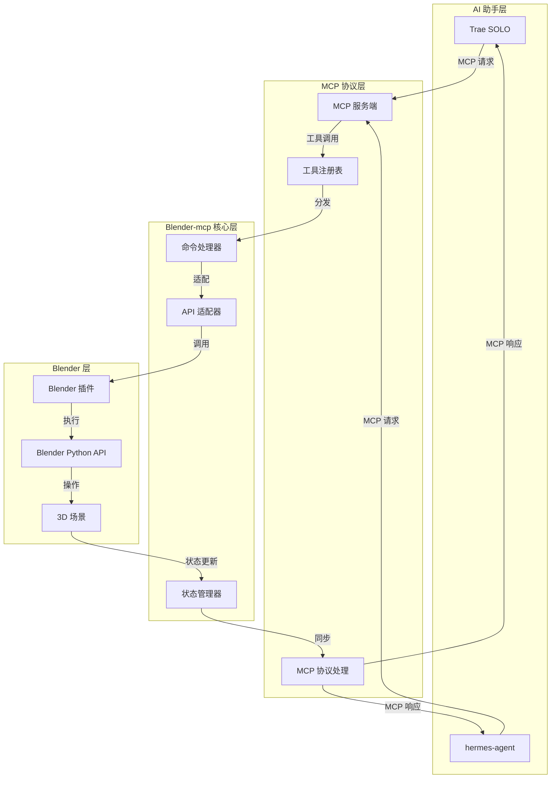

# Blender-mcp 客户端系统架构文档

## 1. 架构设计



## 2. 技术选型

### 2.1 核心技术栈
- **编程语言**：Python 3.x（与 Blender 内置 Python 一致）
- **MCP 框架**：Model Context Protocol SDK
- **通信方式**：WebSocket / stdio
- **Blender 集成**：bpy（Blender Python API）

### 2.2 依赖库
- `mcp`：MCP 协议实现
- `bpy`：Blender Python API（Blender 内置）
- `asyncio`：异步处理
- `json`：数据序列化

## 3. 模块划分

### 3.1 目录结构
```
blender-mcp/
├── mcp_server/          # MCP 服务端
│   ├── __init__.py
│   ├── server.py        # MCP 服务入口
│   ├── tools.py         # 工具定义
│   └── schemas.py       # 数据模型
├── blender_plugin/      # Blender 插件
│   ├── __init__.py
│   ├── addon.py         # 插件注册
│   ├── connection.py    # 连接管理
│   └── operators.py     # Blender 操作封装
├── core/                # 核心逻辑
│   ├── command.py       # 命令处理器
│   ├── adapter.py       # API 适配器
│   └── state.py         # 状态管理
├── config/              # 配置
│   └── settings.py
├── tests/               # 测试
├── requirements.txt
└── README.md
```

### 3.2 核心模块职责

| 模块 | 职责 |
|------|------|
| mcp_server/server.py | 启动 MCP 服务，注册工具，处理请求 |
| mcp_server/tools.py | 定义 MCP 工具接口，参数验证 |
| blender_plugin/addon.py | Blender 插件的注册与注销 |
| blender_plugin/connection.py | 管理与 MCP 服务的连接 |
| core/command.py | 将 MCP 工具调用转换为内部命令 |
| core/adapter.py | 适配 Blender Python API |
| core/state.py | 管理 Blender 场景状态，提供查询接口 |

## 4. MCP 工具定义

### 4.1 工具列表（按优先级排序）
| 工具名称 | 描述 | 优先级 |
|----------|------|--------|
| create_object | 创建 3D 对象 | 高 |
| transform_object | 变换对象（移动、旋转、缩放） | 高 |
| modify_mesh | 修改网格（布尔运算、倒角、挤出、实体化等） | 高 |
| export_model | 导出模型（优先支持 STL/OBJ 3D打印格式） | 高 |
| import_model | 导入模型（支持 STL/OBJ） | 高 |
| check_model | 检查3D打印模型（非流形、法线、壁厚） | 高 |
| repair_model | 修复3D打印模型问题 | 高 |
| save_project | 保存项目 | 中 |
| open_project | 打开项目 | 中 |
| get_scene_info | 获取场景信息 | 中 |
| list_objects | 列出场景中的对象 | 中 |
| set_material | 设置材质 | 低 |
| render_scene | 渲染场景 | 低 |

### 4.2 工具接口示例
```typescript
// 创建对象工具
interface CreateObjectParams {
  type: 'mesh' | 'curve';
  name?: string;
  location?: [number, number, number];
  rotation?: [number, number, number];
  scale?: [number, number, number];
  mesh_type?: 'cube' | 'sphere' | 'cylinder' | 'plane' | 'cone' | 'torus';
}

interface CreateObjectResult {
  success: boolean;
  object_id: string;
  name: string;
  message?: string;
}

// 导出模型工具（3D打印优先）
interface ExportModelParams {
  object_id?: string;
  format: 'stl' | 'obj';
  filepath: string;
  options?: {
    scale?: number;
    use_selection?: boolean;
    ascii?: boolean;
  };
}

interface ExportModelResult {
  success: boolean;
  filepath: string;
  message?: string;
}

// 检查模型工具
interface CheckModelParams {
  object_id: string;
  checks?: ('non_manifold' | 'normals' | 'thickness')[];
  min_thickness?: number;
}

interface CheckModelResult {
  success: boolean;
  issues: {
    type: string;
    count: number;
    details?: string;
  }[];
  is_printable: boolean;
}

// 修改网格工具
interface ModifyMeshParams {
  object_id: string;
  operation: 'boolean_union' | 'boolean_difference' | 'boolean_intersect' | 'bevel' | 'extrude' | 'solidify';
  target_object_id?: string;
  parameters?: {
    [key: string]: any;
  };
}

interface ModifyMeshResult {
  success: boolean;
  object_id: string;
  message?: string;
}
```

## 5. 通信协议

### 5.1 连接方式
- **主模式**：MCP 服务通过 stdio 与 AI 助手通信
- **Blender 连接**：Blender 插件通过 WebSocket 与 MCP 服务通信

### 5.2 消息格式
```json
{
  "id": "unique-message-id",
  "type": "request|response|event",
  "action": "create_object|transform_object|...",
  "payload": {},
  "timestamp": "2024-01-01T00:00:00Z"
}
```

## 6. 数据模型

### 6.1 场景对象模型
```python
@dataclass
class SceneObject:
    id: str
    name: str
    type: str
    location: Tuple[float, float, float]
    rotation: Tuple[float, float, float]
    scale: Tuple[float, float, float]
    parent_id: Optional[str] = None
    material_ids: List[str] = field(default_factory=list)
```

### 6.2 材质模型
```python
@dataclass
class Material:
    id: str
    name: str
    base_color: Tuple[float, float, float, float]
    roughness: float
    metallic: float
```

## 7. 部署与运行

### 7.1 部署方式
1. **Blender 插件安装**：将 `blender_plugin` 目录复制到 Blender 插件目录
2. **MCP 服务配置**：在 Trae SOLO/hermes-agent 配置文件中添加 MCP 服务

### 7.2 启动流程
1. 启动 Blender，启用 Blender-mcp 插件
2. 配置插件连接参数
3. 在 AI 助手中配置并启动 MCP 客户端
4. 开始使用自然语言控制 Blender
